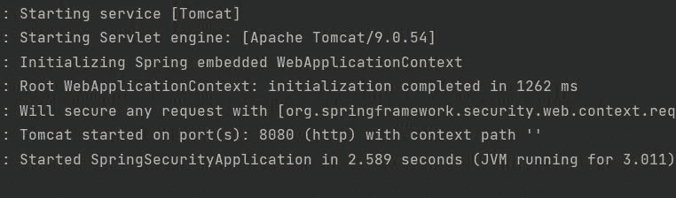
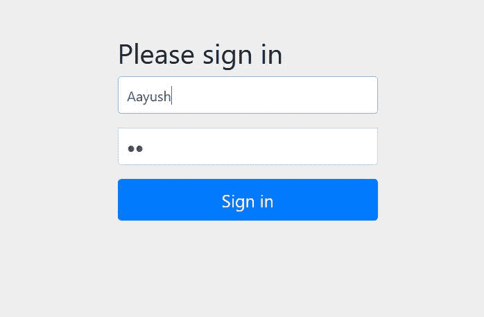

# Spring–在 Spring Security

中添加用户名和密码

> 原文:[https://www . geesforgeks . org/spring-add-用户名和密码-spring-security/](https://www.geeksforgeeks.org/spring-add-user-name-and-password-in-spring-security/)

**Spring Security** 是一个功能强大且高度可定制的身份验证和访问控制框架。这是保护基于 Spring 的应用程序的事实标准。Spring Security 是一个专注于为 Java 应用程序提供身份验证和授权的框架。与所有 Spring 项目一样，Spring Security 的真正威力在于它可以轻松扩展以满足定制需求。Spring Security 的一些关键特性包括:

1.  对身份验证和授权的全面和可扩展的支持
2.  防止像会话固定、点击劫持、跨站点请求伪造等攻击
3.  Servlet 应用编程接口集成
4.  与 Spring Web MVC 的可选集成

在本文中，我们将讨论如何在 spring security **中添加用户名和密码默认情况下，spring security 会提供一个默认的密码和用户名。**

> **注**:首先我们需要在我们的项目中建立 spring 应用。

[**Spring Initializr**](https://www.geeksforgeeks.org/spring-initializr/) 是一个基于 web 的工具，使用它我们可以很容易地生成 Spring Boot 项目的结构。它还为元数据模型中表达的项目提供了各种不同的特性。这个模型允许我们配置 JVM 支持的依赖列表。在这里，我们将使用 spring 初始化器创建应用程序的结构，

**第一步:转到弹簧初始化器**

按照要求填写细节。对于此应用:

```java
Project: Maven
Language: Java
Spring Boot: 2.4.12
Packaging: JAR
Java: 8
Dependencies: Spring Web, Spring Security
```


**第二步:**提取 zip 文件。现在打开一个合适的 IDE，然后转到文件>从现有资源>新建>项目【Spring-boot-app】并选择 pom.xml。在提示中点击导入更改并等待项目同步。


> **注意**:在 Maven 的导入项目窗口中，确保选择了创建项目时选择的相同版本的 JDK。

**步骤 3:** 现在我们必须设置我们的用户名和密码，以便覆盖默认用户名和密码。所以我们必须在我们的**应用程序.属性**文件中设置它。

```java
spring.security.user.name=Aayush
spring.security.user.password=12
```

现在转到 src > main > Java > com . gfg . spring . boot . app > SpringBootAppApplication.java

**SpringBootAppApplication.java**

## Java 语言(一种计算机语言，尤用于创建网站)

```java
@SpringBootApplication
public class SpringSecurityApplication {

    public static void main(String[] args) {
        SpringApplication.run(SpringSecurityApplication.class, args);
    }
}
```

这个应用程序现在可以运行了。运行 SpringBootAppApplication 类，等待 Tomcat 服务器启动。

> **注意**:Tomcat 服务器的默认端口是 8080，可以在 application.properties 文件中更改。

**终端输出:**



我们可以看到，当我们提供用户名和密码时，不会生成默认密码。现在进入任意浏览器，输入**http://localhost:8080/登录**



这是当我们试图访问一个应用编程接口时会出现的页面。