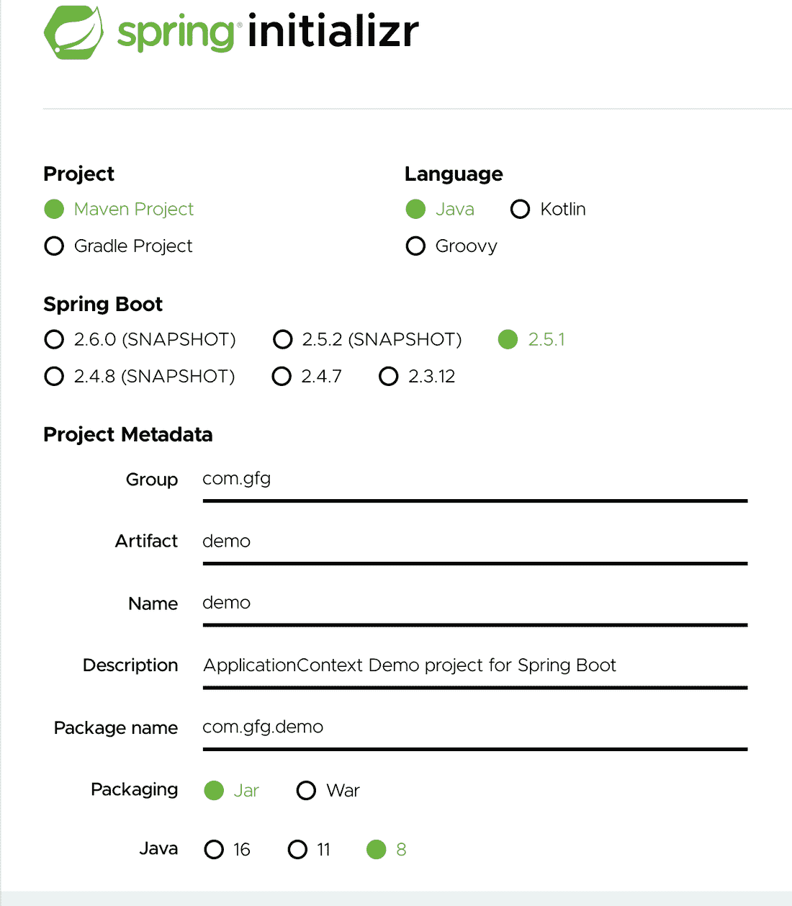

# spring–application context

> 哎哎哎:# t0]https://www . geeksforgeeks . org/spring-application context/

Spring IoC 容器负责实例化、连接、配置和管理对象的整个生命周期。BeanFactory 和 ApplicationContext 代表 Spring IoC 容器。ApplicationContext 是 BeanFactory 的子接口。BeanFactory 提供了基本功能，建议用于移动和小程序等轻量级应用程序。除了特定于企业的功能之外，ApplicationContext 还提供了以下基本功能:

*   通过解析属性文件将事件发布到注册的侦听器。
*   访问应用程序组件的方法。
*   支持国际化。
*   以通用方式加载文件资源。

> **注意:**正是因为这些额外的特性，开发人员更喜欢使用 ApplicationContext 而不是 BeanFactory。

**应用上下文实现类**

Spring 为下面列出的不同需求提供了不同类型的应用程序容器，后面将结合声明进行描述，最后提供一个例子，通过图片辅助完成实现部分。容器如下:

1.  annotation configapplicationcontext 容器
2.  注释配置网络应用上下文
3.  XmlWebApplicationContext

**容器 1:**annotation configapplicationcontext

在 Spring 3.0 中引入了 AnnotationConfigApplicationContext 类。它接受用@Configuration、@Component **、**和 JSR-330 兼容类注释的类。AnnotationConfigApplicationContext 的构造函数接受一个或多个类。例如，在下面的声明中，两个配置类 **Appconfig 和 AppConfig1** 作为参数传递给构造函数。当作为参数传递时，后面的类中定义的 bean 将覆盖前面的类中相同的类型和名称 bean。例如，AppConfig 和 AppConfig1 具有相同的 bean 声明。AppConfig1 中定义的 bean 覆盖了 AppConfig 中的 bean。

**语法:**声明

```
ApplicationContext context = new AnnotationConfigApplicationContext(AppConfig.class, AppConfig1.class);
```

> **注意:**在 IDE 的属性文件中添加以下内容，以允许 spring 覆盖 beans。

```
spring.main.allow-bean-definition-overriding=true
```

**容器 2:**annotation config web application context

在 Spring 3.0 中引入了 AnnotationConfigWebApplicationContext 类。它类似于网络环境的注释配置应用程序上下文。它接受用@Configuration、@Component 和 JSR 330 兼容类注释的类。这些类可以通过 ***注册()方法*** 或通过基础包到 ***扫描()方法*** 进行注册。当我们在 web.xml 中配置 ContextLoaderListener servlet 侦听器或[dispatchersvlet](https://www.geeksforgeeks.org/spring-mvc-with-jsp-view/)时，可能会用到这个类。从 Spring 3.1 开始，这个类可以通过实现 web applicationinitializer(web . XML 的替代)使用 java 代码实例化并注入到 dispatchersvlet 中。

**例**

```
// Class
// Implementing WebApplicationInitializer
public class MyWebApplicationInitializer implements WebApplicationInitializer {

  // Servlet container

  public void onStartup(ServletContext container) throws ServletException {
    AnnotationConfigWebApplicationContext context = new AnnotationConfigWebApplicationContext();
    context.register(AppConfig.class);
    context.setServletContext(container);

    // Servlet configuration
  }
}
```

**容器 3:**XMlWeBaapplicationContext

Spring MVC 基于 Web 的应用程序完全可以使用 XML 或 Java 代码进行配置。配置这个容器类似于 AnnotationConfigWebApplicationContext 容器，这意味着我们可以用 web.xml 或使用 java 代码来配置它。

```
// Class
// Implementing WebApplicationInitializer
public class MyXmlWebApplicationInitializer implements WebApplicationInitializer {

  // Servlet container
  public void onStartup(ServletContext container) throws ServletException {
    XmlWebApplicationContext context = new XmlWebApplicationContext();
    context.setConfigLocation("/WEB-INF/spring/applicationContext.xml");
    context.setServletContext(container);

    // Servlet configuration
  }
}
```

**容器 4:**file system xmlapplicationcontext

文件系统 XML 应用上下文用于从文件系统或从网址加载基于 XML 的 Spring 配置文件。我们可以使用 Java 代码获取应用程序上下文。它对于独立环境和测试线束非常有用。下面的代码展示了如何创建一个容器，并使用 XML 作为元数据信息来加载 beans。

插图:

```
String path = "Documents/demoProject/src/main/resources/applicationcontext/student-bean-config.xml";

ApplicationContext context = new FileSystemXmlApplicationContext(path);
AccountService accountService = context.getBean("studentService", StudentService.class);
```

**容器 5:** 类路径 XML 应用上下文

文件系统 XML 应用上下文用于从类路径加载基于 XML 的 Spring 配置文件。我们可以使用 Java 代码获取应用程序上下文。它对于独立环境和测试线束非常有用。下面的代码展示了如何创建一个容器，并使用 XML 作为元数据信息来加载 beans。

插图:

```
ApplicationContext context = new ClassPathXmlApplicationContext("applicationcontext/student-bean-config.xml");
StudentService studentService = context.getBean("studentService", StudentService.class);
```

现在，让我们实现同样的展示示例，如下所示:

**实施:**

*   使用[弹簧初始化器](https://start.spring.io/)创建弹簧项目。
*   在 **com.gfg.demo.domain** 下创建学生班级
*   同样的， **com.gfg.demo.config** 包下的AppConfig 类。
*   根处的主应用程序类包含容器的创建。
*   最后，在创建 SpringBoot 项目时， **SpringApplication.run()** 方法默认在主类中提供。

**例**

步骤 1:使用[弹簧初始化器](https://start.spring.io/)创建一个弹簧项目，如下图所示。



**第二步:**在*下创建 Student 类**com . gfg . demo . domain*****和**在***com . gfg . demo . config***包下创建 AppConfig 类**。AppConfig 是一个配置类，包含所有使用基于 Java 的配置配置的 Java beans。学生班是 [POJO 班](https://www.geeksforgeeks.org/pojo-vs-java-beans/)。**

*   ****类 1:** AppConfig 类**

```
@Configuration

// Class
public class AppConfig {

  @Bean

  // Method
  public Student student() {

    return new Student(1, "Geek");
  }
}
```

*   ****2 班:**学生班**

```
// Class
public class Student {

  // member variables
  private int id;
  private String name;

  // Constructor 1
  public Student() {}

  // Constructor 2
  public Student(int id, String name) {
    this.id = id;
    this.name = name;
  }

  // Method of this class
  // @Override
  public String toString() {

    return "Student{" + "id=" + id + ", name='" + name + '\'' + '}';
  }
}
```

****第 3 步:**现在根处的 Main Application 类包含容器的创建。**

```
// Class
// @SpringBootApplication
public class DemoApplication {

  // Main driver method
  public static void main(String[] args) {

    // SpringApplication.run(DemoApplication.class, args);

    // Creating its object
    ApplicationContext context = new AnnotationConfigApplicationContext(AppConfig.class);
    Student student = context.getBean(Student.class);

    // Print and display
    System.out.println(student);
  }
}
```

****步骤 4:** 创建 SpringBoot 项目时，默认情况下在主类中提供 **SpringApplication.run()** 方法。它创建容器，创建 bean，管理依赖注入和这些 bean 的生命周期。这是使用[@回弹应用注释](https://www.geeksforgeeks.org/introduction-to-spring-boot/)完成的。**

```
// Main driver method
public static void main(String[] args) {

  ApplicationContext context = SpringApplication.run(DemoApplication.class, args);

  Student student = context.getBean(Student.class);

  // Print adn display
  System.out.println(student);
}
```