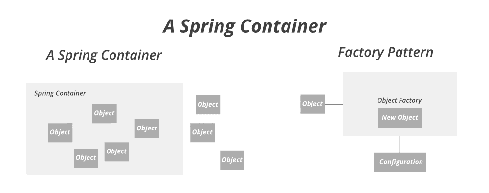

# 春季–豆工厂

> 原文:[https://www.geeksforgeeks.org/spring-beanfactory/](https://www.geeksforgeeks.org/spring-beanfactory/)

当我们谈论 spring 时，最重要的事情是依赖注入，这是可能的，因为 spring 实际上是一个容器，表现得像一个 Beans 的工厂。就像 BeanFactory 接口是最简单的容器，它提供了一种高级配置机制来实例化、配置和管理 beans 的生命周期。Beans 是运行时由 Spring IoC 容器配置的 java 对象。BeanFactory 表示一个基本的 **IoC 容器**，它是 **ApplicationContext 的父接口。** **BeanFactory** 使用 Beans 及其依赖元数据在运行时创建和配置它们。BeanFactory 基于配置文件(XML)在 bean 之间加载 bean 定义和依赖关系，或者可以在需要时使用 Java Configuration 直接返回 bean。还有其他类型的配置文件，如 LDAP、RDMS、属性文件等。BeanFactory 不支持基于注释的配置，而 ApplicationContext 支持。



让我们先了解一下 bean 工厂的一些方法，然后再开始实现，如下表所示:

<figure class="table">

| 

【方法】

 | 

描述

 |
| --- | --- |
| 包含 Bean(字符串名称) | Does this Bean factory contain Bean definitions or externally registered singletons with a given name? |
| Getalias (string name) | Returns the alias of the given bean name, if any. |
| getBean(类<t>必需类型)</t> | Returns the Bean instance (if any) that uniquely matches the given object type. |
| getBean(类<t>所需类型，对象…参数)</t> | Returns an instance of the specified Bean, which can be shared or independent. |
| [getBean (string name) | Returns an instance of the specified Bean, which can be shared or independent. |
| getBean(字符串名称,类<t>所需类型)</t> | Returns an instance of the specified Bean, which can be shared or independent. |
| 字符串名称，对象…参数 | Returns an instance of the specified Bean, which can be shared or independent. |
| getbean 提供程序(类<t>必需类型)</t> | Returns the provider of the bean, allowing lazy on-demand retrieval of instances, including availability and uniqueness options. |
| getBeanProvider(resolvableType 必需类型) | Returns the provider of the bean, allowing delayed on-demand retrieval of instances, including availability and uniqueness options. |
| Gets the type (string name) | Determines the type of bean with the given name. |
| getType(■⑴{ fnsimheibord 1 sh ad1 pos(200，288)}你好，-什么 allowfactorybeainit) | Determines the type of bean with the given name. |
| Is rototype (string name) | Is this bean a prototype? That is to say, will getBean(java.lang.String) always return independent instances? |
| 是单例(字符串名称) | Is this bean a shared singleton? That is to say, will getBean(java.lang.String) always return the same instance? |
| isTypeMatch（字符串名称，类 typeToMatch） | Checks whether the bean with the given name matches the specified type. |
| istype match(■⑴{ fnsimheibord 1 sh ad1 pos(200，288)}你好，解析 typeto match) | Checks whether the bean with the given name matches the specified type. |

</figure>

**程序:**

1.  使用 [start.spring.io](https://start.spring.io/) 创建一个 Spring 项目。
2.  创建 POJO 类。
3.  在**bean-工厂-演示. xml** 文件中配置学生 bean。
4.  将其写入应用程序类。

**实施:**

**第一步:** Bean 定义:创建一个 Student POJO 类。

```
// Java Program where we are creating a POJO class

// POJO class
public class Student {

  // Member variables
  private String name;
  private String age;

  // Constructor 1
  public Student() {
  }

  // Constructor 2
  public Student(String name, String age) {
    this.name = name;
    this.age = age;
  }

  // Method inside POJO class
  @Override
  public String toString() {

    // Print student clas attributes
    return "Student{" + "name='" + name + '\'' + ", age='" + age + '\'' + '}';
  }
}
```

**第二步:** XML Bean 配置:在***Bean-factory-demo . XML***文件中配置学生 Bean。

```
<?xml version = "1.0" encoding="UTF-8"?>
<beans xmlns = "http://www.springframework.org/schema/beans"
            xmlns:xsi="http://www.w3.org/2001/XMLSchema-instance"
            xsi:schemaLocation = "http://www.springframework.org/schema/beans
            https://www.springframework.org/schema/beans/spring-beans.xsd">

    <bean id="student" class = "com.gfg.demo.domain.Student">
                <constructor-arg name="name" value="Tina"/>
                <constructor-arg name="age" value="21"/>
        </bean>
</beans>
```

**第三步:**主类

```
// Application class 
@SpringBootApplication

// Main class
public class DemoApplication {

  // Main driver method
  public static void main(String[] args) {

    // Creating object in a spring container (Beans)
    BeanFactory factory = new ClassPathXmlApplicationContext("bean-factory-demo.xml");
    Student student = (Student) factory.getBean("student");

    System.out.println(student);
  }
}
```

**输出:**

```
Student{name='Tina', age='21'}
```

> **注意:XmlBeanFactory 类**已弃用。