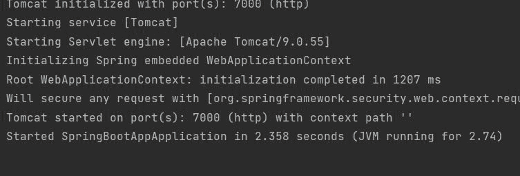
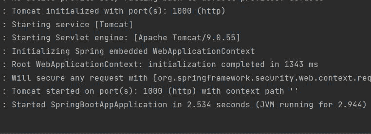
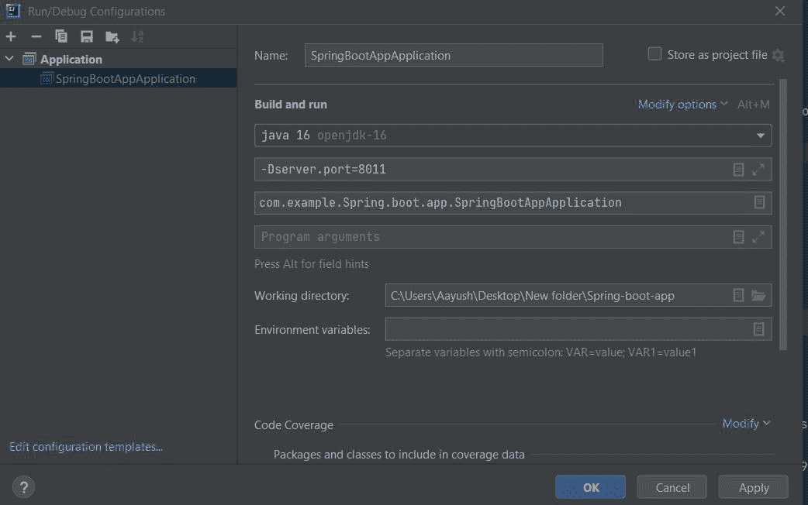
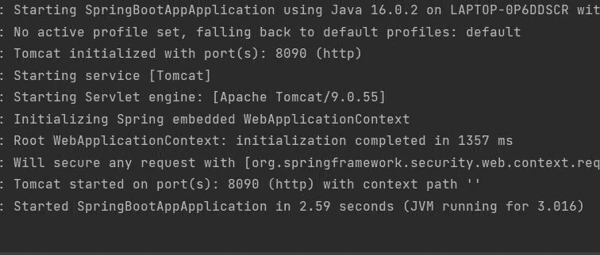

# Spring Boot–更换端口

> 原文:[https://www.geeksforgeeks.org/spring-boot-change-port/](https://www.geeksforgeeks.org/spring-boot-change-port/)

Spring Boot 建在春天的顶端，包含了春天的所有特征。由于其快速的生产就绪环境，开发人员能够直接专注于逻辑，而不是纠结于配置和设置，因此正成为开发人员的最爱。Spring Boot 是一个基于微服务的框架，在其中制作一个生产就绪的应用程序只需要很少的时间。在本文中，我们将讨论如何更改 Spring Boot 的端口号。

**端口号**:端口号有助于各种不同类型的服务，因为端口号 80 总是指向 HTTP 服务，但一次只能指向一个服务。所以我们必须更改默认端口号。我们来讨论一下如何更改端口号。

我们可以通过以下方式改变 Spring Boot 的港口:

1.  **通过在 Spring Boot 项目的应用属性中添加配置**
2.  **通过在组件类**中实现 WebServerFactoryCustomizer 接口
3.  **更改虚拟机选项的配置**

首先，我们需要在项目中建立 spring 应用程序。Spring Initializr 是一个基于网络的工具，使用它我们可以很容易地生成 Spring Boot 项目的结构。它还为元数据模型中表达的项目提供了各种不同的特性。这个模型允许我们配置 JVM 支持的依赖列表。在这里，我们将使用 spring 初始化器创建应用程序的结构，然后使用 IDE 创建一个示例 GET 路由。因此，要做到这一点，以下步骤如下所示，介质顺序如下:

### **分步**实施

*   转到 spring 初始化
*   按照要求填写细节
*   单击生成，它将下载初始项目
*   提取压缩文件

**第一步:转到弹簧初始化器**


**第二步:**按要求填写详细内容。对于此应用:

```
Project: Maven
Language: Java
Spring Boot: 2.2.8
Packaging: JAR
Java: 8
Dependencies: Spring Web
```

**第 3 步:**点击生成，将下载启动项目。

**第四步**:提取 zip 文件。现在打开一个合适的 IDE，然后转到文件- >新建- >现有来源的项目- > Spring-boot-app，并选择 pom.xml。在提示符下单击导入更改，等待项目同步


> **注意**:在 Maven 的导入项目窗口中，确保选择了创建项目时选择的相同版本的 JDK。

### **方法 1:** 通过在 Spring Boot 项目的应用属性中添加配置

我们需要在 spring 应用程序的项目结构中使用 application.properties 文件来更改端口号。

**应用属性:**

```
server.port=7000
```

**第五步**:转 src->main->Java->com . gfg . spring . boot . app，运行主应用。

**终端输出:**



### **方法 2:** 通过在组件类中实现 WebServerFactoryCustomizer 接口

在组件类中实现 WebServerFactoryCustomizer 接口。创建一个组件类型的服务器类，这样 IOC 容器就可以在加载时获取它，并在其中实现接口。转到 src-> main-> Java-> com . gfg . spring . boot . app，创建一个新的**server.java 类**

**server.java**

## Java 语言(一种计算机语言，尤用于创建网站)

```
@Component
public class server implements WebServerFactoryCustomizer<ConfigurableWebServerFactory> {
    @Override
    public void customize(ConfigurableWebServerFactory factory) {
          // Setting the port number
        factory.setPort(1000);
    }
}
```

现在运行主应用程序:

**终端输出:**



### **方法 3:更改春季项目的 VM 选项**

转到运行->编辑配置->跳转应用->虚拟机选项

```
-Dserver.port=8011
```



应用配置后，运行主应用程序。

**终端输出:**

