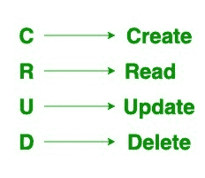

# Spring Boot–原油操作

> 原文:[https://www.geeksforgeeks.org/spring-boot-crud-operations/](https://www.geeksforgeeks.org/spring-boot-crud-operations/)

CRUD 代表创建、读取/检索、更新和删除，这是我们在持久性存储上执行的四个基本操作。CRUD 是面向数据的，是 HTTP 方法的标准化使用。HTTP 有一些作为 CRUD 操作的方法，从开发的角度来看，它们在编程中非常重要，这也有助于我们更好地进行 web 开发，并在处理数据库时帮助我们。因此，标准的 CRUD 操作如下:

*   **开机自检**:创建新资源
*   **获取**:读取/检索资源
*   **PUT** :更新现有资源
*   **删除**:删除资源



顾名思义

*   **创建操作**:执行 INSERT 语句创建新记录。
*   **读取操作**:根据输入参数读取表格记录。
*   **更新操作**:对表执行更新语句。它基于输入参数。
*   **删除操作**:删除表格中指定的一行。它也基于输入参数。

因此，在本文中，我们将通过创建一个 Spring Boot 应用程序和使用 H2 数据库来执行一些基本的 CRUD 操作。这是对什么是 Spring Boot 和什么是 H2 数据库的简单解释。

### Spring Boot

[Spring Boot](https://www.geeksforgeeks.org/introduction-to-spring-boot/) 建在春天的顶端，包含了春天的所有特征。现在正成为开发人员的最爱，因为这是一个快速生产就绪的环境，使开发人员能够直接专注于逻辑，而不是在配置和设置上挣扎。Spring Boot 是一个基于微服务的框架，在其中制作一个生产就绪的应用程序只需要很少的时间。

### H2 数据库

H2 是一个用 Java 编写的关系数据库管理系统。它可以嵌入到 Java 应用程序中，也可以在客户端-服务器模式下运行。H2 的主要特点是:

*   非常快，开源，JDBC 应用编程接口
*   嵌入式和服务器模式；内存数据库
*   基于浏览器的控制台应用程序
*   占用空间小:大约 2.5 兆字节的 jar 文件大小

### Spring Boot 原油仓库

在 Spring Boot 有一个名为 CrudRepository 的接口，它包含了 CRUD 操作的方法。它在存储库上提供通用的 Crud 操作。在***org . Spring framework . Data . Repository***包中定义，扩展了 Spring Data **Repository** 界面。如果有人想在春季启动应用程序中使用 CrudRepository，他/她必须创建一个接口并扩展 CrudRepository 接口。

插图:

```
public interface DepartmentRepository extends CrudRepository<Department, Long> { }
```

其中:

*   **部门**:存储库管理的域类型(一般是实体/模型类名)
*   **Long** :存储库管理的实体的 id 类型(通常是在实体/模型类中创建的@Id 的包装类)

**示例:**

**第一步:**参考本文[如何用 IntelliJ IDEA](https://www.geeksforgeeks.org/how-to-create-a-spring-boot-project-with-intellij-idea/) 创建 Spring Boot 项目，创建 Spring Boot 项目。

**步骤 2:** 添加以下依赖项

*   弹簧网
*   H2 数据库
*   龙目岛
*   春季数据

下面是 **pom.xml** 文件的完整代码。请检查你是否遗漏了什么。

## 可扩展标记语言

```
<?xml version="1.0" encoding="UTF-8"?>
<project xmlns="http://maven.apache.org/POM/4.0.0" xmlns:xsi="http://www.w3.org/2001/XMLSchema-instance"
    xsi:schemaLocation="http://maven.apache.org/POM/4.0.0 https://maven.apache.org/xsd/maven-4.0.0.xsd">
    <modelVersion>4.0.0</modelVersion>
    <parent>
        <groupId>org.springframework.boot</groupId>
        <artifactId>spring-boot-starter-parent</artifactId>
        <version>2.5.5</version>
        <relativePath/> <!-- lookup parent from repository -->
    </parent>
    <groupId>com.amiya</groupId>
    <artifactId>Spring-Boot-Demo-Project</artifactId>
    <version>1.0.0-SNAPSHOT</version>
    <name>Spring-Boot-Demo-Project</name>
    <description>Demo project for Spring Boot</description>
    <properties>
        <java.version>11</java.version>
    </properties>
    <dependencies>
        <dependency>
            <groupId>org.springframework.boot</groupId>
            <artifactId>spring-boot-starter-web</artifactId>
        </dependency>

        <dependency>
            <groupId>com.h2database</groupId>
            <artifactId>h2</artifactId>
            <scope>runtime</scope>
        </dependency>

        <dependency>
            <groupId>org.springframework.boot</groupId>
            <artifactId>spring-boot-devtools</artifactId>
            <scope>runtime</scope>
            <optional>true</optional>
        </dependency>

        <dependency>
            <groupId>org.springframework.boot</groupId>
            <artifactId>spring-boot-starter-data-jpa</artifactId>
        </dependency>

        <dependency>
            <groupId>org.springframework.boot</groupId>
            <artifactId>spring-boot-starter-test</artifactId>
            <scope>test</scope>
        </dependency>

        <dependency>
            <groupId>org.projectlombok</groupId>
            <artifactId>lombok</artifactId>
            <optional>true</optional>
        </dependency>

    </dependencies>

    <build>
        <plugins>
            <plugin>
                <groupId>org.springframework.boot</groupId>
                <artifactId>spring-boot-maven-plugin</artifactId>
                <configuration>
                    <excludes>
                        <exclude>
                            <groupId>org.projectlombok</groupId>
                            <artifactId>lombok</artifactId>
                        </exclude>
                    </excludes>
                </configuration>
            </plugin>
        </plugins>
    </build>

</project>
```

**步骤 3** :创建 4 个包，然后在这些包里面创建一些类和接口，如下图所示:

*   实体
*   仓库
*   服务
*   控制器


> **注**:
> 
> *   绿色圆形图标“我”按钮是界面
> *   蓝色圆形图标“C”按钮是类

**步骤 4:** 在实体包内部

在 Department.java 文件中创建一个简单的 [POJO 类](https://www.geeksforgeeks.org/pojo-vs-java-beans/)。

**例**

## Java 语言(一种计算机语言，尤用于创建网站)

```
// Java Program to Illustrate Department.java File

// Importing required package modules
package com.amiya.springbootdemoproject.entity;

// Importing required classes
import javax.persistence.Entity;
import javax.persistence.GeneratedValue;
import javax.persistence.GenerationType;
import javax.persistence.Id;
import lombok.AllArgsConstructor;
import lombok.Builder;
import lombok.Data;
import lombok.NoArgsConstructor;

@Entity
@Data
@NoArgsConstructor
@AllArgsConstructor
@Builder

// Class
public class Department {

    @Id
    @GeneratedValue(strategy = GenerationType.AUTO)
    private Long departmentId;
    private String departmentName;
    private String departmentAddress;
    private String departmentCode;
}
```

**步骤 5:** 在存储库包内

创建一个简单的接口，并将该接口命名为 DepartmentRepository。这个接口将扩展我们在上面讨论过的 CrudRepository。以下是**DepartmentRepository.java**文件的代码

**例**

## Java 语言(一种计算机语言，尤用于创建网站)

```
package com.amiya.springbootdemoproject.repository;

import com.amiya.springbootdemoproject.entity.Department;
import org.springframework.data.repository.CrudRepository;
import org.springframework.stereotype.Repository;

@Repository
public interface DepartmentRepository extends CrudRepository<Department, Long> {

}
```

**步骤 6:** 服务包内

在包内创建一个名为**部门服务**的接口和一个名为**部门服务 Impl** 的类。

**例 1**

## Java 语言(一种计算机语言，尤用于创建网站)

```
// Java Program to Illustrate DepartmentService.java File

// Importing packages
package com.amiya.springbootdemoproject.service;
import com.amiya.springbootdemoproject.entity.Department;
// Importing required classes
import java.util.List;

// Class
public interface DepartmentService {

    // Save operation
    Department saveDepartment(Department department);

    // Read operation
    List<Department> fetchDepartmentList();

    // Update operation
    Department updateDepartment(Department department,
                                Long departmentId);

    // Delete operation
    void deleteDepartmentById(Long departmentId);
}
```

以下是**DepartmentServiceImpl.java**文件的代码

**例 2**

## Java 语言(一种计算机语言，尤用于创建网站)

```
// Java Program to Illustrate DepartmentServiceImpl.java
// File

// Importing required packages
package com.amiya.springbootdemoproject.service;

import com.amiya.springbootdemoproject.entity.Department;
import com.amiya.springbootdemoproject.repository.DepartmentRepository;
// Importing required classes
import java.util.List;
import java.util.Objects;
import org.springframework.beans.factory.annotation.Autowired;
import org.springframework.stereotype.Service;

// Annotation
@Service
// Class implementing DepartmentService class
public class DepartmentServiceImpl
    implements DepartmentService {

    @Autowired
    private DepartmentRepository departmentRepository;

    // Save operation
    @Override
    public Department saveDepartment(Department department)
    {
        return departmentRepository.save(department);
    }

    // Read operation
    @Override public List<Department> fetchDepartmentList()
    {
        return (List<Department>)
            departmentRepository.findAll();
    }

    // Update operation
    @Override
    public Department
    updateDepartment(Department department,
                     Long departmentId)
    {

        Department depDB
            = departmentRepository.findById(departmentId)
                  .get();

        if (Objects.nonNull(department.getDepartmentName())
            && !"".equalsIgnoreCase(
                department.getDepartmentName())) {
            depDB.setDepartmentName(
                department.getDepartmentName());
        }

        if (Objects.nonNull(
                department.getDepartmentAddress())
            && !"".equalsIgnoreCase(
                department.getDepartmentAddress())) {
            depDB.setDepartmentAddress(
                department.getDepartmentAddress());
        }

        if (Objects.nonNull(department.getDepartmentCode())
            && !"".equalsIgnoreCase(
                department.getDepartmentCode())) {
            depDB.setDepartmentCode(
                department.getDepartmentCode());
        }

        return departmentRepository.save(depDB);
    }

    // Delete operation
    @Override
    public void deleteDepartmentById(Long departmentId)
    {
        departmentRepository.deleteById(departmentId);
    }
}
```