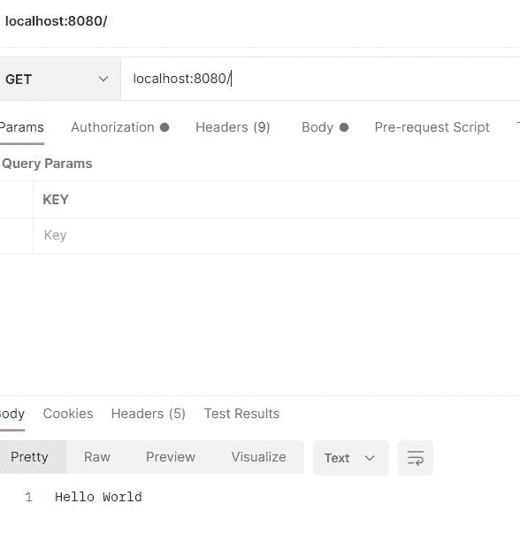

# Spring Boot–你好世界示例

> 原文:[https://www . geesforgeks . org/spring-boot-hello-world-example/](https://www.geeksforgeeks.org/spring-boot-hello-world-example/)

**Spring Boo** t 构建在弹簧的顶部，包含了弹簧的所有特性。由于其快速的生产就绪环境，开发人员能够直接专注于逻辑，而不是纠结于配置和设置，因此正成为开发人员的最爱。Spring Boot 是一个基于微服务的框架，在其中制作一个生产就绪的应用程序只需要很少的时间。在本文中，我们将讨论使用弹簧靴的 Hello World 示例。我们将讨论使用 Spring Boot 打印 Hello World 的两种方法。

*   借助于回弹的[命令通道](https://www.geeksforgeeks.org/what-is-command-line-runner-interface-in-spring-boot/) r 界面
*   在回弹中使用控制器类

首先，在我们的机器上初始化项目。 [Spring Initializr](https://www.geeksforgeeks.org/spring-initializr/) 是一个基于 web 的工具，使用它我们可以很容易地生成 Spring Boot 项目的结构。它还为元数据模型中表达的项目提供了各种不同的特性。这个模型允许我们配置 JVM 支持的依赖列表。在这里，我们将使用 spring 初始化器创建应用程序的结构，然后使用 IDE 创建一个示例 GET 路由。因此，要做到这一点，按顺序遵循以下步骤。

### 逐步实施

**第一步:转到弹簧初始化器**

按照要求填写细节。对于此应用:

```java
Project: Maven
Language: Java
Spring Boot: 2.2.8
Packaging: JAR
Java: 8
Dependencies: Spring Web
```

**第二步:点击生成，将下载启动项目**


**第三步:**提取 zip 文件。现在打开一个合适的 IDE，然后转到文件>从现有资源>新建>项目【Spring-boot-app】并选择 pom.xml。在提示符下单击导入更改并等待项目同步，如下图所示:


> **注意**:在 Maven 的导入项目窗口中，确保选择了创建项目时选择的相同版本的 JDK。

### 方法一:借助 SpringBoot 的 CommandRunner 接口

**第四步**:转 src >主>Java>com . gfg . spring . boot . app，下面是**SpringBootAppApplication.java**文件的代码。

## Java 语言(一种计算机语言，尤用于创建网站)

```java
@SpringBootApplication

// Main class

// Implementing CommandLineRunner interface
public class SpringBootAppApplication implements CommandLineRunner
{
    // Method 1

    // run() method for springBootApplication to execute
    @Override
    public void run(String args[]) throws Exception
    {
        // Print statement when method is called
        System.out.println("HEllo world");
    }

    // Method 2

    // Main driver method
    public static void main(String[] args)
    {
        // Calling run() method to execute
        // SpringBootApplication by

        // invoking run() inside main() method
        SpringApplication.run(SpringBootAppApplication.class, args);
    }
}
```

这个应用程序现在可以运行了。

**第 6 步:**运行 SpringBootAppApplication 类，等待 Tomcat 服务器在已经设置了默认端口的地方启动。

> **提示**:Tomcat 服务器的默认端口是 8080，可以在 application.properties 文件中更改。

**输出:**在端子/CMD 上产生


### 方法 2:用 SpringBoot 中的控制器类

转到 src > main > Java > com . gfg . spring . boot . app，创建一个控制器类。以下是**controller.java**文件的代码。

## Java 语言(一种计算机语言，尤用于创建网站)

```java
@RestController
public class controller {
    @GetMapping("/")
    String return1(){
        return "Hello World";
    }
}
```

这个控制器帮助处理来自客户端的所有传入请求。现在我们将使用邮递员并调用 Spring 引导应用程序的 get API。

