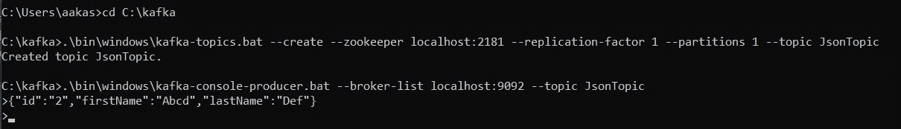
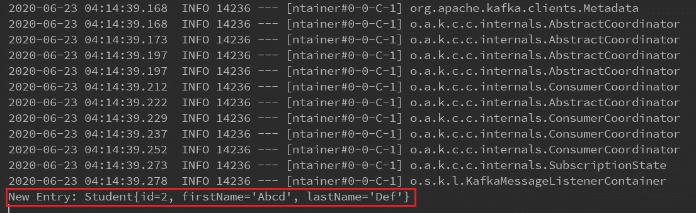

# Spring Boot |如何使用 Apache Kafka 消费 JSON 消息

> 原文:[https://www . geesforgeks . org/spring-boot-how-consume-JSON-messages-use-Apache-Kafka/](https://www.geeksforgeeks.org/spring-boot-how-to-consume-json-messages-using-apache-kafka/)

[Apache Kafka](https://www.geeksforgeeks.org/Aapche-Kafka/) 是一个流处理系统，允许您在进程、应用程序和服务器之间发送消息。在本文中，我们将看到如何使用 Aapche Kafka 在 Spring 引导应用程序的控制台上发布 JSON 消息。

为了学习如何创建 Spring boot 项目，请参考[这篇文章](https://www.geeksforgeeks.org/how-to-create-a-basic-application-in-java-Spring-boot/?ref=rp)。

**工作步骤:**

1.  转到 [Spring initializr](https://start.Spring.io/) 并创建一个具有以下依赖关系的初始项目:
    *   阿帕奇卡夫卡的春天
2.  在集成开发环境中打开项目，并同步依赖项。在本文中，我们将创建一个学生模型，并在其中发布学生的详细信息。因此，创建一个模型类*学生*。添加数据成员并创建[构造函数](https://www.geeksforgeeks.org/constructors-in-java/)并覆盖*到字符串*方法以查看 JSON 格式的消息。以下是学生班的实施:

    ## 学生模型

    ```java
    // Java program to implement a
    // student class

    // Creating a student class
    public class Student {

        // Data members of the class
        int id;
        String firstName;
        String lastName;

        // Constructor of the student
        // class
        public Student()
        {
        }

        // Parameterized constructor of
        // the student class
        public Student(int id, String firstName,
                       String lastName)
        {
            this.id = id;
            this.firstName = firstName;
            this.lastName = lastName;
        }

        @Override
        public String toString()
        {
            return "Student{"
                + "id = " + id
                + ", firstName = '" + firstName + "'"
                + ", lastName = '" + lastName + "'"
                + "}";
        }
    }
    ```

3.  新建一个类*配置*并添加注释*@配置*和*@启用卡夫卡*。现在用 Student 类对象创建 bean*consumer factory*和*concurrentkakalistercontainerfactory*。

    ## 配置扣

    ```java
    @EnableKafka
    @Configuration
    public class Config {

        // Function to establish a connection
        // between Spring application
        // and Kafka server
        @Bean
        public ConsumerFactory<String, Student>
        studentConsumer()
        {

            // HashMap to store the configurations
            Map<String, Object> map
                = new HashMap<>();

            // put the host IP in the map
            map.put(ConsumerConfig
                        .BOOTSTRAP_SERVERS_CONFIG,
                    "127.0.0.1:9092");

            // put the group ID of consumer in the map
            map.put(ConsumerConfig
                        .GROUP_ID_CONFIG,
                    "id");
            map.put(ConsumerConfig
                        .KEY_DESERIALIZER_CLASS_CONFIG,
                    StringDeserializer.class);
            map.put(ConsumerConfig
                        .VALUE_DESERIALIZER_CLASS_CONFIG,
                    JsonDeserializer.class);

            // return message in JSON formate
            return new DefaultKafkaConsumerFactory<>(
                map, new StringDeserializer(),
                new JsonDeserializer<>(Student.class));
        }

        @Bean
        public ConcurrentKafkaListenerContainerFactory<String,
                                                       Student>
        studentListner()
        {
            ConcurrentKafkaListenerContainerFactory<String,
                                                    Student>
                factory
                = new ConcurrentKafkaListenerContainerFactory<>();
            factory.setConsumerFactory(studentConsumer());
            return factory;
        }
    }
    ```

4.  创建一个带有 *@Service* 注释的类*。此类将包含在控制台上发布消息的侦听器方法。

    ## 卡夫卡式服务

    ```java
    @Service
    public class KafkaService {

        // Annotation required to listen
        // the message from Kafka server
        @KafkaListener(topics = "JsonTopic",
                       groupId = "id", containerFactory
                                       = "studentListner")
        public void
        publish(Student student)
        {
            System.out.println("New Entry: "
                               + student);
        }
    }
    ```* 
5.  *启动动物园管理员和卡夫卡服务器。现在我们需要创建一个名为 *JsonTopic* 的新主题。为此，请打开一个新的命令提示符窗口，并将目录更改为卡夫卡目录。*
6.  *现在使用下面给出的命令创建一个新主题:

    > bin/Kafka-topics。sh–create–动物园管理员本地主机:2181–复制因子 1–分区 1–topic _ name//适用于老兄和 linux
    > 
    > 。\ bin \ windows \ Kafka-主题。bat–create–动物园管理员 localhost:2181–复制因子 1–分区 1–topic _ topic _ name//适用于 windows* 
7.  *现在要运行卡夫卡制作人控制台，使用下面的命令:

    > bin/卡夫卡-控制台-制作人。sh-broker-list localhost:9092–主题卡夫卡 _ 示例//适用于老兄和 linux
    > 
    > 。\ bin \ windows \ Kafka-控制台-生产者。蝙蝠经纪人-列表 localhost:9092-主题卡夫卡 _ 示例//适用于窗户* 
8.  *Run the application and and type message on Kafka producer and press enter.

    **输出:**
    
    *