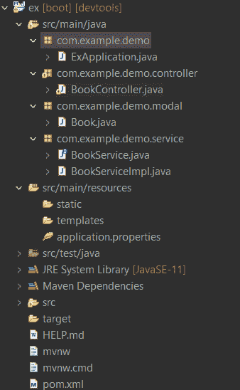

# Spring Boot–休息示例

> 原文:[https://www.geeksforgeeks.org/spring-boot-rest-example/](https://www.geeksforgeeks.org/spring-boot-rest-example/)

我们都知道在当今世界，大多数 web 应用都遵循客户机-服务器架构。应用程序本身是客户端或头罩下的前端部分，它需要调用服务器或后端来获取或保存数据。这种通信使用 HTTP 协议进行。相同的协议是网络的力量。在服务器上，我们公开了可以通过 HTTP 协议访问的一系列服务。然后，客户端可以通过发送 HTTP 请求直接调用服务。

现在，这就是 **REST** 进入画面的地方。Rest 代表**R**presentation**S**state**T**transfer 构建这些 HTTP 服务基本上是一个惯例。所以我们用一个简单的 HTTP 协议原理来提供对 **CREATE** 、 **READ** 、**UPDATE**&**DELETE**数据的支持。我们将这些操作统称为 **CRUD** 操作。简而言之，这是开发人员在创建应用编程接口时遵循的一组规则。其中一条规则规定，当你链接到一个特定的网址时，你应该能够获得一段数据(称为资源)。让我们实现一个 RSET 应用程序，并通过创建一个简单地以 **JSON** 的形式返回图书数据的例子来理解 REST 方法。

### 以身作则

**设置春季项目:**

所以首先我们将在 [STS(spring 工具套件)IDE](https://www.geeksforgeeks.org/how-to-download-and-install-spring-tool-suite-spring-tools-4-for-eclipse-ide/) 中设置 Spring 项目。下面给出了谁的指示

*   单击文件->新建->项目->选择 Spring Starter 项目->单击下一步。
*   将会打开一个新的对话框，您可以在其中提供项目相关的信息，如项目名称、Java 版本、Maven 版本等等。
*   之后，选择所需的 maven 依赖项，如 **Spring Web** 、 **Spring Boot 开发工具**(提供快速应用重启、LiveReload 和配置，以增强开发体验。)
*   单击完成。

**项目结构:**



**pom.xml:**

## 可扩展标记语言

```java
<?xml version="1.0" encoding="UTF-8"?>
<project xmlns="http://maven.apache.org/POM/4.0.0" xmlns:xsi="http://www.w3.org/2001/XMLSchema-instance"
    xsi:schemaLocation="http://maven.apache.org/POM/4.0.0 https://maven.apache.org/xsd/maven-4.0.0.xsd">
    <modelVersion>4.0.0</modelVersion>
    <parent>
        <groupId>org.springframework.boot</groupId>
        <artifactId>spring-boot-starter-parent</artifactId>
        <version>2.6.1</version>
        <relativePath/> <!-- lookup parent from repository -->
    </parent>
    <groupId>com.example</groupId>
    <artifactId>ex</artifactId>
    <version>0.0.1-SNAPSHOT</version>
    <name>ex</name>
    <description>Demo project for Spring Boot</description>
    <properties>
        <java.version>11</java.version>
    </properties>
    <dependencies>

        <dependency>
            <groupId>org.springframework.boot</groupId>
            <artifactId>spring-boot-starter-web</artifactId>
        </dependency>

        <dependency>
            <groupId>org.springframework.boot</groupId>
            <artifactId>spring-boot-devtools</artifactId>
            <scope>runtime</scope>
            <optional>true</optional>
        </dependency>

        <dependency>
            <groupId>org.springframework.boot</groupId>
            <artifactId>spring-boot-starter-test</artifactId>
            <scope>test</scope>
        </dependency>
    </dependencies>

    <build>
        <plugins>
            <plugin>
                <groupId>org.springframework.boot</groupId>
                <artifactId>spring-boot-maven-plugin</artifactId>
            </plugin>
        </plugins>
    </build>

</project>
```

> **注意:**无需向**应用程序添加任何内容。属性**因为我们没有使用数据库。

**POJO(普通旧 java 对象)类:**

## Java 语言(一种计算机语言，尤用于创建网站)

```java
package com.example.demo.modal;

public class Book {

    private long id;
    private String name;
    private String title;

    public Book() {
        super();
    }
    public Book(long id, String name, String title) {
        super();
        this.id = id;
        this.name = name;
        this.title = title;
    }

    public long getId() {
        return id;
    }

    public void setId(long id) {
        this.id = id;
    }

    public String getName() {
        return name;
    }

    public void setName(String name) {
        this.name = name;
    }

    public String getTitle() {
        return title;
    }

    public void setTitle(String title) {
        this.title = title;
    }

}
```

**服务接口和服务实现类**

在这里，我们创建了一个名为 **BookService** 的界面，其中包含了我们的应用程序将要提供给用户的所有服务方法。以及实现 BookService 接口的 **BookServiceImpl** 类。

## Java 语言(一种计算机语言，尤用于创建网站)

```java
package com.example.demo.service;

import java.util.HashSet;
import com.example.demo.modal.Book;

public interface BookService {
     HashSet<Book> findAllBook();
     Book findBookByID(long id);
     void addBook(Book b);
     void deleteAllData();
}
```

## Java 语言(一种计算机语言，尤用于创建网站)

```java
package com.example.demo.service;
import java.util.HashSet;
import org.springframework.stereotype.Service;
import com.example.demo.modal.Book;

@Service
public class BookServiceImpl implements BookService {

    HashSet<Book> bookList = new HashSet<Book>();
    @Override
    public HashSet<Book> findAllBook() {
        if (bookList.isEmpty())
            return null;
        else
            return bookList;
    }
    @Override
    public Book findBookByID(long id) {
        Book book = bookList.stream().filter(b -> b.getId() == id).findAny().orElse(null);
        return book;
    }
    @Override
    public void addBook(Book b) {
        bookList.add(b);
    }
    @Override
    public void deleteAllData() {
        bookList.clear();
    }
}
```

**休息控制器:**

这里是 **ExController** 类，我们在这里公开了我们已经创建的所有 API。

原料药清单

*   **http://localhost:8080/**
    *   保存数据
*   **http://localhost:8080/findbyid/2**
    *   按身份证查找图书
*   **http://localhost:8080/find all**
    *   查找所有书籍
*   **http://localhost:8080/delete**
    *   删除所有书籍

## Java 语言(一种计算机语言，尤用于创建网站)

```java
package com.example.demo.controller;

import java.util.ArrayList;
import java.util.HashSet;

import org.springframework.beans.factory.annotation.Autowired;
import org.springframework.web.bind.annotation.DeleteMapping;
import org.springframework.web.bind.annotation.GetMapping;
import org.springframework.web.bind.annotation.PathVariable;
import org.springframework.web.bind.annotation.PostMapping;
import org.springframework.web.bind.annotation.RequestBody;
import org.springframework.web.bind.annotation.RestController;

import com.example.demo.modal.Book;

import com.example.demo.service.BookServiceImpl;

@RestController
public class BookController {

    @Autowired
    BookServiceImpl bookServiceImpl;

    @PostMapping("/")
    public void addBook(@RequestBody Book book) {
        bookServiceImpl.addBook(book);
    }

    @GetMapping("/findall")
    public HashSet<Book> getAllBook() {
        return bookServiceImpl.findAllBook();
    }

    @GetMapping("/findbyid/{id}")
    public Book geBookById(@PathVariable long id) {
        return bookServiceImpl.findBookByID(id);
    }

    @DeleteMapping("/delete")
    public void deleteBook() {
        bookServiceImpl.deleteAllData();
    }

}
```

**ExApplication.java**

运行应用程序。

## Java 语言(一种计算机语言，尤用于创建网站)

```java
package com.example.demo;

import org.springframework.boot.SpringApplication;
import org.springframework.boot.autoconfigure.SpringBootApplication;

@SpringBootApplication
public class ExApplication {

    public static void main(String[] args) {
        SpringApplication.run(ExApplication.class, args);
    }

}
```

**测试波兹曼**中的原料药

<video class="wp-video-shortcode" id="video-727697-1" width="640" height="360" preload="metadata" controls=""><source type="video/mp4" src="https://media.geeksforgeeks.org/wp-content/uploads/20211203143404/bandicam-2021-12-03-14-32-08-301.mp4?_=1">[https://media.geeksforgeeks.org/wp-content/uploads/20211203143404/bandicam-2021-12-03-14-32-08-301.mp4](https://media.geeksforgeeks.org/wp-content/uploads/20211203143404/bandicam-2021-12-03-14-32-08-301.mp4)</video>