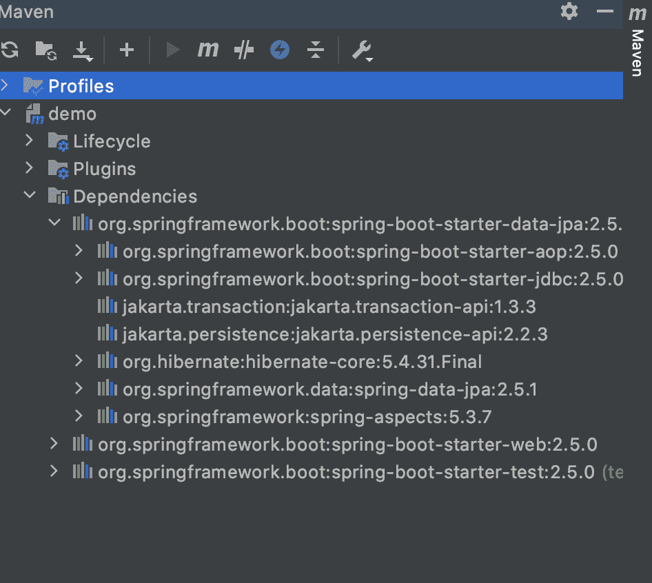

# Spring Boot–启动器

> 原文:[https://www.geeksforgeeks.org/spring-boot-starters/](https://www.geeksforgeeks.org/spring-boot-starters/)

在引入 Spring Boot 之前，Spring Developers 曾经花费大量时间在依赖关系管理上。引入 Spring Boot 启动器是为了解决这个问题，这样开发人员可以在实际代码上花费比依赖项更多的时间。Spring Boot 启动器是依赖描述符，可以添加到 pom.xml 中的 **<依赖>** 部分下。这些启动器用一个名字给出所有的依赖项。例如，如果要使用 Spring Data JPA 进行数据库访问，可以包含**Spring-boot-starter-Data-JPA**依赖项。

使用启动器的优势如下:

*   通过减少开发人员的配置时间来提高生产率。
*   管理 POM 更容易，因为要添加的依赖项的数量减少了。
*   已测试、生产就绪的**、**和支持的依赖配置。
*   不需要记住依赖项的名称和版本。

Spring Boot 入门数据 JPA 说明如下:

```java
<dependencies>
    <dependency>
        <groupId>org.springframework.boot</groupId>
        <artifactId>spring-boot-starter-data-jpa</artifactId>
    </dependency>
</dependencies>
```

这给出了所有必需的依赖项，并且可以在 IntelliJ IDEA 的 Maven 选项卡下看到。



在早期，开发人员习惯于包含所有这些依赖关系。现在 Spring Boot 启动器只为所有人提供一个依赖。官方启动器遵循命名惯例**弹簧启动启动器-*** ，其中 ***** 表示应用程序类型。例如，如果我们想使用 Spring MVC 构建包含 RESTful 应用程序的 web，我们必须使用 **spring-boot-starter-web** 依赖关系。

第三方初学者

如果你想制作自己的启动器或其他第三方启动器，名称不应以**开头，因为它是为官方 Spring Boot 启动器保留的。它可以从项目的名称开始。比如项目名称为 **gfg-code-template** ，那么启动器名称可以为**gfg-code-template-spring-boot-starter**。**

在这里，我们将讨论所有 3 个启动器，以下启动器由 Spring Boot 在 **org.springframework.boot** 组下提供。它们分别涵盖如下:

1.  应用启动器
2.  生产启动器
3.  技术启动器

让我们以相同的顺序详细说明这些启动器，如下所示:

**(甲)** **Spring Boot 应用启动器**

<figure class="table">

| 

名字

 | 

描述

 |
| --- | --- |
| **弹簧启动装置** | 核心入门，包括自动配置支持、日志记录和 YAML |
| **弹簧-启动-启动器-活动 mq** | 使用 Apache 主动 MQ 的 JMS 消息传递入门 |
| **弹簧-启动装置-amqp** | 使用弹簧 AMQP 和兔子 MQ 的启动器 |
| **弹簧-启动装置-aop** | Spring AOP 和 AspectJ 面向方面编程入门 |
| **弹簧-启动装置-卤虫** | 使用 Apache Artemis 的 JMS 消息传递入门 |
| **弹簧-启动-启动-批次** | 使用弹簧批的启动器 |
| **弹簧启动启动器缓存** | 开始使用 Spring 框架的缓存支持 |
| **弹簧-启动-启动-数据-卡珊德拉** | 卡珊德拉分布式数据库和春季数据卡珊德拉的使用入门 |
| **弹簧-启动-启动-数据-卡珊德拉-反应** | 卡珊德拉分布式数据库和春季数据卡珊德拉反应的使用入门 |
| **弹簧-启动-启动-数据-couchbase** | Couchbase 面向文档数据库和 Spring 数据 Couchbase 的使用入门 |
| **弹簧-启动-启动器-数据-couch base-反应** | Couchbase 面向文档数据库和 Spring 数据 Couchbase Reactive 的使用入门 |
| **弹簧-启动-启动-数据-弹性搜索** | 开始使用弹性搜索和分析引擎以及春季数据弹性搜索 |
| **spring-boot-starter-data-JDBC** | 使用春季数据 JDBC 的开始 |
| **弹簧-启动-启动-数据-jpa** | Hibernate 使用 Spring 数据 JPA 的入门 |
| **弹簧-启动-启动器-数据-ldap** | 使用春季数据 LDAP 的入门 |
| **弹簧-启动-启动-数据-mongodb** | 开始使用面向文档的数据库和春季数据蒙古数据库 |
| **弹簧-启动-启动器-数据-MongoDB-反应** | 使用蒙古数据库面向文档的数据库和春季数据蒙古数据库反应 |
| **弹簧-启动-启动-数据-neo4j** | 开始使用 Neo4j 图形数据库和春季数据 Neo4j |
| **弹簧-启动-启动器-数据-r2dbc** | 使用弹簧数据 R2DBC 的启动器 |
| **弹簧-启动-启动-数据-redis** | Spring Data Redis 和莴苣客户端使用 Redis 键值数据存储的入门 |
| **弹簧-启动-启动器-数据-重传-反作用** | 开始使用 Redis 键值数据存储与春季数据 Redis 反应和生菜客户端 |
| **弹簧-启动-启动-数据-静止** | 使用 Spring Data REST 在 REST 上公开 Spring 数据存储库的入门 |
| **弹簧-启动-自由标记** | 使用 FreeMarker 视图构建 MVC 网络应用程序的入门 |
| **弹簧-启动-常规-模板** | 使用 Groovy 模板视图构建 MVC 网络应用程序的入门 |
| **弹簧-启动-启动-hateoas** | 用 Spring MVC 和 Spring HATEOAS 构建基于超媒体的 RESTful web 应用程序的初学者 |
| **弹簧-启动-启动-集成** | 使用弹簧集成的启动器 |
| **弹簧-启动-启动器-jdbc** | 将 JDBC 与 HikariCP 连接池一起使用的初学者 |
| **弹簧靴启动器球衣** | 使用 JAX-RS 和泽西构建 RESTful 网络应用程序的初学者。弹簧靴起动器网的替代方案 |
| **弹簧靴启动器 jooq** | 使用 jOOQ 访问 SQL 数据库的初学者。spring-boot-starter-data-jpa 或 spring-boot-starter-jdbc 的替代方案 |
| **弹簧-启动-启动-json** | json 读写入门 |
| **【spring-boot-JTA 原子】t1]** | 使用 Atomikos 的 JTA 事务启动器 |
| **弹簧靴启动器邮件** | 开始使用 Java 邮件和 Spring 框架的电子邮件发送支持 |
| **弹簧靴启动器胡子** | 使用小胡子视图构建网络应用程序的入门 |
| **弹簧-启动-启动-oauth 2-客户端** | 开始使用 Spring Security 的 OAuth2/OpenID 连接客户端功能 |
| **spring-boot-starter-oaut H2-resource-server** | 开始使用 Spring Security 的 OAuth2 资源服务器功能 |
| **弹簧-启动装置-石英** | 使用石英调度器的启动器 |
| **弹簧-启动装置-启动装置** | 用于构建火箭客户端和服务器的启动器 |
| **弹簧-启动-启动-安全** | 使用弹簧安全的启动器 |
| **弹簧-启动-启动-测试** | 用包括 JUnit Jupiter、Hamcrest 和 Mockito 在内的库测试 Spring Boot 应用程序的入门程序 |
| **弹簧靴启动器百里香** | 使用百里香叶视图构建 MVC 网络应用程序的开始 |
| **弹簧-启动-启动-验证** | 将 Java Bean 验证与 Hibernate 验证器结合使用的初学者 |
| **弹簧靴-起动机-腹板** | 使用 Spring MVC 构建 web(包括 RESTful)应用程序的初学者。使用 Tomcat 作为默认的嵌入式容器。 |
| **弹簧-启动-启动-网络服务** | 使用春季网络服务的开始 |
| **弹簧-启动-启动-网络流量** | 使用 Spring 框架的反应式网络支持构建网络流量应用程序的开始 |
| **弹簧-启动装置-网络插座** | 使用 Spring 框架的网络套接字支持构建网络套接字应用程序的初学者 |

</figure>

**(B)** **Spring Boot 生产启动机**

<figure class="table">

| 

名字

 | 

描述

 |
| --- | --- |
| **弹簧-启动-启动器-致动器** | 使用 Spring Boot 致动器的入门，该致动器提供生产就绪功能，帮助您监控和管理您的应用程序 |

</figure>

**(丙)** **Spring Boot 技术首发**

<figure class="table">

| 

名字

 | 

描述

 |
| --- | --- |
| **弹簧靴启动器码头** | 使用 Jetty 作为嵌入式 servlet 容器的开始。弹簧靴启动器雄猫的替代品 |
| **弹簧靴启动器 log4j2** | 用于日志记录的 Log4j2 启动器。弹簧靴启动器记录的替代方案 |
| **弹簧-启动-启动-记录** | 使用日志记录的启动器。默认日志记录启动器 |
| **弹簧-启动装置-反应器-网络** | 使用 Reactor Netty 作为嵌入式反应式 HTTP 服务器的初学者。 |
| **弹簧-启动-启动-雄猫** | 使用 Tomcat 作为嵌入式 servlet 容器的初学者。spring-boot-starter-web 使用的默认 servlet 容器启动器 |
| **弹簧-启动装置-回流** | 使用 Undertow 作为嵌入式 servlet 容器的初学者。弹簧靴启动器雄猫的替代品 |

</figure>