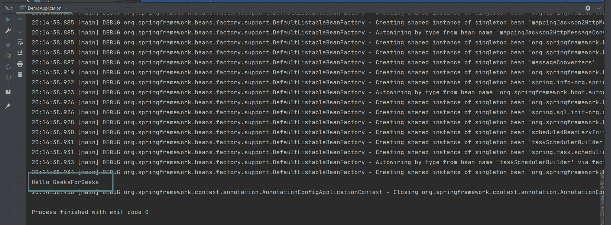
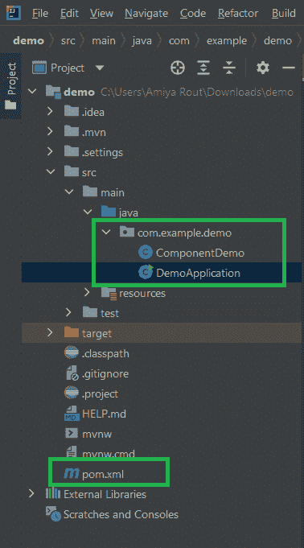

# 弹簧@组件注释示例

> 原文:[https://www . geesforgeks . org/spring-component-annotation-with-example/](https://www.geeksforgeeks.org/spring-component-annotation-with-example/)

[Spring](https://www.geeksforgeeks.org/introduction-to-spring-framework/) 是目前最流行的 Java EE 框架之一。它是一个开源的轻量级框架，允许 Java EE 7 开发人员构建简单、可靠和可扩展的企业应用程序。这个框架主要侧重于提供各种方法来帮助您管理业务对象。与传统的 Java 框架和应用程序编程接口(如 Java 数据库连接(JDBC)、JavaServer Pages(JSP)和 Java Servlet)相比，它使网络应用程序的开发变得更加容易。这个框架使用各种新技术来开发企业应用程序，例如面向方面编程(AOP)、普通旧 Java 对象(POJO)和依赖注入(DI)。现在谈谈弹簧注释

> **Spring Annotations** 是一种提供程序相关数据的元数据形式。注释用于提供关于程序的补充信息。它对他们注释的代码的操作没有直接影响。它不会改变编译程序的动作。

Spring Framework 中有很多注释。下面列出了一些 Spring 框架注释，我们将在这里讨论最重要的注释之一@组件注释

*   @必选
*   @自动连线
*   @配置
*   @组件扫描
*   @豆
*   @组件
*   @控制器
*   @服务
*   @储存库等。

### **@组件标注**

@Component 是类级注释。它用于将一个类表示为组件。我们可以在整个应用程序中使用@Component 来将 beans 标记为 Spring 的托管组件。组件负责某些操作。Spring 框架提供了另外三个特定的注释，用于将类标记为组件。

1.  @服务
2.  @存储库
3.  @控制器

**1: @Service:** 我们用@Service 指定一个类，以表示它们持有业务逻辑。除了在服务层中使用之外，这个注释没有任何其他特殊用途。实用程序类可以标记为服务类。

**2: @Repository:** 我们用@Repository 指定一个类来表示它们正在处理 **CRUD 操作**，通常，它与 DAO(数据访问对象)或处理数据库表的 Repository 实现一起使用。

**3: @Controller:** 我们用@Controller 指定一个类，表示它们是前端控制器，负责处理用户请求并返回适当的响应。它主要用于 REST 网络服务。

> **注意:**这四个注释都可以在 package‘org . spring framework . stereotype’和部分‘spring-context jar’中找到。

**示例:**弹簧@组件

让我们创建一个非常简单的 Spring 启动应用程序来展示 Spring Component 注释的使用，以及 Spring 如何通过基于注释的配置和类路径扫描来自动检测它。

**步骤 1:** 创建一个简单的 Spring Boot 项目。

**步骤 2:** 在您的 pom.xml 文件中添加 spring 上下文依赖。转到项目内部的 pom.xml 文件，并添加以下 spring 上下文依赖项。

## 可扩展标记语言

```
<dependency>
    <groupId>org.springframework</groupId>
    <artifactId>spring-context</artifactId>
    <version>5.3.13</version>
</dependency>
```

**步骤 3:** 创建一个简单的组件类

转到 ***src >主> java >你的包名>右键>新建> Java 类*** 创建你的组件类并用 **@Component** 标注标记。

**例**

## Java 语言(一种计算机语言，尤用于创建网站)

```
// Java Program to Illustrate Component class
package com.example.demo;

import org.springframework.stereotype.Component;

// Annotation
@Component

// Class
public class ComponentDemo {

    // Method
    public void demoFunction()
    {

        // Print statement when method is called
        System.out.println("Hello GeeksForGeeks");
    }
}
```

**步骤 4:** 创建基于注释的弹簧上下文

现在转到您的应用程序(@ SpringBootApplication)文件，在这个文件中创建一个基于注释的 spring 上下文，并从中获取组件演示 bean。

**例**

## Java 语言(一种计算机语言，尤用于创建网站)

```
// Java Program to Illustrate Application class

// Importing package here
package com.example.demo;
// Importing required classes
import org.springframework.boot.autoconfigure.SpringBootApplication;
import org.springframework.context.annotation.AnnotationConfigApplicationContext;

// Annotation
@SpringBootApplication

// Class
public class DemoApplication {

    // Main driver method
    public static void main(String[] args)
    {

        // Annotation based spring context
        AnnotationConfigApplicationContext context
            = new AnnotationConfigApplicationContext();
        context.scan("com.example.demo");
        context.refresh();

        // Getting the Bean from the component class
        ComponentDemo componentDemo
            = context.getBean(ComponentDemo.class);
        componentDemo.demoFunction();

        // Closing the context
        // using close() method
        context.close();
    }
}
```

**输出:**



所以你可以看到@Component 注释的力量，我们不需要做任何事情来将我们的组件注入到 spring 上下文中。下图显示了我们的 Spring Component 示例项目的目录结构。

