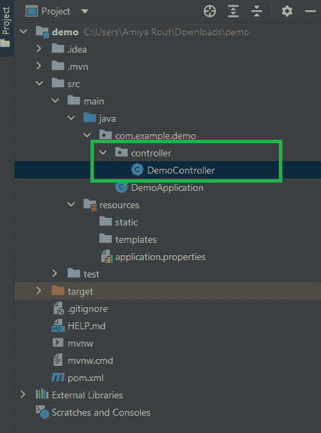
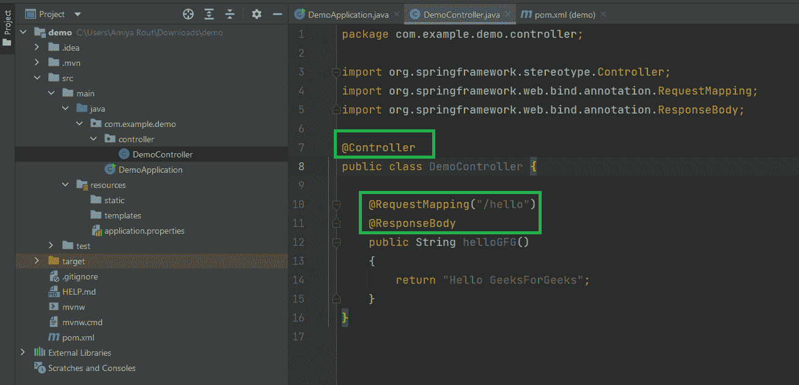
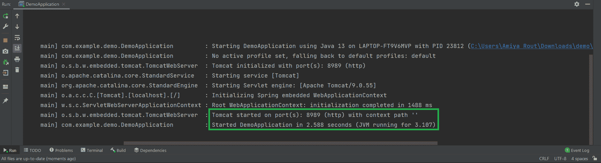
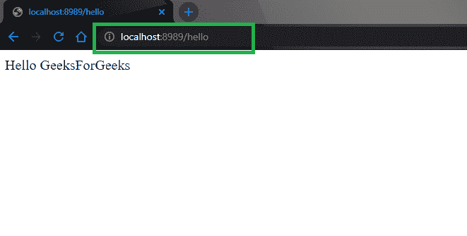

# 弹簧@控制器注释示例

> 原文:[https://www . geesforgeks . org/spring-controller-annotation-with-example/](https://www.geeksforgeeks.org/spring-controller-annotation-with-example/)

Spring 是最流行的 Java EE 框架之一。它是一个开源的轻量级框架，允许 Java EE 7 开发人员构建简单、可靠和可扩展的企业应用程序。这个框架主要侧重于提供各种方法来帮助您管理业务对象。与传统的 Java 框架和应用程序编程接口(如 Java 数据库连接(JDBC)、JavaServer Pages(JSP)和 Java Servlet)相比，它使网络应用程序的开发变得更加容易。这个框架使用各种新技术来开发企业应用程序，例如面向方面编程(AOP)、普通旧 Java 对象(POJO)和依赖注入(DI)。现在谈谈弹簧注释

> **Spring Annotations** 是一种提供程序相关数据的元数据形式。注释用于提供关于程序的补充信息。它对他们注释的代码的操作没有直接影响。它不会改变编译程序的动作。

Spring Framework 中有很多注释。下面列出了一些 Spring 框架注释，我们将在这里讨论最重要的注释之一，即**@控制器注释**

*   @必选
*   @自动连线
*   @配置
*   @组件扫描
*   @豆
*   @组件
*   **@控制器**
*   @服务
*   @储存库等。

### @控制器注释

Spring @Controller 标注也是 **@Component** 标注的专门化。@Controller 注释表示特定的类充当了**控制器**的角色。Spring Controller 注释通常与基于 **@RequestMapping** 注释的带注释的处理程序方法结合使用。它只能应用于类。它用于将一个类标记为 web 请求处理程序。主要用于 [Spring MVC](https://www.geeksforgeeks.org/spring-mvc-using-java-based-configuration/) 应用。这个注释充当被注释类的原型，指示它的角色。调度程序扫描这些带注释的类以寻找映射的方法，并检测 **@RequestMapping** 注释。让我们通过例子来理解所有这些。

**程序**

1.  创建一个简单的 Spring Boot 项目
2.  在你的 [pom.xml](https://www.geeksforgeeks.org/page-object-model-pom/) 文件中添加 spring-web 依赖关系
3.  创建一个包并将其命名为“控制器”
4.  在包中创建一个类
5.  在 DemoApplication.java 文件中运行我们的应用程序

**步骤 1:** 创建一个简单的 Spring Boot 项目

参考本文[在 Eclipse IDE](https://www.geeksforgeeks.org/how-to-create-and-setup-spring-boot-project-in-eclipse-ide/) 中创建和设置 Spring Boot 项目，并创建一个简单的 spring boot 项目。

**步骤 2:** 在您的 [pom.xml](https://www.geeksforgeeks.org/page-object-model-pom/) 文件中添加 spring-web 依赖项。转到项目内部的 pom.xml 文件，并添加以下 spring-web 依赖项。

## 可扩展标记语言

```java
<dependency>
    <groupId>org.springframework.boot</groupId>
    <artifactId>spring-boot-starter-web</artifactId>
</dependency>
```

**步骤 3:** 在您的项目中创建一个包，并将该包命名为“控制器”。在控制器包中创建一个类，并将其命名为**演示控制器**。这将是我们最终的项目结构。



**例**

## Java 语言(一种计算机语言，尤用于创建网站)

```java
// Java Program to Illustrate DemoController File

// Importing package in this code module
package com.example.demo.controller;
// Importing required classes
import org.springframework.stereotype.Controller;
import org.springframework.web.bind.annotation.RequestMapping;
import org.springframework.web.bind.annotation.ResponseBody;

// Annotation
@Controller
// Main class
public class DemoController {

    @RequestMapping("/hello")
    @ResponseBody

    // Method
    public String helloGFG()
    {
        return "Hello GeeksForGeeks";
    }
}
```

我们已经在我们的控制器层中使用了下面的注释。在这个例子中，URI 路径是***/你好*** 。

*   **@控制器:**用于指定控制器。
*   **@RequestMapping:** 这是用来映射到 Spring MVC 控制器的方法。
*   **@ResponseBody:** 用于将 HTTP 响应体与返回类型中的域对象绑定。



**第四步:**现在，我们的控制器准备好了。让我们在**DemoApplication.java**文件中运行应用程序。没有必要更改**DemoApplication.java**文件中的任何内容。

**例**

## Java 语言(一种计算机语言，尤用于创建网站)

```java
// Java Program to Illustrate DemoApplication File

// Importing package in this code module
package com.example.demo;
// Importing required classes
import org.springframework.boot.SpringApplication;
import org.springframework.boot.autoconfigure.SpringBootApplication;

// Annotation
@SpringBootApplication

// Main class
public class DemoApplication {

    // Main driver method
    public static void main(String[] args)
    {

        SpringApplication.run(DemoApplication.class, args);
    }
}
```

**输出:**



> **提示:**试试下面媒体中描绘的 Tomcat URL，它运行在 ***上 http://localhost:8989/hello***

