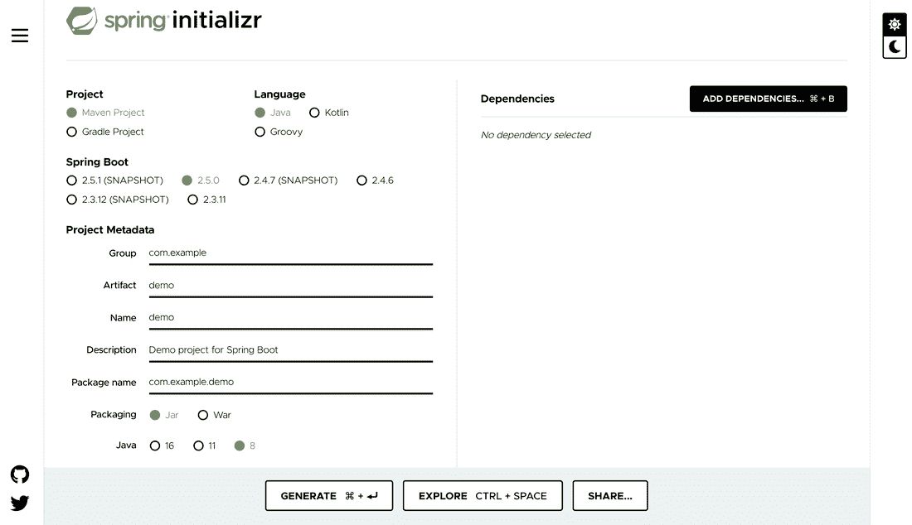
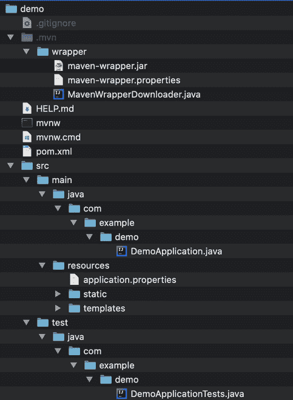
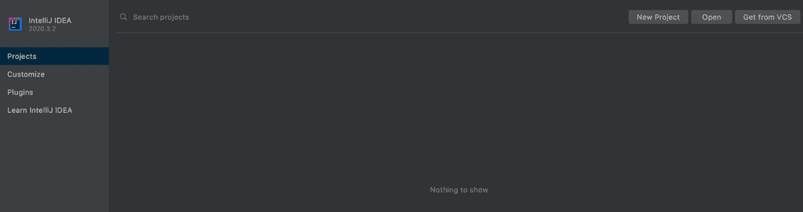
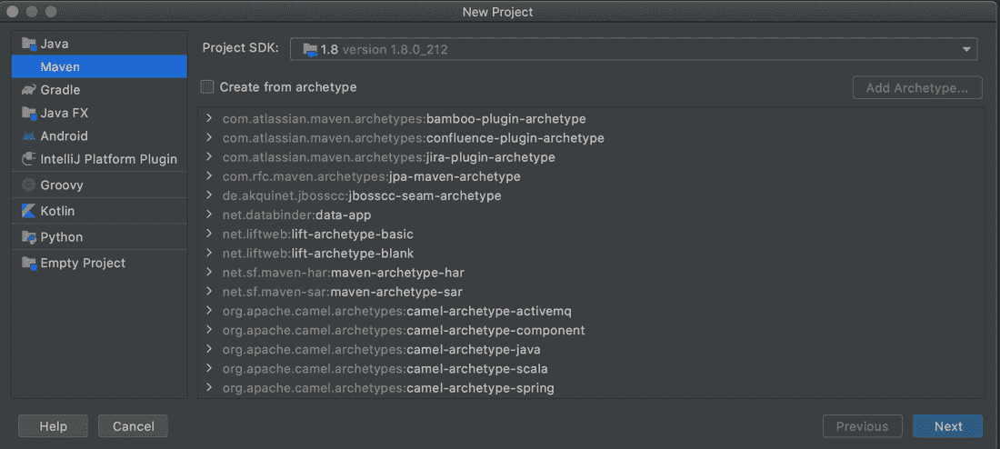
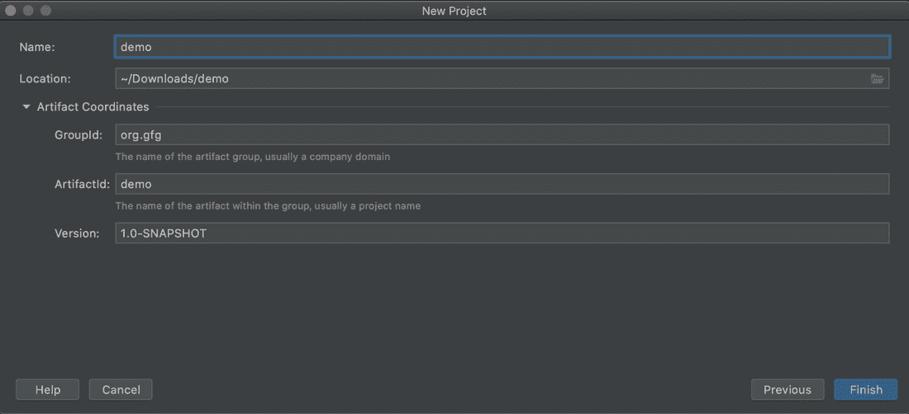
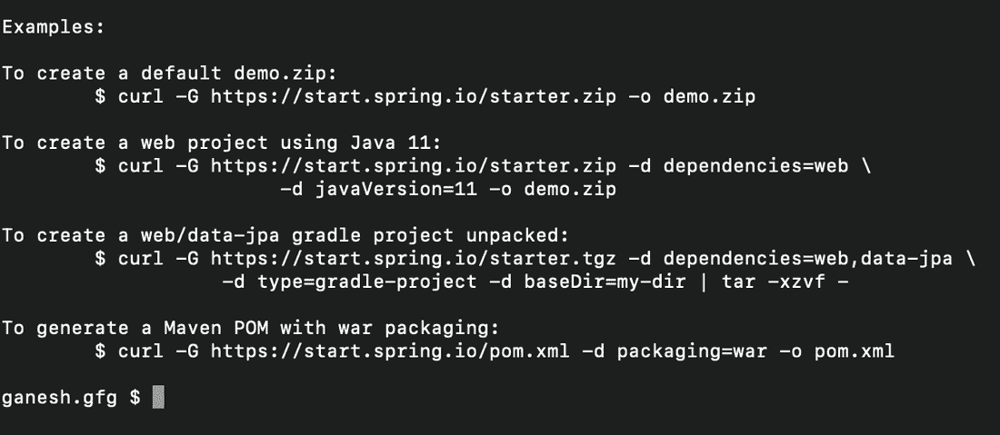

# 春季初始化 zr

> 哎哎哎:# t0]https://www . geeksforgeeks . org/spring-initialize/

Spring Initializr 是一个基于网络的工具，可以生成 [Spring Boot](https://www.geeksforgeeks.org/introduction-to-spring-boot/) 项目结构。initializr 中的拼写错误是受 [initializr](http://www.initializr.com/) 的启发。现代 ide 集成了 Spring Initializr，提供了初始项目结构。开发人员很容易为他们的项目选择必要的配置。Spring Initializr 工具负责任何基于 Spring 的项目的以下配置。

*   构建工具( [Maven](https://www.geeksforgeeks.org/introduction-apache-maven-build-automation-tool-java-projects/) 或 [Gradle](https://www.geeksforgeeks.org/gradle-build-tool-i-modern-open-source-build-automation/) )来构建应用程序。
*   Spring Boot 版本(依赖项是根据版本添加的)。
*   项目所需的依赖项。
*   语言及其版本。
*   项目元数据，如名称、打包(Jar 或 War)、包名等。

根据提供的所有信息，spring Initializr 生成 spring 项目结构。我们可以从网络、集成开发环境或命令行使用 Spring Initializr。

**spring initialize web**

让我们学习如何使用 Spring Initializr web UI 来生成 Spring Boot 项目，该项目的前一步是导航到 [start.spring.io](https://start.spring.io/) 来获取它。将弹出的窗口如下所示:



Spring Initializr 用户界面有以下选项，

*   **项目:**使用这个可以创建 [Maven 或者 Gradle](https://www.geeksforgeeks.org/difference-between-gradle-and-maven/) 项目即；Maven 或 Gradle 可以用作构建工具。默认选项是 Maven 项目。整个教程中都使用了 Maven 项目。
*   **语言:** Spring Initializr 提供 [Java](https://www.geeksforgeeks.org/java/) 、 [Kotlin](https://www.geeksforgeeks.org/kotlin-programming-language/) 和 Groovy 作为项目的编程语言。Java 是默认选项。
*   **Spring Boot 版:**使用这个可以选择他们项目的 Spring Boot 版。Spring Boot 最新版本是 2.5.0。快照版本正在开发中，不稳定。
*   **项目依赖关系:**依赖关系是我们可以添加到项目中的工件。我正在选择网络依赖。
*   **项目元数据:**是关于项目的信息。

元数据中的信息包括以下要点:

**组 ID:** 是项目组的 ID。

*   工件:它是应用程序的名称。
*   名称应用程序名称。
*   描述:关于项目。
*   包名:是组和工件标识的组合。
*   包装:可以选择使用这个罐子或战争包装

**生成:**点击生成选项，项目以 zip 格式下载。zip 文件可以解压缩，项目可以加载到集成开发环境中。

**Explore:** 这允许查看生成的项目并对其进行更改。

**项目结构:**Spring Boot 项目如下图:



方法:

弹簧初始化可以通过以下两种方式实现:

1.  使用集成开发环境
2.  使用

**方法 1:** 使用 IDE 的 Spring Initializr

Spring Initializr 受到各种 ide 的支持，如 Spring 工具套件(STS)、IntelliJ IDEA Ultimate 和 IntelliJ IDEA 社区版(有限配置选项)、Netbeans 和 VSCode。

如果使用的是 Netbeans，可以在 IDE 中添加 [Spring Initializr 插件](https://github.com/AlexFalappa/nb-springboot)。

如果使用的是 vscode，可以在 VSCode 中添加 [vscode-spring-initializr 插件](https://github.com/microsoft/vscode-spring-initializr)。

智能社区版用法:

**应遵循的步骤:**

1.  Open IntelliJ 此 IDE。
2.  单击新建项目。
3.  选择马文项目和 Java JDK 主页路径
4.  输入项目元数据详细信息
5.  单击“完成”按钮。

让我们形象地描述上述步骤，以获得更公平的理解

*   Open IntelliJ 此 IDE。
*   单击新建项目。



*   选择 Maven 项目和 Java JDK 主页路径。



*   输入项目元数据详细信息，如名称、组标识、人工标识。



*   单击“完成”按钮。

> **注意:**如果你使用的是 IntelliJ 至尊版，步骤可在[这里](https://www.jetbrains.com/help/idea/new-project-wizard.html#spring-init)获得。

**方法 2:** 使用命令行初始化 Spring Initializr

很多开发人员喜欢从命令行做事情。对于他们来说，有一个选项可以使用命令行实用程序(如 cURL 或 HTTPie)来创建 Spring 项目。要使用 cURL 或 HTTPie，必须在使用前安装它们。

```
curl https://start.spring.io
```

上面的命令将给出如何使用 curl 创建项目的完整说明。



让我们假设您想要使用 web 和开发人员工具依赖项生成一个基于 Spring Boot 1.5.2.RELEASE 的 **demo.zip** 项目(记住，这两个 id 显示在服务的功能中):

```
$ curl https://start.spring.io/starter.zip -d dependencies=web,devtools \
           -d bootVersion=1.5.2.RELEASE -o demo.zip.zip
```

也可以使用 HTTP 命令生成完全相同的项目:

```
$ http https://start.spring.io/starter.zip -d dependencies==web,devtools \
           -d bootVersion==1.5.1.RELEASE -o demo.zip
```

> **注意:**除了所有这些，Spring Initializr 团队还为创建基于 JVM 的项目提供了可扩展的 API。此外，可以为自己的项目创建自己的 Spring Initializr 实例。它还为项目提供了以元数据模型表示的各种选项。元数据模型允许我们配置 JVM 和平台版本等支持的依赖项列表。