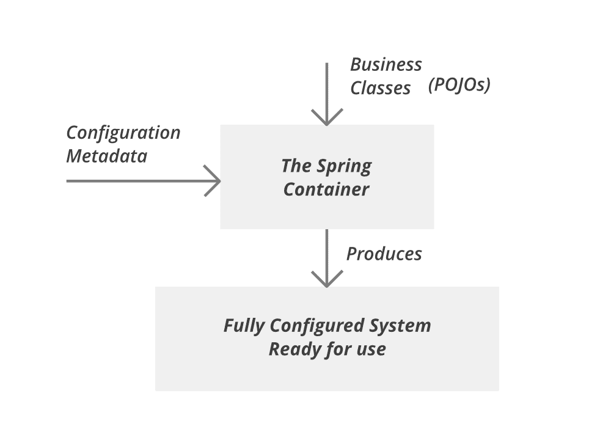

# 弹簧–IoC 容器

> 原文:[https://www.geeksforgeeks.org/spring-ioc-container/](https://www.geeksforgeeks.org/spring-ioc-container/)

Spring 框架可以看作是子框架的集合，也称为层，例如 Spring AOP、Spring ORM、Spring Web Flow 和 Spring Web MVC。您可以在构建网络应用程序时单独使用这些模块中的任何一个。这些模块也可以组合在一起，以在网络应用中提供更好的功能。

在深入到 Spring to container 之前，请记住 Spring 提供了两种类型的容器，即:

1.  豆工厂容器
2.  ApplicationContext 容器

Spring 框架的特性，如 IoC、AOP 和事务管理，使其在框架列表中独一无二。Spring 框架的一些最重要的特性如下:

1.  **IoC 容器**
2.  数据访问框架
3.  弹簧 MVC
4.  事务管理
5.  春季网络服务
6.  JDBC 抽象层
7.  Spring 测试上下文框架

Spring IoC 容器是 Spring 框架的核心。它创建对象，配置和组装它们的依赖关系，管理它们的整个生命周期。容器使用依赖注入来管理组成应用程序的组件。它从配置文件(XML)或 Java 代码或 Java 注释以及 [Java POJO 类](https://www.geeksforgeeks.org/pojo-vs-java-beans/)中获取关于对象的信息。这些对象被称为 Beans。由于 Java 对象及其生命周期的控制不是由开发人员完成的，因此得名**控制反转**。

> **注意:** Spring IoC 一般直接引用核心容器，它使用 DI/DC 模式在运行时隐式提供类中的对象引用。IoC 容器包含处理应用程序对象配置管理的汇编代码。

下图描述了容器如何利用配置元数据和 Java [POJO 类](https://www.geeksforgeeks.org/pojo-vs-java-beans/)来管理 beans。

因此，最后让我们讨论一下 BeanFactory 和 ApplicationContext 之间的一些主要区别，以便对 spring IoC 容器有一个清晰的剖面理解，如下表所示:

<figure class="table">T46】国际化 T52】是

是

T56】T57T64】T65】是

| 

特性

 | 

Bean factory

 | 

application context

 |
| --- | --- | --- |
| Comment support | No
T26 实例化/接线 | 是 | 是 |
| no | Enterprise service | T61] No |
| Loading mechanism | load on demand | Rush loading |
| 自动 bean factorypostprocessor注册 | 否 | 是 |

</figure>