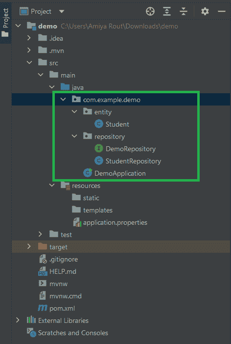
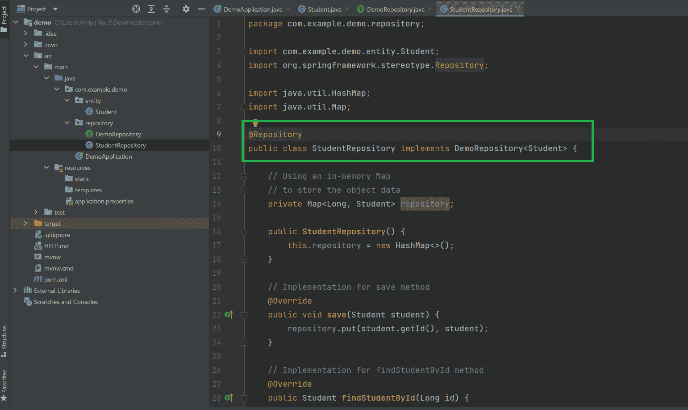
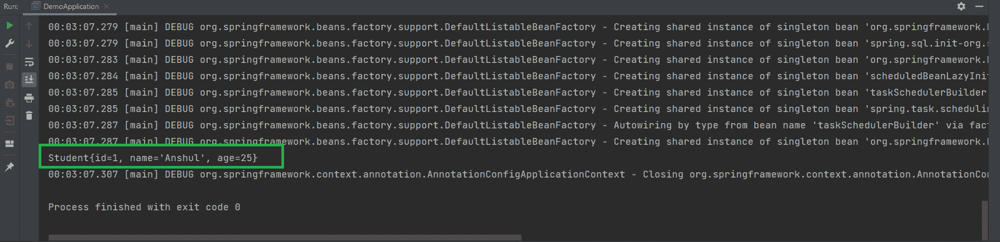

# Spring @Repository 注释示例

> 原文:[https://www . geesforgeks . org/spring-repository-annotation-with-example/](https://www.geeksforgeeks.org/spring-repository-annotation-with-example/)

Spring 是最流行的 Java EE 框架之一。它是一个开源的轻量级框架，允许 Java EE 7 开发人员构建简单、可靠和可扩展的企业应用程序。这个框架主要侧重于提供各种方法来帮助您管理业务对象。与传统的 Java 框架和应用程序编程接口(如 Java 数据库连接(JDBC)、JavaServer Pages(JSP)和 Java Servlet)相比，它使网络应用程序的开发变得更加容易。这个框架使用各种新技术来开发企业应用程序，例如面向方面编程(AOP)、普通旧 Java 对象(POJO)和依赖注入(DI)。现在谈谈弹簧注释

> **Spring Annotations** 是一种提供程序相关数据的元数据形式。注释用于提供关于程序的补充信息。它对他们注释的代码的操作没有直接影响。它不会改变编译程序的动作。

Spring Framework 中有很多注释。下面列出了一些 Spring 框架注释，我们将在这里讨论一个最重要的注释，即**@存储库注释**

*   @必选
*   @自动连线
*   @配置
*   @组件扫描
*   @豆
*   @组件
*   @控制器
*   @服务
*   @储存库等。

### @存储库注释

@Repository Annotation 是 **@Component** annotation 的专门化，用来表示类提供了对对象进行存储、检索、更新、删除和搜索操作的机制。尽管它是@Component 注释的专门化，所以 Spring Repository 类是由 Spring 框架通过类路径扫描自动检测的。这个注释是一个通用的原型注释，非常接近于 [DAO 模式](https://www.geeksforgeeks.org/data-access-object-pattern/)，其中 DAO 类负责在数据库表上提供 CRUD 操作。

### 例子

**步骤 1:** 创建一个简单的 Spring Boot 项目

参考本文[在 Eclipse IDE](https://www.geeksforgeeks.org/how-to-create-and-setup-spring-boot-project-in-eclipse-ide/) 中创建和设置 Spring Boot 项目，并创建一个简单的 spring boot 项目。

**步骤 2:** 在您的 [pom.xml](https://www.geeksforgeeks.org/page-object-model-pom/) 文件中添加 spring 上下文依赖。转到项目内部的 pom.xml 文件，并添加以下 spring 上下文依赖项。

## 可扩展标记语言

```
<dependency>
    <groupId>org.springframework</groupId>
    <artifactId>spring-context</artifactId>
    <version>5.3.13</version>
</dependency>
```

**步骤 3:** 在您的项目中创建两个包，并将包命名为“实体”和“存储库”。在实体中，包创建一个类名为 Student。在存储库中，这个包创建了一个名为 DemoRepository 的[通用接口](https://www.geeksforgeeks.org/generic-constructors-and-interfaces-in-java/)，以及一个名为 StudentRepository 的类名。这将是我们最终的项目结构。



**步骤 4:** 创建一个实体类，我们将为其实现一个 spring 存储库。这里我们的实体类是学生。以下是**Student.java**文件的代码。这是 java 中一个简单的 **POJO** (普通旧 Java 对象)类。

## Java 语言(一种计算机语言，尤用于创建网站)

```
package com.example.demo.entity;

public class Student {

    private Long id;
    private String name;
    private int age;

    public Student(Long id, String name, int age) {
        this.id = id;
        this.name = name;
        this.age = age;
    }

    public Long getId() {
        return id;
    }

    public void setId(Long id) {
        this.id = id;
    }

    public String getName() {
        return name;
    }

    public void setName(String name) {
        this.name = name;
    }

    public int getAge() {
        return age;
    }

    public void setAge(int age) {
        this.age = age;
    }

    @Override
    public String toString() {
        return "Student{" +
                "id=" + id +
                ", name='" + name + '\'' +
                ", age=" + age +
                '}';
    }
}
```

**步骤 5:** 在实现存储库类之前，我们已经创建了一个通用的 DemoRepository 接口，为我们的存储库类提供要实现的契约。以下是**DemoRepository.java**文件的代码。

## Java 语言(一种计算机语言，尤用于创建网站)

```
// Java Program to illustrate DemoRepository File

package com.example.demo.repository;

public interface DemoRepository<T> {

    // Save method
    public void save(T t);

    // Find a student by its id
    public T findStudentById(Long id);

}
```

**第 6 步:**现在我们来看看我们的 StudentRepository 类实现。

## Java 语言(一种计算机语言，尤用于创建网站)

```
// Java Program to illustrate StudentRepository File

package com.example.demo.repository;

import com.example.demo.entity.Student;
import org.springframework.stereotype.Repository;

import java.util.HashMap;
import java.util.Map;

@Repository
public class StudentRepository implements DemoRepository<Student> {

    // Using an in-memory Map
    // to store the object data
    private Map<Long, Student> repository;

    public StudentRepository() {
        this.repository = new HashMap<>();
    }

    // Implementation for save method
    @Override
    public void save(Student student) {
        repository.put(student.getId(), student);
    }

    // Implementation for findStudentById method
    @Override
    public Student findStudentById(Long id) {
        return repository.get(id);
    }
}
```

在这个**StudentRepository.java**文件中，您可以注意到我们添加了@Repository 注释，以表明该类提供了对对象进行存储、检索、更新、删除和搜索操作的机制。



> **注意**:这里我们使用了内存中的[地图](https://www.geeksforgeeks.org/map-interface-java-examples/)来存储对象数据，你也可以使用任何其他机制。在现实世界中，我们使用数据库来存储对象数据。

**第 7 步:**弹簧库测试

现在我们的 Spring 存储库已经准备好了，让我们测试一下。转到**DemoApplication.java**文件，参考下面的代码。

## Java 语言(一种计算机语言，尤用于创建网站)

```
package com.example.demo;

import com.example.demo.entity.Student;
import com.example.demo.repository.StudentRepository;
import org.springframework.boot.autoconfigure.SpringBootApplication;
import org.springframework.context.annotation.AnnotationConfigApplicationContext;

@SpringBootApplication
public class DemoApplication {

    public static void main(String[] args) {

        AnnotationConfigApplicationContext context = new AnnotationConfigApplicationContext();
        context.scan("com.example.demo");
        context.refresh();

        StudentRepository repository = context.getBean(StudentRepository.class);

        // testing the store method
        repository.save(new Student(1L, "Anshul", 25));
        repository.save(new Student(2L, "Mayank", 23));

        // testing the retrieve method
        Student student = repository.findStudentById(1L);
        System.out.println(student);

        // close the spring context
        context.close();
    }

}
```

**输出:**最后，运行您的应用程序，您应该会得到如下所示的输出:

