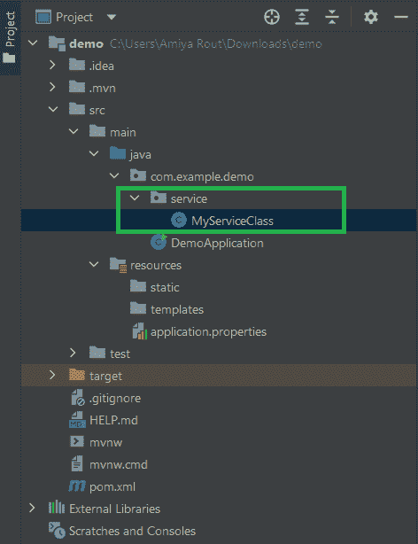
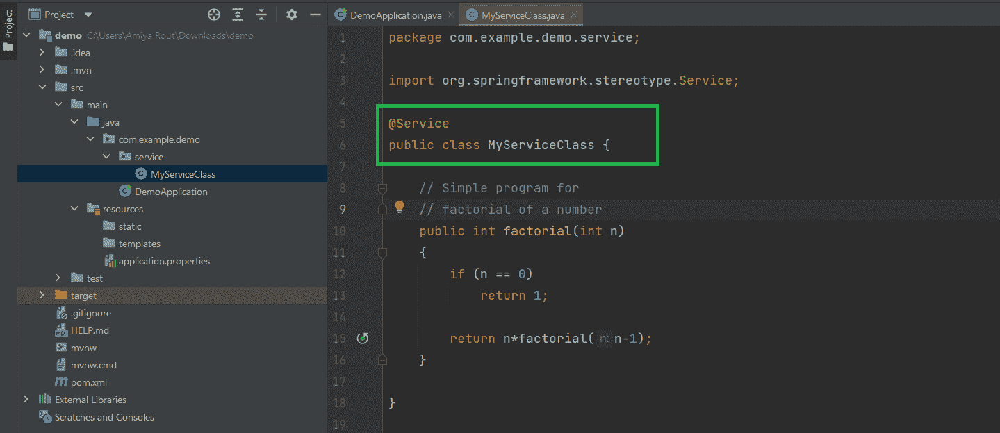
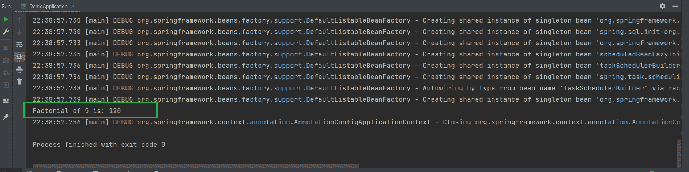

# 带示例的 Spring @Service 注释

> 原文:[https://www . geesforgeks . org/spring-service-annotation-with-example/](https://www.geeksforgeeks.org/spring-service-annotation-with-example/)

[Spring](https://www.geeksforgeeks.org/introduction-to-spring-framework/) 是目前最流行的 Java EE 框架之一。它是一个开源的轻量级框架，允许 Java EE 7 开发人员构建简单、可靠和可扩展的企业应用程序。这个框架主要侧重于提供各种方法来帮助您管理业务对象。与传统的 Java 框架和应用程序编程接口(如 Java 数据库连接(JDBC)、JavaServer Pages(JSP)和 Java Servlet)相比，它使网络应用程序的开发变得更加容易。这个框架使用各种新技术来开发企业应用程序，例如面向方面编程(AOP)、普通旧 Java 对象(POJO)和依赖注入(DI)。现在谈谈弹簧注释

> **Spring Annotations** 是一种提供程序相关数据的元数据形式。注释用于提供关于程序的补充信息。它对他们注释的代码的操作没有直接影响。它不会改变编译程序的动作。

Spring Framework 中有很多注释。下面列出了一些 Spring 框架注释，我们将在这里讨论最重要的注释之一 **@ServiceAnnotation**

*   @必选
*   @自动连线
*   @配置
*   @组件扫描
*   @豆
*   @组件
*   @控制器
*   **@服务**
*   @储存库等。

**@服务注释**

在应用程序中，业务逻辑驻留在服务层中，因此我们使用**@服务注释**来指示一个类属于该层。它也是**@组件注释**的专门化，就像**@存储库注释**一样。@Service Annotation 最重要的一点是它只能应用于类。它用于将类标记为服务提供者。因此，总体而言@Service 注释与提供一些业务功能的类一起使用。当使用基于注释的配置和类路径扫描时，Spring context 将自动检测这些类。

**程序**

1.  创建一个简单的 Spring Boot 项目
2.  在您的 [pom.xml](https://www.geeksforgeeks.org/page-object-model-pom/) 文件中添加 spring 上下文依赖。
3.  创建一个包并将该包命名为“服务”。
4.  测试 spring 存储库

**步骤 1:** 创建一个简单的 Spring Boot 项目

参考本文[在 Eclipse IDE](https://www.geeksforgeeks.org/how-to-create-and-setup-spring-boot-project-in-eclipse-ide/) 中创建和设置 Spring Boot 项目，并创建一个简单的 spring boot 项目。

**步骤 2:** 在您的 [pom.xml](https://www.geeksforgeeks.org/page-object-model-pom/) 文件中添加 spring 上下文依赖。转到项目内部的 pom.xml 文件，并添加以下 spring 上下文依赖项。

## 可扩展标记语言

```java
<dependency>
    <groupId>org.springframework</groupId>
    <artifactId>spring-context</artifactId>
    <version>5.3.13</version>
</dependency>
```

**步骤 3:** 在您的项目中创建一个包，并将该包命名为“服务”。在服务中，包创建一个类，并将其命名为**我的服务类**。这将是我们最终的项目结构。



**例**

## Java 语言(一种计算机语言，尤用于创建网站)

```java
// Java Program to Illustrate MyServiceClass

// Importing package module to code module
package com.example.demo.service;
// Importing required classes
import org.springframework.stereotype.Service;

// Annotation
@Service

// Class
public class MyServiceClass {

    // Method
    // To compute factorial
    public int factorial(int n)
    {
        // Base case
        if (n == 0)
            return 1;

        return n * factorial(n - 1);
    }
}
```

在这段代码中，请注意这是一个简单的 java 类，它提供了计算一个数的阶乘的功能。所以我们可以称之为服务提供商。我们用@Service 注释对它进行了注释，这样 spring-context 就可以自动检测它，并且我们可以从上下文中获取它的实例。



**第 4 步:**弹簧库测试

现在我们的 Spring 存储库已经准备好了，让我们测试一下。转到**DemoApplication.java**文件，参考下面的代码。

**例**

## Java 语言(一种计算机语言，尤用于创建网站)

```java
// Java Program to Illustrate DemoApplication

// Importing package module to code fragment
package com.example.demo;
// Importing requirede classes
import com.example.demo.service.MyServiceClass;
import org.springframework.boot.autoconfigure.SpringBootApplication;
import org.springframework.context.annotation.AnnotationConfigApplicationContext;

// Annotation
@SpringBootApplication

// Main class
public class DemoApplication {

    // MAin driver method
    public static void main(String[] args)
    {

        AnnotationConfigApplicationContext context
            = new AnnotationConfigApplicationContext();
        context.scan("com.example.demo");

        context.refresh();

        MyServiceClass myServiceClass
            = context.getBean(MyServiceClass.class);

        // Testing the factorial method
        int factorialOf5 = myServiceClass.factorial(5);
        System.out.println("Factorial of 5 is: "
                           + factorialOf5);

        // Closing the spring context
        // using close() method
        context.close();
    }
}
```

**输出:**



> **注意:**如果您没有使用@Service 注释，那么您将会遇到以下异常
> 
> 线程“main”中出现异常。org . spring framework . beans . factory . nosuchbeandinitionexception:没有类型为“com . example . demo . service . my service class”的合格 bean 可用
> 
> at . org . spring framework . beans . factory . support . defaultlistablebeantfactory . getbean(defaultlistablebeantfactory . Java:351)
> 
> at . org . spring framework . beans . factory . support . defaultlistablebeantfactory . getbean(defaultlistablebeantfactory . Java:342)
> 
> at org . springframework . context . support . abstractapplicationcontext . getbean(abstractapplicationcontext . Java:1172)
> 
> at . com . example . demo . DeMoapplication . main(DeMoapplication . Java:17)