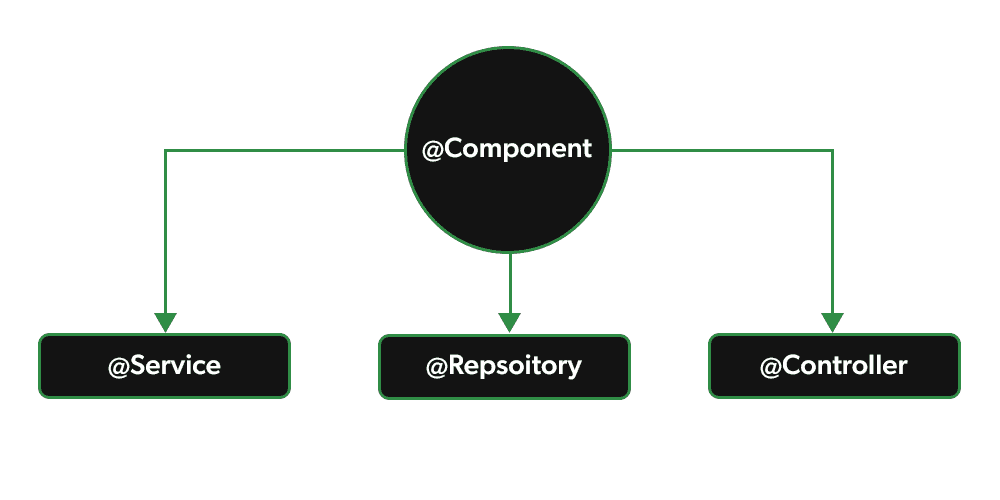

# 春季–刻板印象注释

> 原文:[https://www . geesforgeks . org/spring-刻板印象-注释/](https://www.geeksforgeeks.org/spring-stereotype-annotations/)

Spring 是最流行的 Java EE 框架之一。它是一个开源的轻量级框架，允许 Java EE 7 开发人员构建简单、可靠和可扩展的企业应用程序。这个框架主要侧重于提供各种方法来帮助您管理业务对象。现在谈谈 Spring Annotation，**Spring Annotation 是一种元数据的形式，它提供了关于一个程序的数据。注释用于提供关于程序的补充信息。它对他们注释的代码的操作没有直接影响。它不会改变编译程序的动作。**

### 原型注释

Spring Framework 为我们提供了一些特殊的注释。这些注释用于在应用程序上下文中自动创建 Spring beans。@Component 注释是主要的原型注释。有一些来自*@组件*的原型元注释，它们是

1.  *@服务*
2.  *@储存库*
3.  *@控制器*

**1: @Service:** 我们用@Service 指定一个类，以表示它们持有业务逻辑。除了在服务层中使用之外，这个注释没有任何其他特殊用途。实用程序类可以标记为服务类。

**2: @Repository:** 我们用@Repository 指定一个类来表示它们正在处理 **CRUD 操作**，通常，它与 DAO(数据访问对象)或处理数据库表的 Repository 实现一起使用。

**3: @Controller:** 我们用@Controller 指定一个类，表示它们是前端控制器，负责处理用户请求并返回适当的响应。它主要用于 REST 网络服务。

> 所以春季的原型标注是**@组件、@服务、@存储库、@控制器**。



**@组件标注**

@Component 是类级注释。它用于将一个类表示为组件。我们可以在整个应用程序中使用@Component 来将 beans 标记为 Spring 的托管组件。组件负责某些操作。

**插图:**让我们创建一个非常简单的 Spring 启动应用程序，展示 Spring Component 注释的使用，以及 Spring 如何通过基于注释的配置和类路径扫描来自动检测它。

**步骤 1:** 创建一个简单的 Spring Boot 项目。极客，你需要创建和设置 Spring Boot 项目的先决条件

参考本文[在 Eclipse IDE](https://www.geeksforgeeks.org/how-to-create-and-setup-spring-boot-project-in-eclipse-ide/) 中创建和设置 Spring Boot 项目，并创建一个简单的 spring boot 项目。

**步骤 2:** 在您的 pom.xml 文件中添加 spring 上下文依赖。转到项目内部的 pom.xml 文件，并添加以下 spring 上下文依赖项。

## 可扩展标记语言

```java
<dependency>
    <groupId>org.springframework</groupId>
    <artifactId>spring-context</artifactId>
    <version>5.3.13</version>
</dependency>
```

**步骤 3:** 创建一个简单的组件类

转到 ***src >主> java >你的包名>右键>新建> Java 类*** 创建你的组件类并用 **@Component** 标注标记。

## Java 语言(一种计算机语言，尤用于创建网站)

```java
// Java Program to Illustrate Component class
package com.example.demo;

import org.springframework.stereotype.Component;

// Annotation
@Component

// Class
public class ComponentDemo {

    // Method
    public void demoFunction()
    {

        // Print statement when method is called
        System.out.println("Hello GeeksForGeeks");
    }
}
```

**步骤 4:** 创建基于注释的弹簧上下文

现在转到您的应用程序(@ SpringBootApplication)文件，在这个文件中创建一个基于注释的 spring 上下文，并从中获取组件演示 bean。

## Java 语言(一种计算机语言，尤用于创建网站)

```java
// Java Program to Illustrate Application class

// Importing package here
package com.example.demo;
// Importing required classes
import org.springframework.boot.autoconfigure.SpringBootApplication;
import org.springframework.context.annotation.AnnotationConfigApplicationContext;

// Annotation
@SpringBootApplication

// Class
public class DemoApplication {

    // Main driver method
    public static void main(String[] args)
    {

        // Annotation based spring context
        AnnotationConfigApplicationContext context = new AnnotationConfigApplicationContext();
        context.scan("com.example.demo");
        context.refresh();

        // Getting the Bean from the component class
        ComponentDemo componentDemo = context.getBean(ComponentDemo.class);
        componentDemo.demoFunction();

        // Closing the context
        // using close() method
        context.close();
    }
}
```

**输出:**


所以你可以看到@Component 注释的力量，我们不需要做任何事情来将我们的组件注入到 spring 上下文中。

### **@服务**标注

在应用程序中，业务逻辑驻留在服务层中，因此我们使用**@服务注释**来指示一个类属于该层。它也是**@组件注释**的专门化，就像**@存储库注释**一样。@Service Annotation 最重要的一点是它只能应用于类。它用于将类标记为服务提供者。因此，总体而言@Service 注释与提供一些业务功能的类一起使用。当使用基于注释的配置和类路径扫描时，Spring context 将自动检测这些类。

**例**

**步骤 1:** 创建一个简单的 Spring Boot 项目

参考本文[在 Eclipse IDE](https://www.geeksforgeeks.org/how-to-create-and-setup-spring-boot-project-in-eclipse-ide/) 中创建和设置 Spring Boot 项目，并创建一个简单的 spring boot 项目。

**步骤 2:** 在您的 [pom.xml](https://www.geeksforgeeks.org/page-object-model-pom/) 文件中添加 spring 上下文依赖。转到项目内部的 pom.xml 文件，并添加以下 spring 上下文依赖项。

## 可扩展标记语言

```java
<dependency>
    <groupId>org.springframework</groupId>
    <artifactId>spring-context</artifactId>
    <version>5.3.13</version>
</dependency>
```

**步骤 3:** 在您的项目中创建一个包，并将该包命名为“服务”。在服务包中创建一个类，并将其命名为**我的服务类**。这将是我们最终的项目结构。


以下是**MyServiceClass.java**文件的代码。

## Java 语言(一种计算机语言，尤用于创建网站)

```java
package com.example.demo.service;

import org.springframework.stereotype.Service;

@Service
public class MyServiceClass {

    // Simple program for
    // factorial of a number
    public int factorial(int n)
    {
        if (n == 0)
            return 1;

        return n*factorial(n-1);
    }

}
```

在这段代码中，请注意这是一个简单的 java 类，它提供了计算一个数的阶乘的功能。所以我们可以称之为服务提供商。我们用@Service 注释对它进行了注释，这样 spring-context 就可以自动检测它，并且我们可以从上下文中获取它的实例。


**第 4 步:**弹簧库测试

现在我们的 Spring 存储库已经准备好了，让我们测试一下。转到**DemoApplication.java**文件，参考下面的代码。

## Java 语言(一种计算机语言，尤用于创建网站)

```java
package com.example.demo;

import com.example.demo.service.MyServiceClass;
import org.springframework.boot.autoconfigure.SpringBootApplication;
import org.springframework.context.annotation.AnnotationConfigApplicationContext;

@SpringBootApplication
public class DemoApplication {

    public static void main(String[] args) {

        AnnotationConfigApplicationContext context = new AnnotationConfigApplicationContext();
        context.scan("com.example.demo");
        context.refresh();

        MyServiceClass myServiceClass = context.getBean(MyServiceClass.class);

        // Testing the factorial method
        int factorialOf5 = myServiceClass.factorial(5);
        System.out.println("Factorial of 5 is: " + factorialOf5);

        // close the spring context
        context.close();
    }

}
```

**输出:**


### @存储库注释

@Repository Annotation 是 **@Component** annotation 的专门化，用来表示类提供了对对象进行存储、检索、更新、删除和搜索操作的机制。尽管它是@Component 注释的专门化，所以 Spring Repository 类是由 Spring 框架通过类路径扫描自动检测的。这个注释是一个通用的原型注释，非常接近于 [DAO 模式](https://www.geeksforgeeks.org/data-access-object-pattern/)，其中 DAO 类负责在数据库表上提供 CRUD 操作。

**例**

**步骤 1:** 创建一个简单的 Spring Boot 项目

参考本文[在 Eclipse IDE](https://www.geeksforgeeks.org/how-to-create-and-setup-spring-boot-project-in-eclipse-ide/) 中创建和设置 Spring Boot 项目，并创建一个简单的 spring boot 项目。

**步骤 2:** 在您的 [pom.xml](https://www.geeksforgeeks.org/page-object-model-pom/) 文件中添加 spring 上下文依赖。转到项目内部的 pom.xml 文件，并添加以下 spring 上下文依赖项。

## 可扩展标记语言

```java
<dependency>
    <groupId>org.springframework</groupId>
    <artifactId>spring-context</artifactId>
    <version>5.3.13</version>
</dependency>
```

**步骤 3:** 在您的项目中创建两个包，并将包命名为“实体”和“存储库”。在实体包中创建一个类名为 Student。在存储库中，打包创建一个[通用接口](https://www.geeksforgeeks.org/generic-constructors-and-interfaces-in-java/)将其命名为 DemoRepository，一个类将其命名为 StudentRepository。这将是我们最终的项目结构。


**步骤 4:** 创建一个实体类，我们将为其实现一个 spring 存储库。这里我们的实体类是学生。以下是**Student.java**文件的代码。这是 java 中一个简单的 **POJO** (普通旧 Java 对象)类。

## Java 语言(一种计算机语言，尤用于创建网站)

```java
package com.example.demo.entity;

public class Student {

    private Long id;
    private String name;
    private int age;

    public Student(Long id, String name, int age) {
        this.id = id;
        this.name = name;
        this.age = age;
    }

    public Long getId() {
        return id;
    }

    public void setId(Long id) {
        this.id = id;
    }

    public String getName() {
        return name;
    }

    public void setName(String name) {
        this.name = name;
    }

    public int getAge() {
        return age;
    }

    public void setAge(int age) {
        this.age = age;
    }

    @Override
    public String toString() {
        return "Student{" +
                "id=" + id +
                ", name='" + name + '\'' +
                ", age=" + age +
                '}';
    }
}
```

**步骤 5:** 在实现存储库类之前，我们已经创建了一个通用的 DemoRepository 接口，为我们的存储库类提供要实现的契约。以下是**DemoRepository.java**文件的代码。

## Java 语言(一种计算机语言，尤用于创建网站)

```java
// Java Program to illustrate DemoRepository File

package com.example.demo.repository;

public interface DemoRepository<T> {

    // Save method
    public void save(T t);

    // Find a student by its id
    public T findStudentById(Long id);

}
```