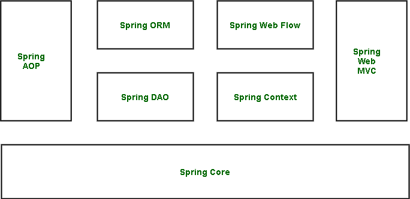
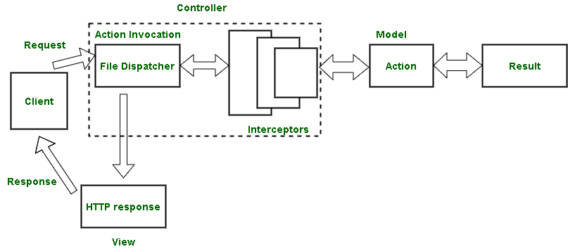

# Java 中的 Spring 与 Struts

> 原文:[https://www.geeksforgeeks.org/spring-vs-struts-in-java/](https://www.geeksforgeeks.org/spring-vs-struts-in-java/)

Struts 和 spring 都是用来开发 [Java web 应用的](https://www.geeksforgeeks.org/top-10-frameworks-for-web-applications/)。Struts 比 Spring 开发得更早，但是在 Struts 框架中有所增强，现在两者都被用来使用 Java 开发 web 应用程序。

[**春天框架**](https://www.geeksforgeeks.org/introduction-to-spring-framework/)【T4:

使用开源 spring 框架可以形成模块化、可移植和可测试的 Java 应用程序。它是开发网络应用程序的标准，可以在 J2EE 也就是 Java 到企业版应用程序上使用。这处理了基础设施，并使代码可重用和可测试，从而提高了它们的性能。它致力于控制 IoC 和依赖注入概念的反转。它也用于减少程序模块之间的耦合。

**春天框架架构**

[**Struts 框架**](https://www.geeksforgeeks.org/introduction-and-working-of-struts-web-framework/) **:**

Struts 是一个基于 MVC 架构的框架，代表模型视图和控制器架构。它是一个开源平台，用于开发企业版 web 应用程序。它有一个请求处理程序和一个响应处理程序，因为它基于处理用户请求的基于请求的框架。Struts 支持 AJAX、REST 和 SOAP。

**Struts 的工作:**

**Spring 与 Struts 架构的区别**

<figure class="table">

| 春天 | 支杆 |
| --- | --- |
| It is a lightweight framework. | It's a heavyweight framework. |
| It does not support tag libraries. | Support tag library instruction. |
| It has loosely coupled modules. | It has tightly coupled programming modules. |
| It is integrated with ORM Technologies, which requires less coding before and after the main logic. | Manual coding is supported. |
| It has a layered MVC architecture, including three layers for modeling, viewing and controller. | It has no hierarchical architecture. |

</figure>