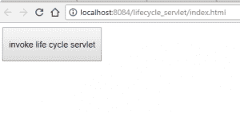
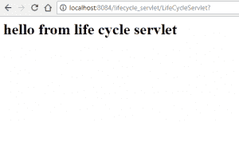

# 从第一个 Servlet 应用程序开始

> 原文:[https://www . geesforgeks . org/starting-first-servlet-application/](https://www.geeksforgeeks.org/starting-first-servlet-application/)

首先，让我们从一个简单的 Servlet 应用程序*开始，即* **生命周期**应用程序，它将演示 **init()** 、 **service()** 和 **destroy()** 方法的实现。

首先，重要的是要理解，如果我们正在开发任何 Servlet 应用程序，它将处理一些客户端的请求，因此，每当我们谈论 Servlet 时，我们需要开发一个 index.html 页面(也可以是任何其他名称)，它将请求一个特定的 Servlet 来处理客户端提出的请求(在本例中是 index.html 页面)。

简单来说，让我们首先描述开发**生命周期**应用程序的步骤:

*   创建 index.html 页面
*   创建**生命周期** Servlet
*   正在创建部署描述符

## 创建 index.html 页面

为了简单起见，这个页面只会有一个按钮**调用生命周期**。当你点击此按钮时，它将调用**生命周期服务集**(根据 web.xml 文件中的条目进行映射)。

```java
<html>
    <form action="LifeCycleServlet">
        <input type="submit" value="invoke life cycle servlet">
    </form>
</html>
```

Servlet 的名称在表单标签的动作属性中给出，点击按钮请求将被发送到该表单标签，在本例中为 **FirstServlet** 。

## 创建小服务程序(第一个小服务程序)

现在，是时候创建 LifeCycleServlet 了，它实现了 **init()** 、 **service()** 和 **destroy()** 方法来演示 Servlet 的生命周期。

```java
// importing the javax.servlet package
// importing java.io package for PrintWriter
import javax.servlet.*;
import java.io.*;

// now creating a servlet by implementing Servlet interface
public class LifeCycleServlet implements Servlet {

    ServletConfig config = null;

    // init method
    public void init(ServletConfig sc)
    {
        config = sc;
        System.out.println("in init");
    }

    // service method
    public void service(ServletRequest req, ServletResponse res)
        throws ServletException, IOException
    {
        res.setContenttype("text/html");
        PrintWriter pw = res.getWriter();
        pw.println("<h2>hello from life cycle servlet</h2>");
        System.out.println("in service");
    }

    // destroy method
    public void destroy()
    {
        System.out.println("in destroy");
    }
    public String getServletInfo()
    {
        return "LifeCycleServlet";
    }
    public ServletConfig getServletConfig()
    {
        return config; // getServletConfig
    }
}
```

## 正在创建部署描述符(web.xml)

正如在其他关于 **web.xml** 文件的帖子中所讨论的，我们将在本文中继续创建它。

```java
<?xml version="1.0" encoding="UTF=8"?>
<web-app>
    <servlet>
         <servlet-name>LifeCycleServlet</servlet-name>
         <servlet-class>LifeCycleServlet</servlet-class>
    </servlet>
    <servlet-mapping>
         <servlet-name>LifeCycleServlet</servlet-name>
         <url-pattern>/LifeCycleServlet</url-pattern>
    </servlet-mapping>
    <session-config>
         <session-timeout>
             30
         </session-config>
</web-app>
```

要了解以上 **web.xml** 文件的工作和使用，建议阅读下一篇文章。

## 上面的程序怎么运行？

重要的是要确保您有一些像 **Apache Tomcat** 这样的服务器，并安装和配置了您选择的集成开发环境，如 Netbeans。

现在，如果上述条件满足，那么您可以简单地在 **Web 应用程序**项目下创建上述三个文件，然后简单地运行上述应用程序。

首先执行**index.html**文件，然后当点击按钮时，请求进入 Servlet，在这种情况下是 LifeCycleServlet，service()方法处理请求。

点击上述**调用生命周期 servlet** 按钮，执行 LifeCycleServlet 的 service()方法下的代码，得到如下输出:
