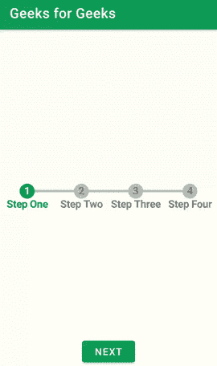

# 安卓状态进度条

> 原文:[https://www.geeksforgeeks.org/state-progressbar-in-android/](https://www.geeksforgeeks.org/state-progressbar-in-android/)

**状态进度条**是我们在很多应用中看到的主要功能之一。我们可以在订票应用、教育应用中看到这个功能。这个进度条有助于告诉用户执行任务要执行的步骤。在本文中，我们将看到如何在安卓中实现状态进度条。下面给出了一个 GIF 示例，来了解一下我们将在本文中做什么。注意，我们将使用 **Java** 语言来实现这个项目。



### 状态进度条的应用

*   用于大多数服务提供应用，如订票、考试表格填写等。
*   该状态进度条有助于用户执行任务的步骤。
*   用于各种考试填表应用。

### **状态进度条的属性**

<figure class="table">

| 

属性

 | 

描述

 |
| --- | --- |
| **布局 _ 宽度** | 用于给出特定的宽度。 |
| **布局 _ 高度** | 用于给出特定的高度。 |
| **spb_maxStateNumber** | 用于显示应用程序中使用的状态数。 |
| **spb_currentStateNumber** 的缩写形式 | 用于显示当前状态。 |
| **spb_stateBackgroundColor** | 用于显示背景颜色。 |
| **SPB _ stateforedgroundcolor** | 用于显示前景色。 |
| **spb_animateToCurrentProgressState** | 将动画设置为当前进度状态。 |
| **spb_checkStateCompleted** | 检查状态是否完成。 |

</figure>

### 逐步实施

**第一步:创建新项目**

在安卓工作室创建新项目请参考 [如何在安卓工作室创建/启动新项目](https://www.geeksforgeeks.org/android-how-to-create-start-a-new-project-in-android-studio/) 。注意选择 **Java** 作为编程语言。

**第二步:在 build.gradle 文件中添加状态进度条库的依赖关系**

然后导航到梯度脚本，然后导航到**构建.梯度(模块)**级别。在 dependencies 部分的 build.gradle 文件中添加以下行。

> implementation ' com . kofigyan . state progress bar:state progress bar:1 . 0 . 0 '

现在点击**立即同步**它将同步你在 **build.gradle()中的所有文件。**

**第三步:在你的 activity_main.xml 文件中新建一个状态进度条**

导航到**应用程序> res >** 布局，打开 **activity_main.xml** 文件。下面是 **activity_main.xml** 文件的代码。

## 可扩展标记语言

```
<?xml version="1.0" encoding="utf-8"?>
<RelativeLayout 
    xmlns:android="http://schemas.android.com/apk/res/android"
    xmlns:app="http://schemas.android.com/apk/res-auto"
    xmlns:tools="http://schemas.android.com/tools"
    android:layout_width="match_parent"
    android:layout_height="match_parent"
    tools:context=".MainActivity">

    <!--Progress Bar created-->
    <com.kofigyan.stateprogressbar.StateProgressBar
        android:id="@+id/your_state_progress_bar_id"
        android:layout_width="wrap_content"
        android:layout_height="wrap_content"
        android:layout_centerInParent="true"
        app:spb_animateToCurrentProgressState="true"
        app:spb_checkStateCompleted="true"
        app:spb_currentStateDescriptionColor="#0F9D58"
        app:spb_currentStateNumber="one"
        app:spb_maxStateNumber="four"
        app:spb_stateBackgroundColor="#BDBDBD"
        app:spb_stateDescriptionColor="#808080"
        app:spb_stateForegroundColor="#0F9D58"
        app:spb_stateNumberBackgroundColor="#808080"
        app:spb_stateNumberForegroundColor="#eeeeee" />

    <!--Button to go on next step-->
    <Button
        android:id="@+id/button"
        android:layout_width="wrap_content"
        android:layout_height="wrap_content"
        android:layout_alignParentBottom="true"
        android:layout_centerHorizontal="true"
        android:text="NEXT" />

</RelativeLayout>
```

**步骤 4:使用 MainActivity.java 文件**

转到**MainActivity.java**文件，参考以下代码。下面是 MainActivity.java 文件的代码。代码中添加了注释，以更详细地理解代码。

## Java 语言(一种计算机语言，尤用于创建网站)

```
import android.os.Bundle;
import android.view.View;
import android.widget.Button;

import androidx.appcompat.app.AppCompatActivity;

import com.kofigyan.stateprogressbar.StateProgressBar;

public class MainActivity extends AppCompatActivity {

    // steps on state progress bar
    String[] descriptionData = {"Step One", "Step Two", "Step Three", "Step Four"};

    Button button;

    @Override
    protected void onCreate(Bundle savedInstanceState) {
        super.onCreate(savedInstanceState);
        setContentView(R.layout.activity_main);

        StateProgressBar stateProgressBar = (StateProgressBar) findViewById(R.id.your_state_progress_bar_id);
        stateProgressBar.setStateDescriptionData(descriptionData);

        // button given along with id
        button = (Button) findViewById(R.id.button);

        button.setOnClickListener(new View.OnClickListener() {
            @Override
            public void onClick(View view) {
                switch (stateProgressBar.getCurrentStateNumber()) {
                    case 1:
                        stateProgressBar.setCurrentStateNumber(StateProgressBar.StateNumber.TWO);
                        break;
                    case 2:
                        stateProgressBar.setCurrentStateNumber(StateProgressBar.StateNumber.THREE);
                        break;
                    case 3:
                        stateProgressBar.setCurrentStateNumber(StateProgressBar.StateNumber.FOUR);
                        break;
                    case 4:
                        stateProgressBar.setAllStatesCompleted(true);
                        break;
                }
            }
        });
    }
}
```

现在点击**运行**选项，需要一些时间来建立 Gradle。之后，您将获得如下所示的设备输出。

### **输出:**

<video class="wp-video-shortcode" id="video-545532-1" width="640" height="360" preload="metadata" controls=""><source type="video/mp4" src="https://media.geeksforgeeks.org/wp-content/uploads/20210115134220/Screenrecorder-2021-01-15-13-37-46-819.mp4?_=1">[https://media.geeksforgeeks.org/wp-content/uploads/20210115134220/Screenrecorder-2021-01-15-13-37-46-819.mp4](https://media.geeksforgeeks.org/wp-content/uploads/20210115134220/Screenrecorder-2021-01-15-13-37-46-819.mp4)</video>