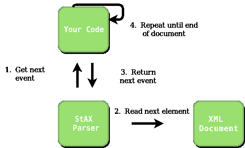

# Java 中的 StAX XML 解析器

> 原文:[https://www.geeksforgeeks.org/stax-xml-parser-java/](https://www.geeksforgeeks.org/stax-xml-parser-java/)

本文主要讨论如何用 Java 解析一个 XML 文件。
**XML :** XML 代表可扩展标记语言。它被设计用来存储和传输数据。它被设计成人类可读和机器可读的。这就是为什么，XML 的设计目标强调互联网上的简单性、通用性和可用性。

**为什么是 StAX 而不是 SAX？**

*   **SAX**:SAX 是一个推模型 API，也就是说调用你的处理程序的是 API，而不是调用 API 的你的处理程序。因此，SAX 解析器将事件“推入”您的处理程序。有了这个应用编程接口的推送模型，您无法控制解析器如何以及何时迭代文件。一旦您启动了解析器，它会一直迭代直到结束，为输入 XML 文档中的每个 XML 事件调用您的处理程序。

```
SAX Parser --> Handler
```

*   **StAX**:StAX 拉模型意味着调用解析器 API 的是你的“处理程序”类，而不是相反。因此，您的处理程序类控制解析器何时进入输入中的下一个事件。换句话说，您的处理程序将 XML 事件从解析器中“拉出”。此外，您可以随时停止解析。当输入或数据库以离线或在线 xml 文件的形式给出时，通常使用 StAX 解析器来代替文件读取器。的拉动模式总结如下:

```
Handler --> StAX Parser
```

*   此外，StAX 解析器可以读写 XML 文档，而 SAX 只能读取。SAX 提供了模式验证，即如果标签被正确嵌套或者 XML 被正确编写，但是 StAX 没有提供这样的模式验证方法。

**实施**

**关于 StAX 解析器工作原理的想法:**



**输入文件:**这是作者制作的示例输入文件，以展示如何使用 StAX 解析器。将其保存为 data.xml 并运行代码。XML 数据库文件通常很大，并且包含许多相互嵌套的标签。

## Java 语言(一种计算机语言，尤用于创建网站)

```
// Java Code to implement StAX parser
import java.io.File;
import java.io.FileNotFoundException;
import java.io.FileReader;
import java.util.Iterator;
import javax.xml.namespace.QName;
import javax.xml.stream.XMLEventReader;
import javax.xml.stream.XMLInputFactory;
import javax.xml.stream.XMLStreamException;
import javax.xml.stream.events.*;

public class Main
{

    private static boolean bcompany,btitle,bname,bemail,bphone;

    public static void main(String[] args) throws FileNotFoundException,
                                                XMLStreamException
    {
        // Create a File object with appropriate xml file name
        File file = new File("data.xml");

        // Function for accessing the data
        parser(file);
    }

    public static void parser(File file) throws FileNotFoundException,
                                                XMLStreamException
    {
        // Variables to make sure whether a element
        // in the xml is being accessed or not
        // if false that means elements is
        // not been used currently , if true the element or the
        // tag is being used currently
        bcompany = btitle = bname = bemail = bphone = false;

        // Instance of the class which helps on reading tags
        XMLInputFactory factory = XMLInputFactory.newInstance();

        // Initializing the handler to access the tags in the XML file
        XMLEventReader eventReader =
                factory.createXMLEventReader(new FileReader(file));

        // Checking the availability of the next tag
        while (eventReader.hasNext())
        {
            // Event is actually the tag . It is of 3 types
            // <name> = StartEvent
            // </name> = EndEvent
            // data between the StartEvent and the EndEvent
            // which is Characters Event
            XMLEvent event = eventReader.nextEvent();

            // This will trigger when the tag is of type <...>
            if (event.isStartElement())
            {
                StartElement element = (StartElement)event;

                // Iterator for accessing the metadeta related
                // the tag started.
                // Here, it would name of the company
                Iterator<Attribute> iterator = element.getAttributes();
                while (iterator.hasNext())
                {
                    Attribute attribute = iterator.next();
                    QName name = attribute.getName();
                    String value = attribute.getValue();
                    System.out.println(name+" = " + value);
                }

                // Checking which tag needs to be opened for reading.
                // If the tag matches then the boolean of that tag
                // is set to be true.
                if (element.getName().toString().equalsIgnoreCase("comapany"))
                {
                    bcompany = true;
                }
                if (element.getName().toString().equalsIgnoreCase("title"))
                {
                    btitle = true;
                }
                if (element.getName().toString().equalsIgnoreCase("name"))
                {
                    bname = true;
                }
                if (element.getName().toString().equalsIgnoreCase("email"))
                {
                    bemail = true;
                }
                if (element.getName().toString().equalsIgnoreCase("phone"))
                {
                    bphone = true;
                }
            }

            // This will be triggered when the tag is of type </...>
            if (event.isEndElement())
            {
                EndElement element = (EndElement) event;

                // Checking which tag needs to be closed after reading.
                // If the tag matches then the boolean of that tag is
                // set to be false.
                if (element.getName().toString().equalsIgnoreCase("company"))
                {
                    bcompany = false;
                }
                if (element.getName().toString().equalsIgnoreCase("title"))
                {
                    btitle = false;
                }
                if (element.getName().toString().equalsIgnoreCase("name"))
                {
                    bname = false;
                }
                if (element.getName().toString().equalsIgnoreCase("email"))
                {
                    bemail = false;
                }
                if (element.getName().toString().equalsIgnoreCase("phone"))
                {
                    bphone = false;
                }
            }

            // Triggered when there is data after the tag which is
            // currently opened.
            if (event.isCharacters())
            {
                // Depending upon the tag opened the data is retrieved .
                Characters element = (Characters) event;
                if (bcompany)
                {
                    System.out.println(element.getData());
                }
                if (btitle)
                {
                    System.out.println(element.getData());
                }
                if (bname)
                {
                    System.out.println(element.getData());
                }
                if (bemail)
                {
                    System.out.println(element.getData());
                }
                if (bphone)
                {
                    System.out.println(element.getData());
                }
            }
        }
    }
}
```

**输出:**

```
name = geeksforgeeks.org
Kunal Sharma
Student
kunal@example.com
(202) 456-1414
```

【StAX 在上述代码中是如何工作的？

在上面代码中创建 eventReader 后，借助工厂模式创建一个 XML 文件阅读器，基本上是从读取标签开始的。一旦标签来了，一个布尔变量被设置为真，表示标签已经被打开。这种标签匹配是通过识别它是开始标签还是结束标签来完成的。由于标记指示开始，因此它由 StartElement 匹配。接下来是数据读取部分。在下一步中，它通过 isCharacters 匹配元素来读取字符/数据，这只有在我们需要的起始标记被打开或者它的布尔变量被设置为 true 时才能完成。在此之后，由…>标记指示的元件关闭。当它遇到时，它会检查哪个元素被打开或设置为真，并将该元素的布尔值设置为假或关闭它。

基本上每个事件都是先打开标签，读取它的数据，然后关闭它。

*   [https://docs . Oracle . com/javase/tutorial/JAXP/sax/parsing . html](https://docs.oracle.com/javase/tutorial/jaxp/sax/parsing.html)
*   [https://docs . Oracle . com/CD/e 17802 _ 01/web services/web services/docs/1.6/tutorial/doc/sjsxp 2 . html](https://docs.oracle.com/cd/E17802_01/webservices/webservices/docs/1.6/tutorial/doc/SJSXP2.html)

本文由**库努尔·夏尔马**供稿。如果你喜欢 GeeksforGeeks 并想投稿，你也可以使用[write.geeksforgeeks.org](http://www.write.geeksforgeeks.org)写一篇文章或者把你的文章邮寄到 review-team@geeksforgeeks.org。看到你的文章出现在极客博客主页上，帮助其他极客。
如果你发现任何不正确的地方，或者你想分享更多关于上面讨论的话题的信息，请写评论。