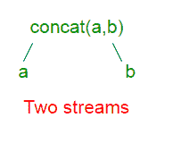
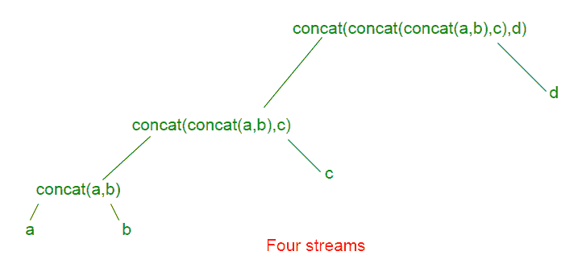

# Java 中的 Stream.concat()

> 原文:[https://www.geeksforgeeks.org/stream-concat-java/](https://www.geeksforgeeks.org/stream-concat-java/)

Stream.concat()方法创建一个串联流，其中的元素是第一个流的所有元素，然后是第二个流的所有元素。如果两个输入流都是有序的，则结果流是有序的；如果两个输入流都是并行的，则[并行](https://www.geeksforgeeks.org/parallel-data-processing-java-set-1/)。

**语法:**

```
static <T> Stream<T> concat(Stream<? extends T> stream1, 
                            Stream<? extends T> stream2)

Where, T is the type of stream elements,
stream1 represents the first stream,
stream2 represents the second stream and
the function returns the concatenation of
the two input streams

```

对 Stream.concat(stream1，stream2)的调用可以看作是形成了一个二叉树。所有输入流的连接是在根。单个输入流在叶子上。下面给出了四个输入流 a、b、c 和 d 的树的一些例子。

对于两个流 a 和 b，树看起来像:

对于三个流 a、b 和 c，树看起来像:

对于四个流 a、b、c 和 d，树看起来像:

每个额外的输入流给树增加一层深度和一层间接到达所有其他流。

**注意:**stream . concat()方法返回的元素是有序的。例如，以下两行返回相同的结果:

```
Stream.concat(Stream.concat(stream1, stream2), stream3);
Stream.concat(stream1, Stream.concat(stream2, stream3));

```

但是下面两个的结果是不同的。

```
Stream.concat(Stream.concat(stream1, stream2), stream3); 
Stream.concat(Stream.concat(stream2, stream1), stream3);

```

下面是一些例子，可以更好地理解函数的实现。
**例 1 :**

```
// Implementation of Stream.concat()
// method in Java 8 with 2 Streams
import java.util.*;
import java.util.stream.IntStream;
import java.util.stream.Stream;

class GFG {

    // Driver code
    public static void main(String[] args)
    {
        // Creating two Streams
        Stream<String> stream1 = Stream.of("Geeks", "for");
        Stream<String> stream2 = Stream.of("GeeksQuiz", "GeeksforGeeks");

        // concatenating both the Streams
        // with Stream.concat() function
        // and displaying the result
        Stream.concat(stream1, stream2)
            .forEach(element -> System.out.println(element));
    }
}
```

**Output:**

```
Geeks
for
GeeksQuiz
GeeksforGeeks

```

**例 2 :**

```
// Implementation of Stream.concat()
// method in Java 8 with more than
// two Streams
import java.util.*;
import java.util.stream.IntStream;
import java.util.stream.Stream;

class GFG {

    // Driver code
    public static void main(String[] args)
    {

        // Creating more than two Streams
        Stream<String> stream1 = Stream.of("Geeks");
        Stream<String> stream2 = Stream.of("GeeksQuiz");
        Stream<String> stream3 = Stream.of("GeeksforGeeks");
        Stream<String> stream4 = Stream.of("GFG");

        // concatenating all the Streams
        // with Stream.concat() function
        // and displaying the result
        Stream.concat(Stream.concat(Stream.concat(stream1,
                             stream2), stream3), stream4)
            .forEach(element -> System.out.println(element));
    }
}
```

**Output:**

```
Geeks
GeeksQuiz
GeeksforGeeks
GFG

```

**例 3 :**

```
// Implementation of Stream.concat()
// method in Java 8 with DoubleStream
import java.util.*;
import java.util.stream.Stream;
import java.util.stream.DoubleStream;

class GFG {

    // Driver code
    public static void main(String[] args)
    {

        // Creating two Streams
        DoubleStream Stream1 = DoubleStream.of(1520, 1620);
        DoubleStream Stream2 = DoubleStream.of(1720, 1820);

        // concatenating both the Streams and
        // displaying the result
        DoubleStream.concat(Stream1, Stream2)
            .forEach(element -> System.out.println(element));
    }
}
```

**Output:**

```
1520.0
1620.0
1720.0
1820.0

```

**例 4 :**

```
// Implementation of Stream.concat()
// method in Java 8 and removing
// the duplicates
import java.util.*;
import java.util.stream.IntStream;
import java.util.stream.Stream;

class GFG {

    // Driver code
    public static void main(String[] args)
    {

        // Creating two Streams
        Stream<String> stream1 = Stream.of("Geeks", "for", "GeeksforGeeks");
        Stream<String> stream2 = Stream.of("GeeksQuiz", "GeeksforGeeks", "for");

        // concatenating both the Streams
        // with Stream.concat() function
        // and displaying the result after
        // removing the duplicates
        Stream.concat(stream1, stream2).distinct().forEach(element -> System.out.println(element));
    }
}
```

**Output:**

```
Geeks
for
GeeksforGeeks
GeeksQuiz

```

**例 5 :**

```
// Implementation of Stream.concat()
// method in Java 8 with LongStream
import java.util.*;
import java.util.stream.Stream;
import java.util.stream.LongStream;

class GFG {

    // Driver code
    public static void main(String[] args)
    {

        // Creating two Streams
        LongStream Stream1 = LongStream.of(1520, 1620);
        LongStream Stream2 = LongStream.of(1720, 1820);

        // concatenating both the Streams and
        // displaying the result
        LongStream.concat(Stream1, Stream2)
            .forEach(element -> System.out.println(element));
    }
}
```

**Output:**

```
1520
1620
1720
1820

```