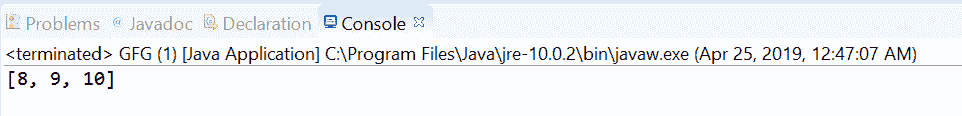
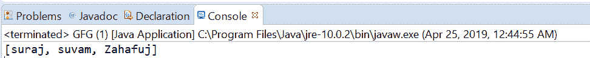

# Java 中的 Stream dropWhile()方法，带示例

> 原文:[https://www . geesforgeks . org/stream-drop while-in-Java-method-with-examples/](https://www.geeksforgeeks.org/stream-dropwhile-method-in-java-with-examples/)

方法返回两种不同类型的流，具体取决于流是否有序。

如果流是有序的，则在删除与给定谓词匹配的最长元素前缀后，该流的剩余元素流由方法返回，否则在删除与给定谓词匹配的元素子集后，该流由该流的剩余元素组成。

**在有序流**的情况下，最长的前缀是该流的元素的连续序列，这些元素与作为参数传递给该方法的谓词相匹配。序列的第一个元素是这个流的第一个元素，紧接着序列最后一个元素的元素与给定的谓词不匹配。

**在无序流**的情况下，该流的一些元素匹配给定的谓词，并且该操作的行为变得不确定；所以这个方法可以自由地删除匹配元素的任何子集。
在某些情况下，当这个流的所有元素都与给定的谓词匹配时，这个方法将丢弃所有元素，结果是一个空流，与流的顺序无关；当流中没有元素与给定的谓词匹配时，没有元素被丢弃，结果与输入流相同。

**语法:**

```
default Stream<T> dropWhile(Predicate<T> predicate)

```

**参数:**该方法接受单个参数**谓词**，这是一个无干扰的无状态谓词，用于元素以确定元素的最长前缀。

**返回值:**该方法返回**新的流**。

下面的程序说明了 dropWhile 方法:

**程序 1:**

```
// Java program to demonstrate
// Stream.dropWhile method
import java.util.List;
import java.util.stream.Collectors;
import java.util.stream.Stream;
public class GFG {

    public static void main(String[] args)
    {

        // create a stream of numbers from 1 to 10
        Stream<Integer> stream
            = Stream.of(4, 4, 4, 5, 6, 7, 8, 9, 10);

        // apply dropWhile to drop all the numbers
        // matches passed predicate
        List<Integer> list
            = stream.dropWhile(number -> (number / 4 == 1))
                  .collect(Collectors.toList());

        // print list
        System.out.println(list);
    }
}
```

打印在集成开发环境控制台上的输出如下所示。
**输出:**


**程序 2:**

```
// Java program to demonstrate
// Stream.dropWhile method

import java.util.List;
import java.util.stream.Collectors;
import java.util.stream.Stream;
public class GFG {

    public static void main(String[] args)
    {

        // create a stream of names
        Stream<String> stream
            = Stream.of("aman", "amar", "suraj",
                        "suvam", "Zahafuj");

        // apply dropWhile to drop all the names
        // matches passed predicate
        List<String> list
            = stream.dropWhile(name -> (name.charAt(0) == 'a'))
                  .collect(Collectors.toList());

        // print list
        System.out.println(list);
    }
}
```

控制台上打印的输出如下所示。
**输出:**


**参考文献:**T2