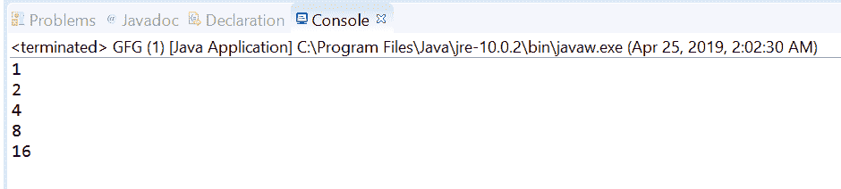
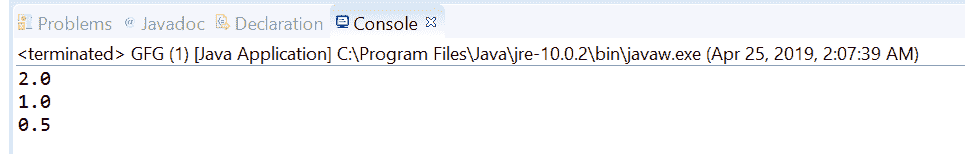

# Java 中的流迭代(T，谓词，UnaryOperator)方法，示例

> 原文:[https://www . geeksforgeeks . org/stream-iterattpredicateunaryooperator-method-in-Java-with-examples/](https://www.geeksforgeeks.org/stream-iteratetpredicateunaryoperator-method-in-java-with-examples/)

**迭代(T， [java.util.function .谓词](https://www.geeksforgeeks.org/java-8-predicate-with-examples/)，[Java . util . function . unaryoperator](https://www.geeksforgeeks.org/unaryoperator-interface-in-java/))**方法允许我们迭代流元素直到指定的条件。该方法返回一个顺序的[流](https://www.geeksforgeeks.org/stream-in-java/)，该流通过给定的下一个函数对初始元素的迭代应用产生，条件是满足作为参数传递的 hasNext 谓词。hasNext 谓词一返回 false，流就终止。

如果传递的谓词不包含种子值，则此方法返回的结果序列可能为空。否则，第一个元素将是提供的种子值，下一个元素将是对种子值应用 next 函数的结果，以此类推，直到 hasNext 谓词指示流应该终止。

**语法:**

```
static <T> Stream<T> iterate(T seed,
                             Predicate<T> hasNext,
                             UnaryOperator<T> next)

```

**参数:**该方法接受三个参数:

*   **种子**:初始元素，
*   **hasNext** :这是一个应用于元素的谓词，用于确定流何时必须终止
*   **下一个**:这是一个应用于前一个元素以产生新元素的函数。

**返回值:**该方法返回一个新的顺序[流](https://www.geeksforgeeks.org/stream-in-java/)。

下面的程序举例说明迭代(T，java.util.function.Predicate，Java . util . function . unaryooperator)方法:

**程序 1:**

```
// Java program to demonstrate
// Stream.iterate method

import java.util.stream.Stream;
public class GFG {

    public static void main(String[] args)
    {

        // create a stream using iterate
        Stream<Integer> stream
            = Stream.iterate(1,
                             i -> i <= 20, i -> i * 2);

        // print Values
        stream.forEach(System.out::println);
    }
}
```

打印在集成开发环境控制台上的输出如下所示。
**输出:**


**程序 2:**

```
// Java program to demonstrate
// Stream.iterate method

import java.util.stream.Stream;
public class GFG {

    public static void main(String[] args)
    {

        // create a stream using iterate
        Stream<Double> stream
            = Stream.iterate(2.0,
                             decimal -> decimal > 0.25, decimal -> decimal / 2);

        // print Values
        stream.forEach(System.out::println);
    }
}
```

打印在集成开发环境控制台上的输出如下所示。
**输出:**


**参考文献:**[https://docs . Oracle . com/javase/10/docs/API/Java/util/stream . html # iterate(T，java.util.function.Predicate，Java . util . function . unaryoperator)](https://docs.oracle.com/javase/10/docs/api/java/util/stream/Stream.html#iterate(T, java.util.function.Predicate, java.util.function.UnaryOperator))