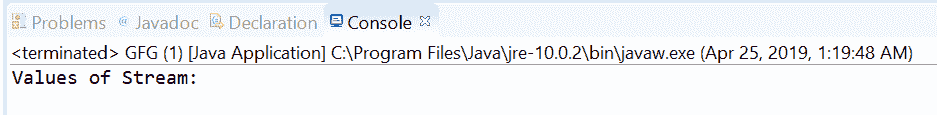
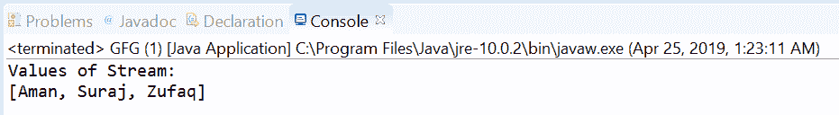

# Java 中的空(T)方法流，示例

> 原文:[https://www . geeksforgeeks . org/stream-of nullablet-method-in-Java-with-examples/](https://www.geeksforgeeks.org/stream-ofnullablet-method-in-java-with-examples/)

方法返回一个包含单个元素的连续的[流](https://www.geeksforgeeks.org/stream-in-java/)，如果这个流是非空的，否则方法返回一个空流。它有助于处理空流和[空指针异常](https://www.geeksforgeeks.org/null-pointer-exception-in-java/)。

**语法:**

```java
static <T> Stream<T> ofNullable(T t)

```

**参数:**该方法接受单个参数 **t** ，这是流要返回的单个元素。

**返回值:**如果指定的元素非空，该方法返回一个带有单个元素的**流**，否则返回一个空流。

下面的程序说明了缺省(T)方法:

**程序 1:**

```java
// Java program to demonstrate
// Stream.ofNullable() method

import java.util.stream.Stream;
public class GFG {

    public static void main(String[] args)
    {

        // Create a stream with null
        Stream<String> value
            = Stream.ofNullable(null);

        // Print values
        System.out.println("Values of Stream:");
        value.forEach(System.out::println);
    }
}
```

打印在集成开发环境控制台上的输出如下所示。
**输出:**


**程序 2:**

```java
// Java program to demonstrate
// Stream.ofNullable method

import java.util.ArrayList;
import java.util.stream.Stream;
public class GFG {

    public static void main(String[] args)
    {

        // Create ArrayList containing names
        ArrayList<String> list = new ArrayList<String>();
        list.add("Aman");
        list.add("Suraj");
        list.add("Zufaq");

        // create a stream with ArrayList
        Stream<ArrayList<String> > value
            = Stream.ofNullable(list);

        // print values
        System.out.println("Values of Stream:");
        value.forEach(System.out::println);
    }
}
```

控制台上打印的输出如下所示。
**输出:**


**参考文献:**[https://docs . Oracle . com/javase/10/docs/API/Java/util/stream/stream . html # of nullable(T)](https://docs.oracle.com/javase/10/docs/api/java/util/stream/Stream.html#ofNullable(T))