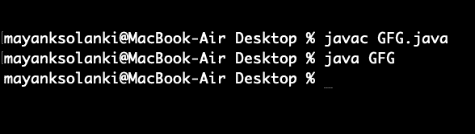

# Java 中的 Stream peek()方法，示例

> 原文:[https://www . geesforgeks . org/stream-peek-method-in-Java-with-examples/](https://www.geeksforgeeks.org/stream-peek-method-in-java-with-examples/)

在 Java 中，Stream 为处理数据提供了一个强大的替代方法，这里我们将讨论一个非常常用的方法 ***peek()，它是一个消费者操作*** ，基本上返回一个由这个流的元素组成的流，当元素从结果流中被消费时，它还对每个元素执行所提供的操作。这是一个**中间操作，因为它创建了一个新的流，当遍历该流时，包含与给定谓词匹配的初始流的元素。**

****语法:****

```java
Stream<T> peek(Consumer<? super T> action)
```

**这里，Stream 是一个接口，T 是流元素的类型。**动作**是一个[非干扰](https://docs.oracle.com/javase/8/docs/api/java/util/stream/package-summary.html#NonInterference)动作，当元素从流中被消耗时，该动作在元素上执行，并且该函数返回新的流。现在，我们需要通过下面列出的干净的 java 程序来理解 peek()方法的内部工作生命周期，如下所示:**

> ****注:****
> 
>  ***   这个方法的存在主要是为了支持调试，在调试中，您希望看到元素流过管道中的某个点。
> *   自从 Java 9 以来，如果元素的数量是预先知道的并且在流中没有改变，那么。peek()语句由于性能优化将 [<u>不执行</u>](https://docs.oracle.com/en/java/javase/11/docs/api/java.base/java/util/stream/Stream.html#count()) 。可以通过改变元素数量的命令(形式)来强制其运行。过滤器(x - >真)。
> *   在没有任何终端操作的情况下使用 peek 没有任何作用。**

****例 1:****

## **Java 语言(一种计算机语言，尤用于创建网站)**

```java
// Java Program to Illustrate peek() Method
// of Stream class Without Terminal Operation Count

// Importing required classes
import java.util.*;

// Main class
class GFG {

    // Main driver method
    public static void main(String[] args)
    {

        // Creating a list of Integers
        List<Integer> list
            = Arrays.asList(0, 2, 4, 6, 8, 10);

        // Using peek without any terminal
        // operation does nothing
        list.stream().peek(System.out::println);
    }
}
```

****输出:****

****

**从上面的输出中，我们可以看出这段代码不会产生任何输出**

****例 2:****

## **Java 语言(一种计算机语言，尤用于创建网站)**

```java
// Java Program to Illustrate peek() Method
// of Stream class With Terminal Operation Count

// Importing required classes
import java.util.*;

// Main class
class GFG {

    // Main driver method
    public static void main(String[] args)
    {

        // Creating a list of Integers
        List<Integer> list
            = Arrays.asList(0, 2, 4, 6, 8, 10);

        // Using peek with count() method,Method
        // which is a terminal operation
        list.stream().peek(System.out::println).count();
    }
}
```

****输出:****

```java
0
2
4
6
8
10
```