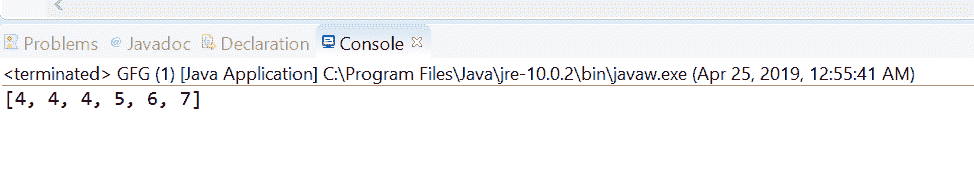
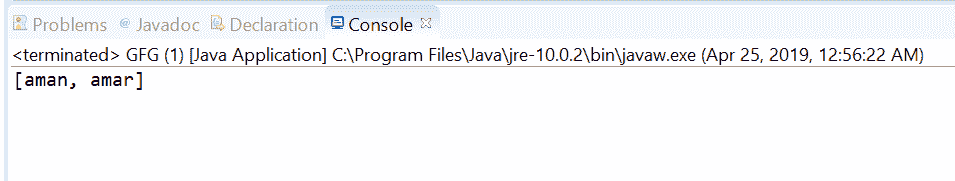

# Java 中的 Stream takeWhile()方法，带示例

> 原文:[https://www . geesforgeks . org/stream-take while-in-Java-method-with-examples/](https://www.geeksforgeeks.org/stream-takewhile-method-in-java-with-examples/)

**take while(Java . util . function . predicate)**方法在取与给定谓词匹配的元素的最长前缀之后返回该流的剩余元素流，如果该流是有序的，则返回从该流中取的与给定谓词匹配的元素子集的流。
**在有序流**的情况下，最长的前缀是该流的元素的连续序列，这些元素与作为参数传递给该方法的谓词相匹配。序列的第一个元素是这个流的第一个元素，紧接着序列最后一个元素的元素与给定的谓词不匹配。
**在无序流**的情况下，该流的一些元素匹配给定的谓词，并且该操作的行为变得不确定；因此，该方法可以自由获取匹配元素的任何子集。
当该流的所有元素都与给定谓词匹配时，该方法将采用所有元素，并且结果与输入流相同，而与流的顺序无关；当流中没有元素与给定谓词匹配时，则不采用任何元素，并且结果为空。

**语法:**

```
default Stream<T> takeWhile(Predicate<T> predicate)

```

**参数:**该方法接受单个参数**谓词**，这是一个无干扰的无状态谓词，用于元素以确定元素的最长前缀。

**返回值:**该方法返回**新的流**。

下面的程序说明了 takeWhile 方法:
**程序 1:**

```
// Java program to demonstrate
// Stream.takeWhile method

import java.util.List;
import java.util.stream.Collectors;
import java.util.stream.Stream;
public class GFG {

    public static void main(String[] args)
    {

        // create a stream of numbers from 1 to 10
        Stream<Integer> stream
            = Stream.of(4, 4, 4, 5, 6, 7, 8, 9, 10);

        // apply takeWhile to take all the numbers
        // matches passed predicate
        List<Integer> list
            = stream.takeWhile(number -> (number / 4 == 1))
                  .collect(Collectors.toList());

        // print list
        System.out.println(list);
    }
}
```

打印在集成开发环境控制台上的输出如下所示。
**输出:**


**程序 2:**

```
// Java program to demonstrate
// Stream.takeWhile method
import java.util.List;
import java.util.stream.Collectors;
import java.util.stream.Stream;
public class GFG {

    public static void main(String[] args)
    {

        // create a stream of names
        Stream<String> stream
            = Stream.of("aman", "amar", "suraj",
                        "suvam", "Zahafuj");

        // apply takeWhile to take all the names
        // matches passed predicate
        List<String> list
            = stream.takeWhile(name -> (name.charAt(0) == 'a'))
                  .collect(Collectors.toList());

        // print list
        System.out.println(list);
    }
}
```

控制台上打印的输出如下所示。
**输出:**


**参考文献:**[https://docs . Oracle . com/javase/10/docs/API/Java/util/stream/stream . html # take while(Java . util . function . predicate)](https://docs.oracle.com/javase/10/docs/api/java/util/stream/Stream.html#takeWhile(java.util.function.Predicate))