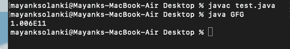

# Java 中的 strictfp 关键字

> 原文:[https://www.geeksforgeeks.org/strictfp-keyword-java/](https://www.geeksforgeeks.org/strictfp-keyword-java/)

**strictfp** 是一个修饰符，代表严格浮点，在 java 的基础版本中没有引入，因为它是在 Java 1.2 版本中引入的。它在 java 中用于限制浮点计算，并确保在浮点变量中执行操作时每个平台上的结果相同。
浮点计算依赖于平台，即当类文件在不同平台(16/32/64 位处理器)上运行时，会获得不同的输出(浮点值)。为了解决这类问题，在 JDK 1.2 版本中，通过遵循 [IEEE 754](https://en.wikipedia.org/wiki/IEEE_floating_point) 浮点计算标准，引入了 strictfp 关键字。

> **注意:** strictfp 修饰符仅用于类、接口和方法，但不适用于变量，如下图所示:

**说明 1:** 类的关键字用法

```
strictfp class Test {

    // All concrete methods here are implicitly strictfp.    
}
```

**说明 2:** 接口的关键字用法

```
strictfp interface Test {

    // All  methods here becomes implicitly 
    // strictfp when used during inheritance.    
}

class Car {

    // strictfp applied on a concrete method 
    strictfp void calculateSpeed(){}
}          
```

**图解 3:** 带变量的关键词用法

```
strictfp interface Test {
    double sum();

    // Compile-time error here
    strictfp double mul(); 
}
```

从以上插图中可以得出如下一些结论:

*   当用 strictfp 修饰符声明类或接口时，类/接口中声明的所有方法以及类中声明的所有嵌套类型都隐式地是 strictfp。
*   strictfp **不能**与抽象方法一起使用。但是，它可以与抽象类/接口一起使用。
*   因为接口的方法是隐式抽象的，所以 strictfp 不能与接口内部的任何方法一起使用。

**例**

## Java 语言(一种计算机语言，尤用于创建网站)

```
// Java program to illustrate strictfp modifier
// Usage in Classes

// Main class
class GFG {

    // Method 1
    // Calculating sum using strictfp modifier
    public strictfp double sum()
    {

        double num1 = 10e+10;
        double num2 = 6e+08;

        // Returning the sum
        return (num1 + num2);
    }

    // Method 2
    // Main driver method
    public static void main(String[] args)
    {

        // Creating object of class in main() method
        GFG t = new GFG();

        // Here we have error of putting strictfp and
        // error is not found public static void main method
        System.out.println(t.sum());
    }
}
```

**输出:**



本文由**高拉夫·米格拉尼**供稿。如果你喜欢 GeeksforGeeks 并想投稿，你也可以使用[write.geeksforgeeks.org](https://write.geeksforgeeks.org)写一篇文章或者把你的文章邮寄到 review-team@geeksforgeeks.org。看到你的文章出现在极客博客主页上，帮助其他极客。
如果你发现任何不正确的地方，或者你想分享更多关于上面讨论的话题的信息，请写评论。