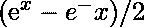

# Java 中的 StrictMath sinh()方法

> 原文:[https://www . geesforgeks . org/strict math-sinh-method-in-Java/](https://www.geeksforgeeks.org/strictmath-sinh-method-in-java/)

**Java . lang . strict math . sinh()**方法用于返回作为参数传递给函数的双精度值的*双曲正弦值*。x 的双曲正弦由公式定义，其中 e 表示**欧拉数**

**语法:**

```java
public static double sinh*(*double x*)*
```

**参数:**函数接受单个双精度值 *x* ，其双曲正弦由函数返回。

**返回值:**该方法返回一个双精度值，即 *x* 的双曲正弦值。出现以下情况:

*   如果参数是 *NaN* 或*无穷大*，则函数返回 *NaN*
*   如果参数为*无穷大*，则函数返回*无穷大*，符号与参数相同。
*   如果参数为零，则函数返回*零*，符号与参数相同

**示例:**

```java
Input : 0.7853981633974483
Output : 0.8686709614860095

Input : 4.0
Output : 27.28991719712775

```

下面的程序说明了 java.lang.StrictMath.sinh()方法的使用:

**程序 1:**

```java
// Java Program to illustrate
// StrictMath.sinh() function 

import java.io.*;
import java.math.*;
import java.lang.*;

class GFG {
    public static void main(String[] args)
    {

        double x = (45 * Math.PI) / 180;

        // Display the hyperbolic sine of the value
        System.out.println("Hyperbolic sine of "
                 + x + " = " + StrictMath.sinh(x));
    }
}
```

**Output:**

```java
Hyperbolic sine of 0.7853981633974483 = 0.8686709614860095

```

**程序 2:**

```java
// Java Program to illustrate
// StrictMath.sinh() function 

import java.io.*;
import java.math.*;
import java.lang.*;

class GFG {
    public static void main(String[] args)
    {

        double x1 = 180 / (0.0), x2 = 0;

        // Display the hyperbolic sine of the values
        System.out.println("Hyperbolic sine of "
                + x1 + " = " + StrictMath.sinh(x1));
        System.out.println("Hyperbolic sine of "
                + x2 + " = " + StrictMath.sinh(x2));
    }
}
```

**Output:**

```java
Hyperbolic sine of Infinity = Infinity
Hyperbolic sine of 0.0 = 0.0

```

**参考:**[https://docs . Oracle . com/javase/8/docs/API/Java/lang/strict math . html # sinh()](https://docs.oracle.com/javase/8/docs/api/java/lang/StrictMath.html#sinh-double-)