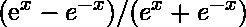

# Java 中的 StrictMath tanh()方法

> 原文:[https://www . geesforgeks . org/strict math-tanh-method-in-Java/](https://www.geeksforgeeks.org/strictmath-tanh-method-in-java/)

**Java . lang . strict math . tanh()**方法用于返回作为参数传递给函数的双精度值的*双曲线 tan* 。x 的*双曲线 tan 由公式定义，其中 e 表示**欧拉数**。*

**语法:**

```
public static double tanh*(*double x*)*
```

**参数:**函数接受双类型的单个参数 *x* ，并引用其双曲正切等价的值。

**返回值:**该方法返回一个双精度值，即 **x** 的双曲正切值。精确 tanh 的绝对值从不超过 1。考虑以下情况:

*   如果参数是 **NaN** ，则函数返回 **NaN** 。
*   对于*正无穷大*和*负无穷大*，该功能分别返回 **+1.0** 和 **-1.0** 。
*   如果参数为零，则函数返回*零*，符号与参数相同

**示例:**

```
Input: 0.7853981633974483
Output: 0.6557942026326724

Input: 4.0
Output: 0.999329299739067

```

下面的程序说明了**Java . lang . strict math . tanh()**方法:
T3】程序 1:

```
// Java Program to demonstrate tanh()
import java.io.*;
import java.math.*;
import java.lang.*;

class GFG {
    public static void main(String[] args)
    {

        double x = (45 * Math.PI) / 180;

        // Display the hyperbolic tan of the value
        System.out.println("Hyperbolic tan of "
                + x + " = " + StrictMath.tanh(x));
    }
}
```

**Output:**

```
Hyperbolic tan of 0.7853981633974483 = 0.6557942026326724

```

**程序 2:**

```
// Java Program to illustrate 
// StrictMath.tanh() function 

import java.io.*;
import java.math.*;
import java.lang.*;

class GFG {
    public static void main(String[] args)
    {

        double x1 = 180 / (0.0), x2 = 0;

        // Display the hyperbolic tan of the values
        System.out.println("Hyperbolic tan of "
               + x1 + " = " + StrictMath.tanh(x1));
        System.out.println("Hyperbolic tan of "
               + x2 + " = " + StrictMath.tanh(x2));
    }
}
```

**Output:**

```
Hyperbolic tan of Infinity = 1.0
Hyperbolic tan of 0.0 = 0.0

```

**参考:**[https://docs . Oracle . com/javase/8/docs/API/Java/lang/strict math . html # tanh()](https://docs.oracle.com/javase/8/docs/api/java/lang/StrictMath.html#tanh-double-)