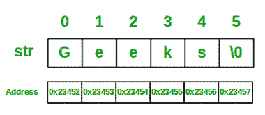
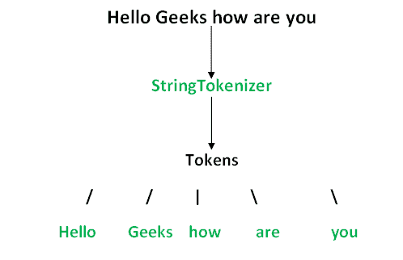

# Java 中的字符串

> 原文:[https://www.geeksforgeeks.org/strings-in-java/](https://www.geeksforgeeks.org/strings-in-java/)

Java 中的字符串是由字符数组在内部支持的对象。因为数组是不可变的(不能增长)，所以字符串也是不可变的。每当对字符串进行更改时，就会创建一个全新的字符串。

**语法:**

```java
<String_Type> <string_variable> = "<sequence_of_string>"; 
```

**示例:**

```java
String str = "Geeks";
```



**字符串的内存分配**

每当字符串对象被创建为文字时，该对象将在字符串常量池中创建。这允许 JVM 优化字符串文字的初始化。

**例如:**

```java
String str = "Geeks";
```

也可以使用**新的**运算符声明字符串，即动态分配。在字符串被动态分配的情况下，它们在堆中被分配一个新的内存位置。此字符串不会添加到字符串常量池中。

**例如:**

```java
String str = new String("Geeks");
```

如果你想把这个字符串存储在常量池中，那么你需要“实习”它。

**例如:**

```java
String internedString = str.intern(); 
// this will add the string to string constant pool.
```

最好使用字符串文字，因为它允许 JVM 优化内存分配。

**一个演示如何声明字符串的例子**

## Java 语言(一种计算机语言，尤用于创建网站)

```java
// Java code to illustrate String
import java.io.*;
import java.lang.*;

class Test {
    public static void main(String[] args)
    {
        // Declare String without using new operator
        String s = "GeeksforGeeks";

        // Prints the String.
        System.out.println("String s = " + s);

        // Declare String using new operator
        String s1 = new String("GeeksforGeeks");

        // Prints the String.
        System.out.println("String s1 = " + s1);
    }
}
```

**Output:** 

```java
String s = GeeksforGeeks
String s1 = GeeksforGeeks
```

**Java 中字符串形式的接口和类**

*   [CharBuffer](https://www.geeksforgeeks.org/tag/java-charbuffer/) :这个类实现了 CharSequence 接口。这个类用于允许字符缓冲区代替字符序列。这种用法的一个例子是正则表达式包“T2”
*   [字符串](https://www.geeksforgeeks.org/string-class-in-java/):字符串是一个字符序列。在 java 中，String 的对象是不可变的，这意味着一个常量，一旦创建就不能更改。

**创建字符串**

*   用 Java 创建字符串有两种方法:
    *   ***字符串文字***

```java
String s = “GeeksforGeeks”;
```

*   **使用** ***新增*** **关键词**

```java
String s = new String (“GeeksforGeeks”);
```

*   [StringBuffer](https://www.geeksforgeeks.org/stringbuffer-class-in-java/):
    **StringBuffer**是 **String** 的对等类，提供了字符串的大部分功能。该字符串表示固定长度、不可变的字符序列，而 StringBuffer 表示可增长和可写的字符序列。
    **语法:**

```java
StringBuffer s = new StringBuffer("GeeksforGeeks");
```

*   [字符串构建器](https://www.geeksforgeeks.org/stringbuilder-class-in-java-with-examples/):
    Java 中的**字符串构建器**代表一个可变的字符序列。因为 Java 中的字符串类创建了一个不可变的字符序列，所以 StringBuilder 类提供了字符串类的替代，因为它创建了一个可变的字符序列。
    **语法:**

```java
StringBuilder str = new StringBuilder();
str.append("GFG");
```

*   [StringTokenizer](https://www.geeksforgeeks.org/stringtokenizer-class-java-example-set-1-constructors/):
    Java 中的 StringTokenizer 类是用来把一个字符串分解成令牌的。
    **例:**



*   StringTokenizer 对象在内部维护要标记化的字符串中的当前位置。某些操作会将当前位置推进到已处理的字符之外。通过获取用于创建 StringTokenizer 对象的字符串的子字符串来返回标记。

*   [StringJoiner](https://www.geeksforgeeks.org/java-util-stringjoiner-java8/):
    StringJoiner 是 [*java.util*](https://www.geeksforgeeks.org/tag/java-util-package/) 包中的一个类，用于构造由分隔符分隔的字符(字符串)序列，可选地以提供的前缀开始，以提供的后缀结束。虽然这也可以在 StringBuilder 类的帮助下在每个字符串后添加分隔符，但是 StringJoiner 提供了一种简单的方法来实现这一点，而无需编写太多代码。
    **语法:**

> 公共字符串分隔符

**上面我们看到我们可以通过字符串文字创建字符串。**

> 对于 ex- // String s= "欢迎"；

在这里，JVM 检查字符串常量池。如果字符串不存在，则会创建一个新的字符串实例并将其放入池中。如果该字符串存在，则它不会创建新的对象。相反，它将返回对同一实例的引用。存储这些字符串实例的缓存称为字符串常量池或字符串池。在早期版本的 Java 中，直到 JDK 6，字符串池都位于永久生成空间中。但是在 JDK 7 中，它被移动到主堆区域。

**为什么弦池从 PermGen 移到****正常堆区？**

PermGen 空间有限，默认大小仅为 64 MB。在 PermGen 空间中创建和存储太多字符串对象是一个问题。这就是为什么字符串池被移动到更大的堆区域。为了让 Java 更有内存效率，使用了字符串文字的概念。通过使用“new”关键字，JVM 将在正常堆区域中创建一个新的字符串对象，即使字符串池中存在相同的字符串对象。

对于前任

> 字符串 a =新字符串(“布巴内斯瓦尔”)

让我们看一下 java 程序的概念，并可视化实际的 JVM 内存结构:

程序:

## Java 语言(一种计算机语言，尤用于创建网站)

```java
class StringStorage {
    public static void main(String args[])
    {
        String s1 = "TAT";
        String s2 = "TAT";
        String s3 = new String("TAT");
        String s4 = new String("TAT");
        System.out.println(s1);
        System.out.println(s2);
        System.out.println(s3);
        System.out.println(s4);
    }
}
```

**Output**

```java
TAT
TAT
TAT
TAT

```


**注意:**Java 中的所有对象都存储在一个堆中。引用变量是指存储在堆栈区域中的对象，或者它们可以包含在其他对象中，这也将它们放在堆区域中。