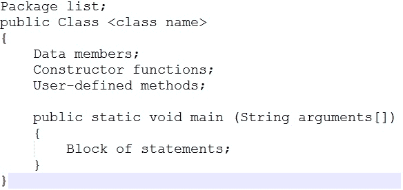
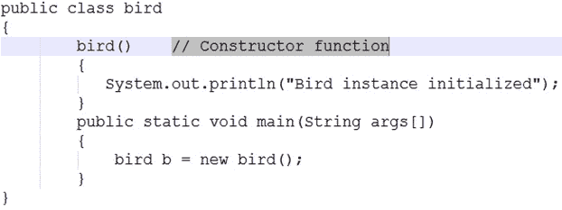
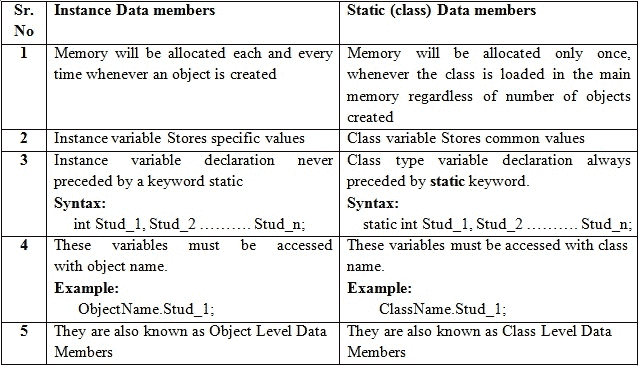
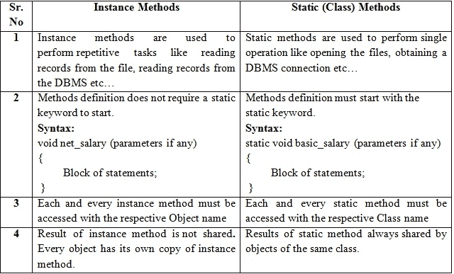
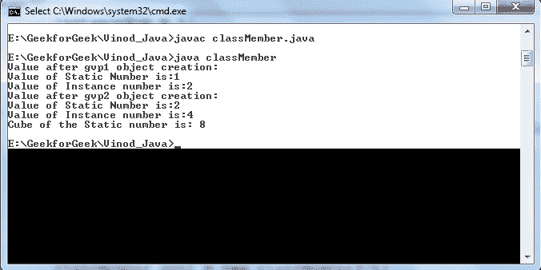

# Java 程序的结构和成员

> 原文:[https://www . geesforgeks . org/structure-members-Java-program/](https://www.geeksforgeeks.org/structure-members-java-program/)

当我们用任何语言编写任何程序时，我们需要遵循语言专家推荐的编写程序的标准结构。一个 java 程序可能包含许多类，其中只有一个类有主方法。类将包含数据成员和对该类的数据成员进行操作的方法。要编写一个 Java 程序，我们首先需要定义类，然后将它们放在一起。一般来说，一个标准的 java 程序由如下图所示的块组成。



说明:
1。包是类、接口和子包的集合。在 java 程序中，如果我们使用任何预定义的类和接口，那么 java 程序员有责任导入包含这些特定类和接口的特定包。在 java 中，默认情况下，java.lang.*包由每个程序导入。
2。类是用于开发用户定义的数据类型的关键字。每个 java 程序都必须从类的原型开始。该类已被声明为公共的，这意味着所有类都可以从所有包中访问该类。然而，一般来说，我们会在不指定修饰符的情况下用 java 声明类。
3。类名是给予该类的名称。每个类名都被视为一种用户定义的数据类型。
4。数据成员表示实例成员或静态成员。
5。创建类的对象时调用构造函数。它是初始化新创建的对象的代码块。构造函数只是与类名同名。构造函数没有返回类型。创建对象的新实例时，会自动调用构造函数。在下面的代码中，构造函数 bird()打印一条消息。



当我们如上图创建鸟类的对象时:
鸟 b =新鸟()；
这里的 new 关键字创建了 class bird 的对象，并调用构造函数来初始化这个新创建的对象。
构造函数和方法不同，因为构造函数用于初始化类的对象，而方法用于通过实现 java 代码来执行任务。构造函数不能声明为抽象的、最终的、静态的和同步的，而方法可以声明。构造函数没有返回类型，而方法有。
6。用户定义的方法表示实例(或)静态，它们的选择取决于类名，这些方法用于重复执行一次(或)操作。一个类的所有用户定义方法都包含特定问题的逻辑。这些方法被称为业务逻辑方法。
7。所有 java 程序都是用 main()方法开始执行的，所以 main()方法被称为程序的主干。java 虚拟机通过首先执行 main()方法开始运行任何 Java 程序。
8。Java 的 main()方法不返回任何值，因此它的返回类型必须是 void。
9。此外，main()方法在 Java 程序的整个生命周期和对象创建之前只执行一次，因此它的本质必须是静态的。
10。main()方法在所有 java 程序中被访问，它的访问说明符必须是公共的(通用的)。
11。java 的每一个 main()方法都必须以 String 类的对象数组作为参数。
12。语句块是为调用类的用户定义方法而编写的一组可执行语句。
13。如果我们有多个 java 文件，那么 java 中类文件的命名约定是，无论哪个类包含 main()方法，该类名都将作为扩展名为(点)java 的文件名给出。
数据成员的类型:
Java 类是数据成员和函数的集合。任何 java 程序都可能包含两种类型的数据成员。他们是；
1。实例或非静态数据成员
2。静态或类数据成员
下表描述了两者的区别。



方法的类型:
在 java 程序中，除了构造函数之外，我们通常可以定义两种类型的方法。他们是；
1。实例或非静态方法
2。静态或类方法
下表描述了两者的区别。



以下名为 TestGVP.java 的示例演示了 java 类不同成员的用法。

## Java 语言(一种计算机语言，尤用于创建网站)

```
// Java code to show structures and
// members of Java Program
public class classMember
{

// Static member
static int staticNum = 0;

// Instance member
int instanceNum;

/* below constructor increments the static
number and initialize instance number */
public classMember(int i) //Constructor method
{
    instanceNum = i;
    staticNum++;
}

/* The show method display the value in the staticNum and instanceNum */
public void show() //instance method
{
    System.out.println("Value of Static Number is:" + staticNum +
                        "\nValue of Instance number is:"+ instanceNum);
}

// To find cube
public static int cube() //Static method
{
    return staticNum * staticNum * staticNum;
}

// Driver code
public static void main(String args[])
{
    classMember gvp1 = new classMember(2);
    System.out.println("Value after gvp1 object creation: ");
    gvp1.show();

    classMember gvp2 = new classMember(4);
    System.out.println("Value after gvp2 object creation: ");
    gvp2.show();

    // static method can be accessed by class name
    int cub=classMember.cube();
    System.out.println("Cube of the Static number is: "+ cub);
}
}
```

输出:

