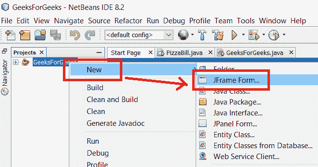
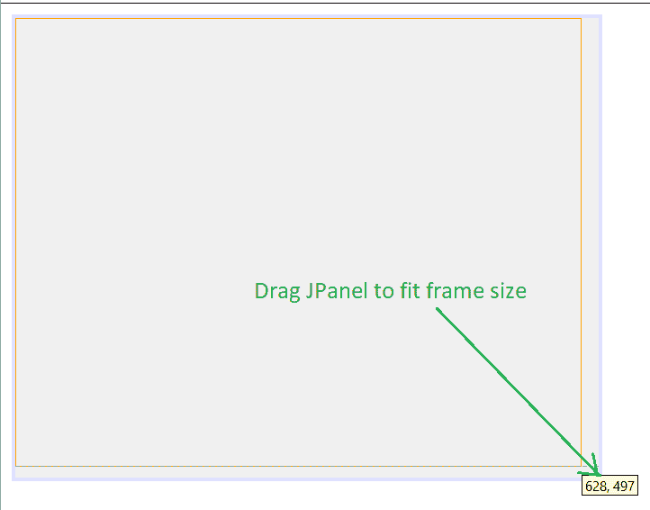
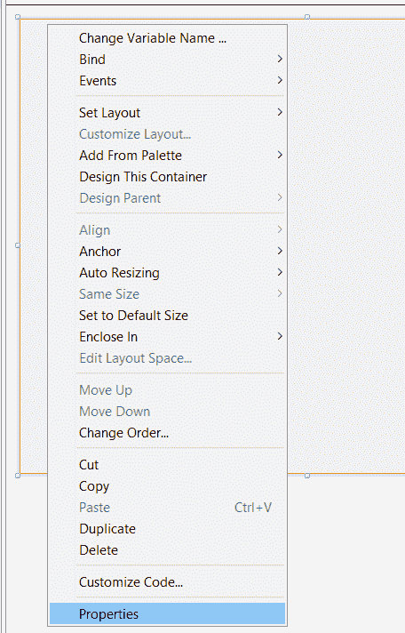
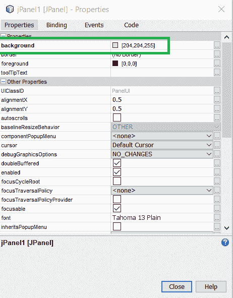
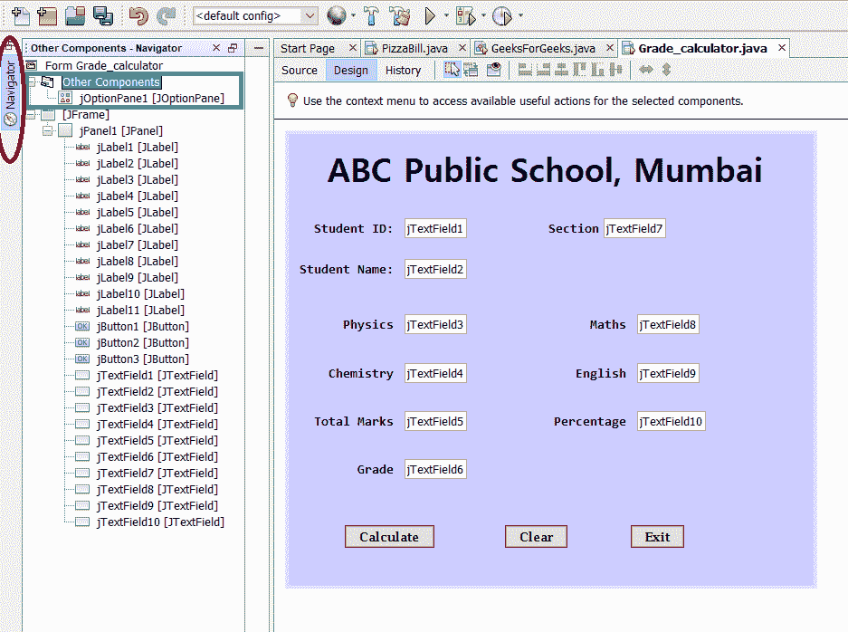

# 使用 Java Swing 的学生成绩计算器

> 原文:[https://www . geesforgeks . org/学生-年级-计算器-使用-java-swing/](https://www.geeksforgeeks.org/student-grade-calculator-using-java-swing/)

考虑以下场景。我们需要创建一个基于图形用户界面的应用程序，根据在 4 个科目中获得的分数来计算学生的分数。以下是不同年级的分数范围。

<figure class="table">

| sign | grade |
| --- | --- |
| >90% | A |
| Between 85%–90% | B |
| Between 80%–85% | C |
| Between 70%–80% |

</figure>

我们将使用 [Netbeans](https://www.geeksforgeeks.org/what-will-be-the-best-java-ides-in-2020/) 来创建图形用户界面应用程序，因为它是一个精心制作的开源集成开发环境，提供了组件检查器、小部件拖放、调试器、对象浏览器等功能。

### 创建学生成绩计算器的步骤

1。通过点击 **新建项目- > Java - > Java 应用** 创建一个新的 Java 应用，并给出一个合适的项目名称。GeeksForGeeks 点击 **完成。**

2.要在同一个 Java 项目 GeeksForGeeks 下创建一个新文件，右键单击窗口左侧的项目名称，单击 **New - > JFrame Form** 并给出一个合适的文件名。单击**完成。**



在现有的 Java 应用程序项目中创建新文件

3.现在，从位于窗口右侧的调色板中，根据需求开始拖动工具包小部件。要更改框架的背景颜色，我们需要先插入一个 *JPanel* 并更改其属性。



拖动面板以适合框架大小

4.单击面板区域的任意位置，转到**属性- >背景。**



5.双击背景选项并选择您选择的任何颜色。然后点击*确定*。



6.设置背景颜色后，将其他小部件拖到设计区域。要在单独的对话框中显示学生详细信息，如学生证、姓名、年级，请从调色板中拖动*选项面板*小部件。首先，它与现有设计重叠。转到屏幕左侧的导航器，然后将*操作面板*组件从 *JFrame* 拖移至*其他组件。*会落后。



7.现在让我们快速浏览一下下表中程序中每个组件的用法。

<figure class="table">T34】jlabel 4:第节节 jTextField4

| object type | Object name | describe |
| --- | --- | --- |
| label | JLabel1: ABC Public School, Mumbai | Describe the title of the application |
| JLabel2: Student ID card | Define student ID card |
| jLabel3：学名 | Define student ID card |
| Define the first |
| jLabel5：物理 | Define the score of subject 1. |
| jLabel8：英语 | Define the score in subject 4 |
| JLabel9: Total score | Define total score |
| JLabel10: percentage | Percent obtained |
| jLabel11：年级 | 4 variables |
| jtextfield 5 | Variable 5 |
| jtextfield 6 | 6 variables |
| jtextfield 7 | 7 variables |
| Jtextfield 8 Button 1: Calculate | Computer rank |
| Button 2: Clear | Clear the contents of all components |
| Button 3: Exit | Existing applications |
| Options panel | Option 1 |  |

</figure>

8.现在输入代码，双击*按钮 1* ，你将被引导到源标签。在这里输入下面的代码。

## Java 语言(一种计算机语言，尤用于创建网站)

```
// Initialize variables
int s_id = Integer.parseInt(jTextField1.getText());
String s_name = jTextField2.getText();
String s_sec = jTextField7.getText();
double phy = Double.parseDouble(jTextField3.getText());
double chem = Double.parseDouble(jTextField4.getText());
double maths = Double.parseDouble(jTextField8.getText());
double eng = Double.parseDouble(jTextField9.getText());

// Calculates total marks
double total = phy + chem + maths + eng;
jTextField5.setText("" + total);

// Calculates percentage
double per = (total / 400) * 100;
jTextField10.setText("" + per);
String grade = null;

// Grade calculation
if (per > 90) {
    grade = "A";
} else if ((per > 85) && (per < 90)) {
    grade = "B";
} else if ((per > 80) && (per < 85)) {
    grade = "C";
} else if ((per > 70) && (per < 80)) {
    grade = "D";
} else if ((per > 60) && (per < 70)) {
    grade = "E";
} else if ((per > 50) && (per < 60)) {
    grade = "Poor";
}

// Displays result in TextField
jTextField6.setText("" + grade);

// Displays result in new Dialog Box
jOptionPane1.showMessageDialog(null, "Hello: " + s_name + " of class: " + s_sec +
    "\nYour Grade is: " + grade);
```

9.现在要清除所有*文本字段*，在*按钮 2* *操作执行*选项下编写以下代码，在设计区域点击两次清除按钮即可实现。

## Java 语言(一种计算机语言，尤用于创建网站)

```
jTextField1.setText("");
jTextField2.setText("");
jTextField3.setText("");
jTextField4.setText("");
jTextField5.setText("");
jTextField6.setText("");
jTextField7.setText("");
jTextField8.setText("");
jTextField9.setText("");
jTextField10.setText("");
```

10.现在要退出系统，在*按钮 3* *动作执行*选项下使用以下语句，在设计区域点击退出按钮两次即可完成。

```
 System.exit(0)

```

11.现在，右键单击屏幕上的任意位置，并从下拉菜单中选择*运行文件*选项。最终输出如下所示。输入必要的细节，应用程序就准备好了！


最终输出

**输出:**

<video class="wp-video-shortcode" id="video-456849-1" width="640" height="360" preload="metadata" controls=""><source type="video/mp4" src="https://media.geeksforgeeks.org/wp-content/uploads/20200718175237/Grade3.mp4?_=1">[https://media.geeksforgeeks.org/wp-content/uploads/20200718175237/Grade3.mp4](https://media.geeksforgeeks.org/wp-content/uploads/20200718175237/Grade3.mp4)</video>