# 使用 Java Swing 的学生记录系统

> 原文:[https://www . geesforgeks . org/student-record-system-use-Java-swing/](https://www.geeksforgeeks.org/student-record-system-using-java-swing/)

考虑这样一个场景:在一所学校里，日常的教师、职员、当局需要出于各种目的查看学生的记录，比如搜索某个学生的详细信息。手动浏览记录是一项乏味且耗时的工作。因此，最好开发校内软件，允许用户插入、更新、搜索或删除记录，而无需在每次出现查询时手动查看文档。

在本文中，我们将看到如何使用 [Java Swing](https://www.geeksforgeeks.org/creating-frames-using-swings-java/) 快速创建应用程序，以使用 [JDBC](https://www.geeksforgeeks.org/introduction-to-jdbc/) 执行创建、检索和删除数据库等操作。

在编写代码之前，需要记住几件事:

1.  **JDBC API:** Java 数据库连接应用程序接口是一组接口和类，使用它们可以编写用于访问和操作数据库的 Java 程序。它充当应用程序和数据库之间的通信。
2.  **JDBC 驱动程序:**它使 Java 应用程序能够与数据库交互。我们需要为不同的数据库设置不同的 JDBC 驱动程序。


通过 JDBC 驱动程序实现 Java 应用程序和数据库交互的工作流程

**创建应用程序的步骤:**

**1。**首先，打开 Netbeans，点击菜单栏中的文件选项。

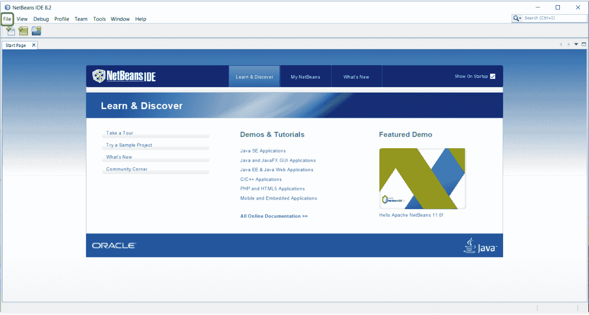

**2。**现在通过点击**新项目- > Java - > Java 应用程序**创建一个新的 Java 应用程序，并给出一个合适的项目名称，然后点击完成。

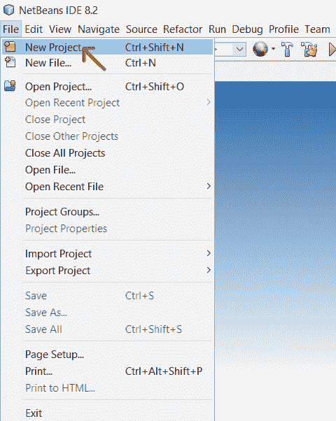

**3** **。** 现在再次进入菜单栏上的【文件】选项创建一个新文件，然后**新建文件- > Swing GUI 表单- > JFrame 表单**，并给出一个合适的文件名点击完成。

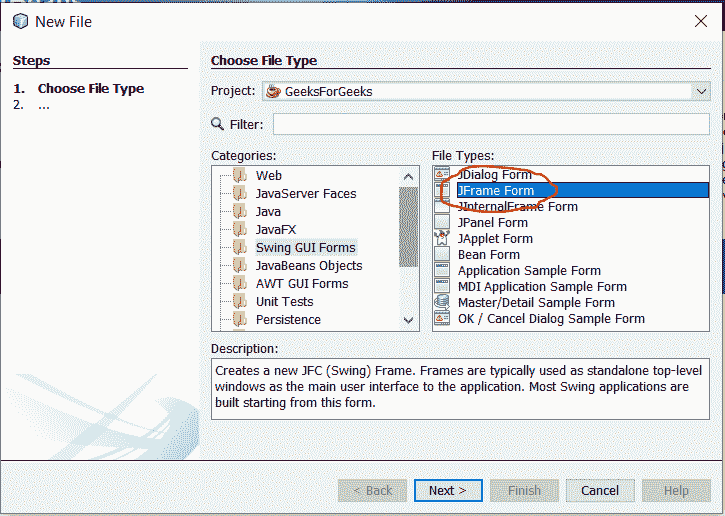

**4。**文件创建成功后，我们将看到以下屏幕。该窗口的 3 个重要部分是:

*   **设计:**这是我们将创建应用程序的设计/模板的区域。
*   **来源:**这是写程序逻辑代码的地方。
*   **调色板:**这个组件包含了我们需要在设计区域拖放的所有小部件

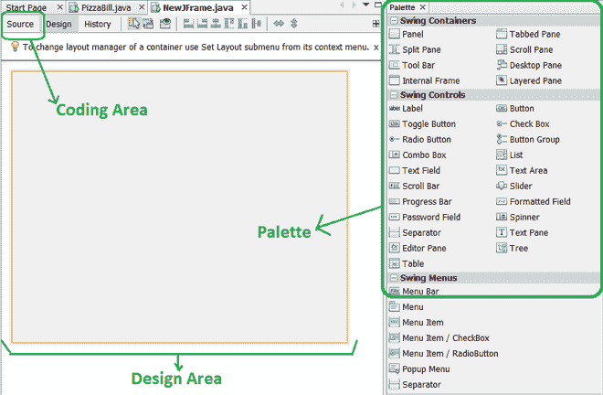

成功创建 Java 文件后显示的窗口。

**5。**现在，从位于窗口右侧的调色板中，开始拖动工具包小部件。

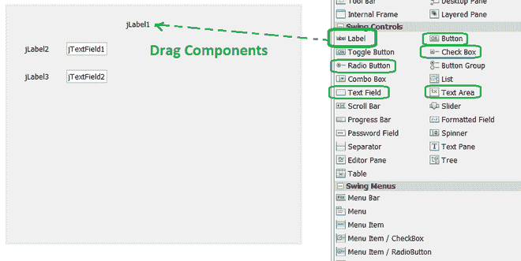

将组件从调色板拖到设计区域

**6。**由于我们需要以列表形式显示所有数据，因此将表格小部件从调色板拖到设计区域。现在要设置标题，右键单击表格，选择**属性- >模型- >添加/删除列**。

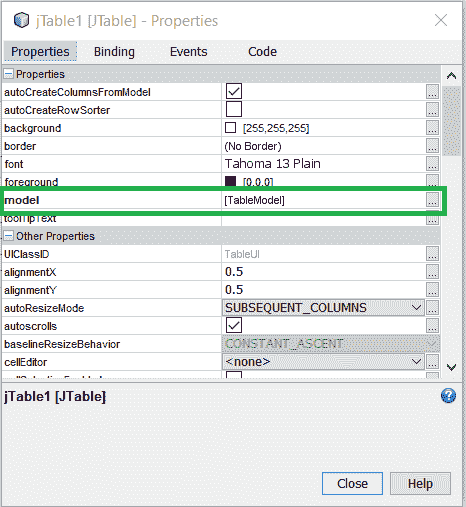 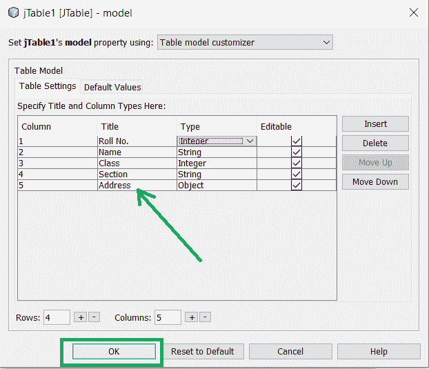

**7。**现在让我们创建数据库来存储数据。打开 MySQL 命令客户端，输入密码，并输入以下命令来创建新数据库、新表和定义属性。

```
mysql> create database student;
Query OK, 1 row affected (0.14 sec)

mysql> use student;
Database changed
mysql> create table record(
    -> rollno int(3),
    -> name char(20),
    -> class int(2),
    -> section char(2),
    -> address varchar(40));
Query OK, 0 rows affected (2.03 sec)

mysql> describe record;
+---------+-------------+------+-----+---------+-------+
| Field   | Type        | Null | Key | Default | Extra |
+---------+-------------+------+-----+---------+-------+
| rollno  | int(3)      | YES  |     | NULL    |       |
| name    | char(20)    | YES  |     | NULL    |       |
| class   | int(2)      | YES  |     | NULL    |       |
| section | char(2)     | YES  |     | NULL    |       |
| address | varchar(40) | YES  |     | NULL    |       |
+---------+-------------+------+-----+---------+-------+
5 rows in set (0.03 sec)

```

回到 NetBeans，我们需要按照以下步骤进行数据库连接:

**8。**我们需要导入与数据库建立连接和检索数据所需的库，这是由–*驱动管理器类*、*连接类*和*语句类*完成的。这样进入菜单栏，在**工具- >库**、下，添加 *MySQL JDBC 连接器*。记下库类路径，然后单击确定。现在转到**项目**工具栏，转到应用程序的库。右键单击并选择**添加 Jar/库**并浏览前面记下的库类路径。

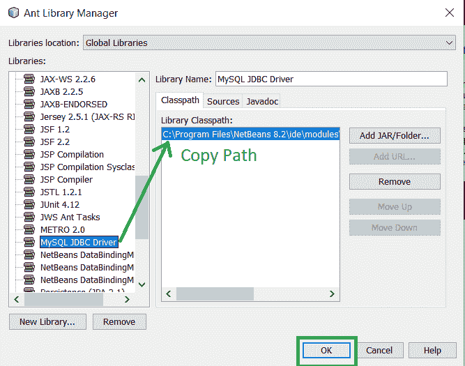

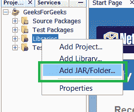

添加 Jar 文件

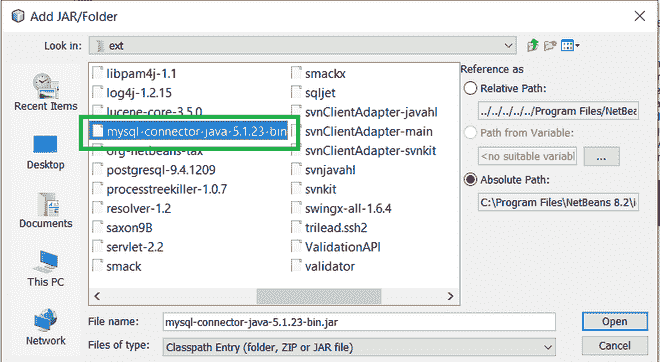

添加 mysql 连接器

9.转到**窗口- >服务- >数据库**并输入所需的 MySQL 用户名和密码凭据。单击“测试连接”后，如果成功，连接器徽标将显示为已连接。

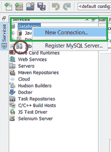

连接最初断开

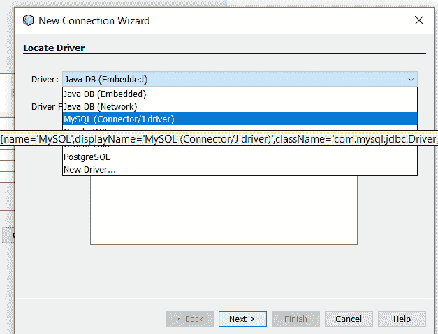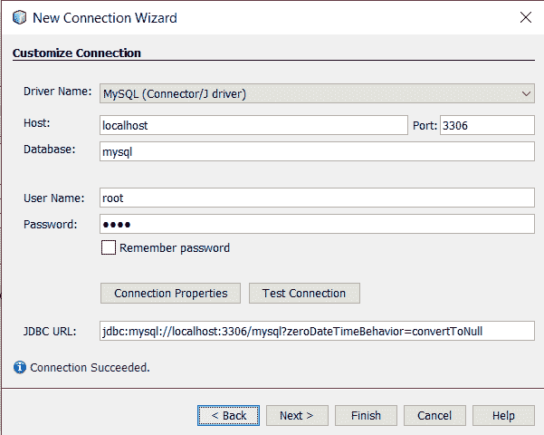

**10。**现在输入代码，双击按钮 1(插入)，你将被引导到源代码选项卡。在这里输入下面的代码。

## Java 语言(一种计算机语言，尤用于创建网站)

```
// Write the import code at top
import java.sql.*;
import javax.swing.JOptionPane;
import javax.swing.table.DefaultTableModel;

public class SchoolRecord extends javax.swing.JFrame {

    Connection con = null;
    Statement stmt = null;
    ResultSet rs = null;
    // JButton1 Code starts from here
    try {
        Class.forName("com.mysql.jdbc.Driver");
        Connection con = DriverManager.getConnection(
            "jdbc:mysql://localhost:3306/student", "root",
            "root");
        stmt = con.createStatement();
        String rollno = jTextField1.getText();
        String name = jTextField2.getText();
        String clss = jTextField3.getText();
        String sec = jTextField4.getText();
        String adr = jTextArea1.getText();
        String INSERT = "INSERT INTO RECORD VALUES('"
                        + rollno + "','" + name + "','"
                        + clss + "','" + sec + "','" + adr
                        + "');";
        stmt.executeUpdate(INSERT);
        JOptionPane.showMessageDialog(
            this, "Record Added Successfully");
        jButton1.setEnabled(true);
    }
    catch (Exception e) {
        JOptionPane.showMessageDialog(
            this, "Error In Connectivity");
    }
```

在上面的代码中，需要记住以下几点:

1.  **连接类:**它充当 Java 程序和特定数据库应用程序之间的连接会话。我们通过它向数据库发送 SQL 查询。
2.  **语句类:**语句是表示 SQL 语句的接口。
3.  **结果集:**当您执行语句对象时，它们会生成结果集对象，这是一个表示数据库结果集的数据表。创建语句对象需要一个连接对象。
4.  **JDBC 驱动程序注册:**要从 Java 应用程序打开到数据库的连接，应该向设备管理器注册 JDBC 驱动程序。因此我们使用语言包的 **forName()** 。这里 *com.mysql.jdbc.Driver* 是 mysql 的驱动名称。
5.  **。getConnection():** 用于通过指定*数据库名称(学生)、用户名(根)和密码(根)来建立与数据库的物理连接。*这将创建一个连接对象。
6.  **查询执行:** *createStatement()* 创建一个保存 SQL 查询的语句类型对象。然后*execute query/execute update*方法执行 SQL 语句。这里是“插入记录值…”。
7.  **数据提取:**上述方法创建了一个包含结果数据的 resultset 对象。*(现在看下面的代码)* rs 是存储结果数据集的变量，因此我们使用一个*。获取<类型> ()* 方法获取数据。
8.  **while(rs.next()):** *(参见下面的代码)*因为我们需要包含多行的数据，所以我们使用一个循环来访问它们。 *next()* 方法将光标向前移动一行。
9.  **关闭打开的数据库:**我们关闭所有打开的数据库来清理环境。因此我们使用- *rs.close()，stmt.close()和 con.close()* 方法。

**11 时。**现在要显示所有数据，在设计区域的*查看数据按钮*上点击两次，在按钮 2 操作执行选项下编写以下代码。

## Java 语言(一种计算机语言，尤用于创建网站)

```
DefaultTableModel model
    = (DefaultTableModel)jTable1.getModel();
try {
    Class.forName("com.mysql.jdbc.Driver");
    Connection con = DriverManager.getConnection(
        "jdbc:mysql://localhost:3306/student", "root",
        "root");
    String query = "SELECT* FROM RECORD;";
    ResultSet rs = stmt.executeQuery(query);
    while (rs.next()) {
        String rollno = rs.getString("rollno");
        String name = rs.getString("name");
        String clss = rs.getString("class");
        String sec = rs.getString("section");
        String adr = rs.getString("address");
        model.addRow(
            new Object[] { rollno, name, clss, sec, adr });
    }
    rs.close();
    stmt.close();
    con.close();
}
catch (Exception e) {
    JOptionPane.showMessageDialog(this,
                                  "Error In Connectivity");
}
```

**12 时。**现在要清除所有文本字段、文本区域和表格内容，请在“按钮 3 操作已执行”选项下编写以下代码，这可以通过在设计区域的“清除”按钮上单击两次来实现。

## Java 语言(一种计算机语言，尤用于创建网站)

```
jTextField1.setText("");
jTextField2.setText("");
jTextField3.setText("");
jTextField4.setText("");
jTextArea1.setText("");
DefaultTableModel dm
    = (DefaultTableModel)jTable1.getModel();
dm.getDataVector().removeAllElements();
jTable1.repaint();
```

**13。**现在要退出系统，在按钮 4 操作执行选项下添加以下语句，在设计区域点击退出按钮两次即可完成。

```
System.exit(0);

```

**14。**输入代码后，右键单击屏幕上的任意位置，并从下拉菜单中选择运行文件选项。最终输出如下所示。输入必要的细节，应用程序就准备好了！


插入日期

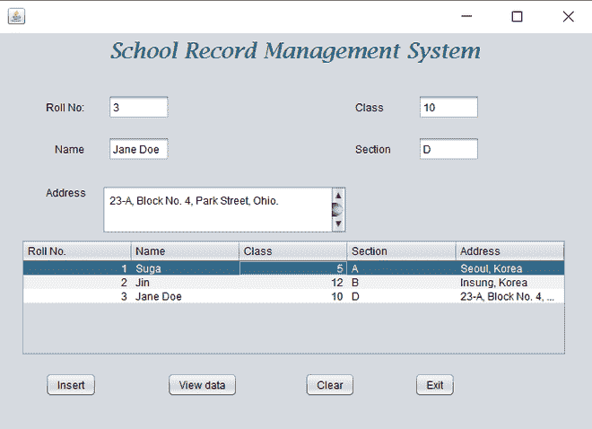

图像数据

**输出:**

<video class="wp-video-shortcode" id="video-471542-1" width="640" height="360" preload="metadata" controls=""><source type="video/mp4" src="https://media.geeksforgeeks.org/wp-content/uploads/20200901171237/student-record-system-using-java-swing.mp4?_=1">[https://media.geeksforgeeks.org/wp-content/uploads/20200901171237/student-record-system-using-java-swing.mp4](https://media.geeksforgeeks.org/wp-content/uploads/20200901171237/student-record-system-using-java-swing.mp4)</video>