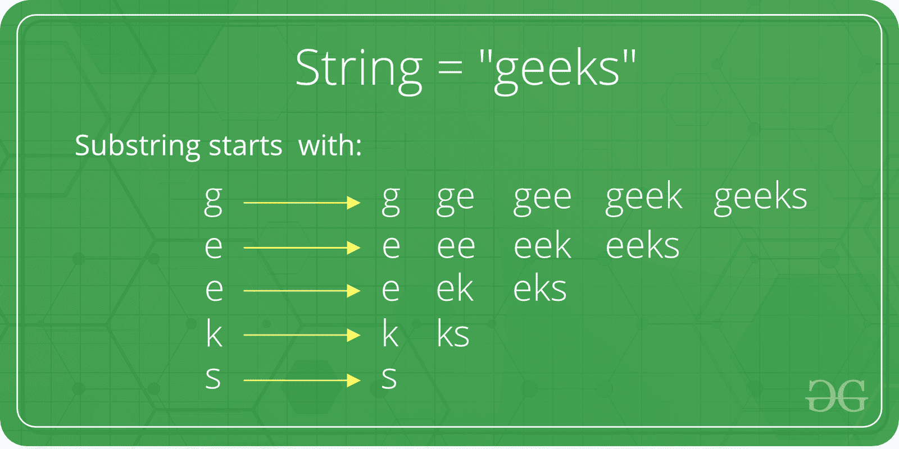

# Java 中的子串

> 原文:[https://www.geeksforgeeks.org/substring-in-java/](https://www.geeksforgeeks.org/substring-in-java/)



substring()方法有两个**变体。本文描述了所有这些，如下所示:**

****1。String substring():** 这个方法有两个变体，**返回** **一个新的字符串**，它是这个字符串的一个子字符串。子字符串从指定索引处的字符开始，一直延伸到该字符串的末尾。子串的索引从 1 开始，而不是从 0 开始。**

```
**Syntax :** 
**public String substring(int begIndex)**
**Parameters :** 
**begIndex :** the begin index, inclusive.
**Return Value :** 
The specified substring.
```

## **Java 语言(一种计算机语言，尤用于创建网站)**

```
// Java code to demonstrate the
// working of substring(int begIndex)
public class Substr1 {
    public static void main(String args[])
    {

        // Initializing String
        String Str = new String("Welcome to geeksforgeeks");

        // using substring() to extract substring
        // returns (whiteSpace)geeksforgeeks

        System.out.print("The extracted substring is : ");
        System.out.println(Str.substring(10));
    }
}
```

****输出:****

```
The extracted substring is :  geeksforgeeks
```

****2。字符串子字符串(begIndex，endIndex):** 该方法有两个变体，**返回一个**新字符串**即该字符串的子字符串**。子字符串从指定索引处的字符开始，**将**扩展到该字符串的末尾，如果给出了第二个参数，则向上扩展**到 endIndex–1**。**

```
**Syntax :** 
**public String substring(int begIndex, int endIndex)**
**Parameters :** 
**beginIndex : ** the begin index, inclusive.
**endIndex : ** the end index, exclusive.
**Return Value :** 
The specified substring.
```

## **Java 语言(一种计算机语言，尤用于创建网站)**

```
// Java code to demonstrate the
// working of substring(int begIndex, int endIndex)
public class Substr2 {
    public static void main(String args[])
    {

        // Initializing String
        String Str = new String("Welcome to geeksforgeeks");

        // using substring() to extract substring
        // returns geeks
        System.out.print("The extracted substring  is : ");
        System.out.println(Str.substring(10, 16));
    }
}
```

****输出:****

```
The extracted substring  is :  geeks
```

****可能的应用:**子串提取在包括前缀和后缀提取在内的许多应用中找到了它的用途。例如**从**中提取姓氏**名称**或**从包含金额和货币符号的字符串中仅提取面额**。后一种解释如下。**

## **Java 语言(一种计算机语言，尤用于创建网站)**

```
// Java code to demonstrate the
// application of substring()
public class Appli {
    public static void main(String args[])
    {

        // Initializing String
        String Str = new String("Rs 1000");

        // Printing original string
        System.out.print("The original string  is : ");
        System.out.println(Str);

        // using substring() to extract substring
        // returns 1000
        System.out.print("The extracted substring  is : ");
        System.out.println(Str.substring(3));
    }
}
```

****输出:****

```
The original string  is : Rs 1000
The extracted substring  is : 1000
```

**本文由 **Astha Tyagi** 供稿。如果你喜欢 GeeksforGeeks 并想投稿，你也可以使用[write.geeksforgeeks.org](https://write.geeksforgeeks.org)写一篇文章或者把你的文章邮寄到 review-team@geeksforgeeks.org。看到你的文章出现在极客博客主页上，帮助其他极客。
如果你发现任何不正确的地方，或者你想分享更多关于上面讨论的话题的信息，请写评论。**