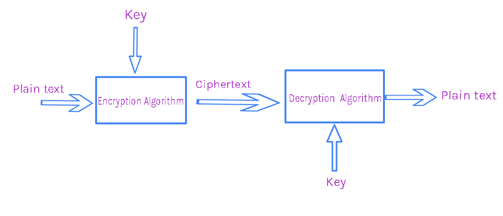
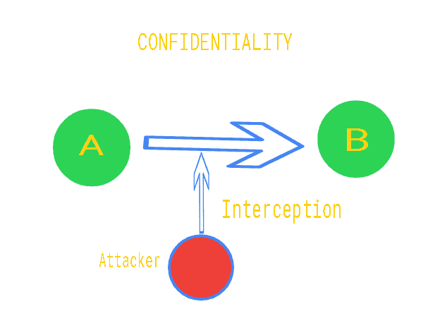
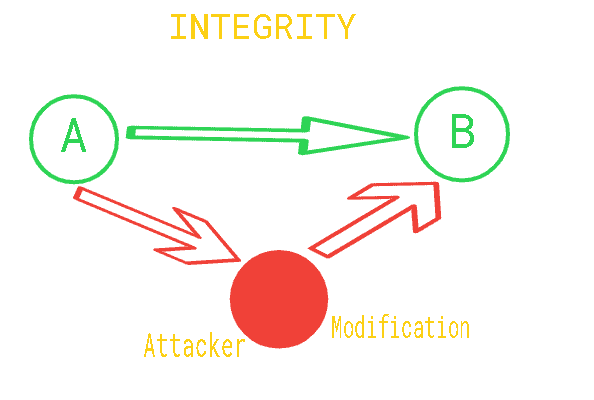
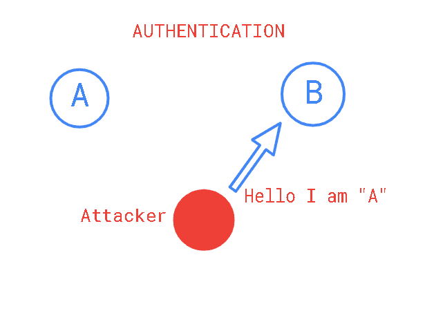
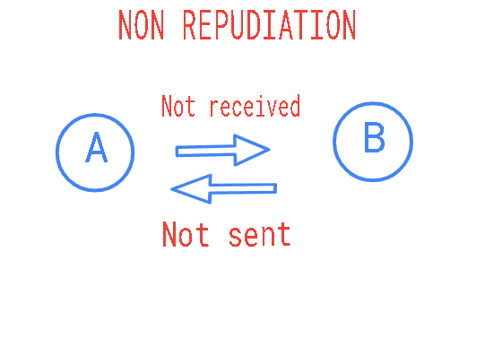
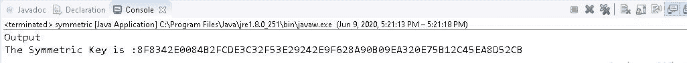
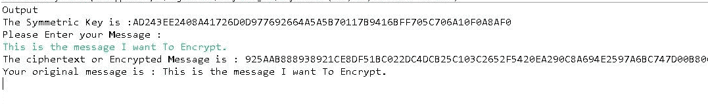

# Java 中的对称加密密码

> 原文:[https://www . geesforgeks . org/symmetric-encryption-crypto-in-Java/](https://www.geeksforgeeks.org/symmetric-encryption-cryptography-in-java/)

[密码学](https://www.geeksforgeeks.org/cryptography-and-its-types/)是对不同技术的研究，以保护来自未授权实体的数据。在计算机科学中，我们试图开发保护敏感数据的策略和实践。大多数密码学都涉及到用于保护数据的非常先进的数学函数。为密码学开发的算法的唯一目的是对攻击者或中间人隐藏数据。在本文中，我们将理解密码学中的对称加密的概念。
在进入概念之前，让我们先了解一下密码学中涉及的几个关键术语。它们是:

*   **纯文本:**纯文本是通过加密算法隐藏在视野之外的原始消息或数据。
*   **密文:**是给定密钥和明文时加密运算的输出。它也是馈送给解密功能的数据。
*   **密钥:**密钥是一段数据或相关的一对数据，当用纯文本输入到加密函数中时会产生密文。因为算法是公开的，所以密钥必须是安全的。

*   **Salt:**Salt 是一个随机的数据片段，当它被添加到哈希函数中时，会在输出中提供更多的熵，从而降低攻击发生的可能性。一个好的加密散列应该总是使用 salt。



现在，让我们了解密码学中所涉及的组件的功能。

*   **数字签名:**数字签名是一种验证来自远程的消息真实性的功能。通过使用私钥对消息进行签名，使用公钥对消息进行解密可以确认发送者的真实性。
*   **加密:**加密是取明文转换成密文的过程，稍后再用合适的密钥转换回原始数据。这可以通过共享密钥或非对称密钥对来实现。
*   **哈希:**哈希允许我们将任意大小的字节集映射为相对唯一的字节集的有限大小。它是映射数据的单向数学函数。

**<u>Java 密码体系结构</u>**
JCA(Java 密码体系结构)是 Java 加密、解密、哈希、安全随机和其他几个允许我们用 Java 编程实现密码功能的引擎的核心和灵魂。以下是该体系结构中涉及的一些基本概念。

*   **安全随机数:**该引擎用于创建密码强随机数。安全随机是 java 中良好加密操作的基本要求。它要么用于种子，要么用于钥匙。
*   **消息摘要:**该引擎用于生成加密安全的哈希。摘要是一个散列函数，接受可变长度的输入并产生固定长度的输出。
*   **签名:**它是创建和验证数字签名的引擎。数字签名是唯一的，它们采用散列和公钥加密非对称操作的组合来创建唯一的值或签名。
*   **密码:**是提供加密操作的引擎。密码同时支持不对称和对称操作。密码也支持流密码和块密码。

**加密:**加密是利用密钥隐藏明文数据的过程，产生密文。没有用于生成密文的密钥，加密文本变得难以阅读。只有授权的实体才能阅读原文。让我们了解加密的目标。在接下来的插图中，我们考虑“A”作为发送者，“B”作为接收者。

*   **保密性:**也称为隐私，即“A”发送给“B”的消息只有“B”可读，假设算法和密钥只有“A”和“B”共享



*   **完整性:**由“A”发送的数据应该接收到“B”而不会受到不良行为者的任何修改或任何中间人的攻击。



*   **认证:**是使用密码学验证或识别用户身份的过程。例如，如果“A”向“B”发送消息，那么真实性就是证明该消息仅由“A”发送。



*   **不否认:**是证明消息来自“A”的一种方式，“B”可以相信消息来自“A”，“A”可以确认是他发出的。



**对称加密:**对称加密或共享密钥加密是一种加密方法，其中涉及的双方共享一个标准密钥。那把公用钥匙必须由双方保密。例如，“A”将使用共享密钥“K”对消息进行加密，那么“B”只能使用“K”对加密的消息进行解密。
**非对称加密:**非对称加密或公钥/私钥对加密是基于两个在数学上相关的密钥(即)的概念，一个用于加密，另一个用于解密。例如，“A”会创建一个公钥和私钥，他会与每个人共享公钥。他可以用私钥加密消息并将其发送给“B”。“B”可以使用公开可用的“A”公钥解密消息。如果“B”想向“A”发送私有消息，他可以使用“A”的公钥加密数据，然后“B”可以使用他的私钥解密数据。
**<u>实现对称加密</u>**
为了实现对称加密，我们需要一个共享密钥。我们将生成一个共享密钥，但是在此之前，我们需要知道一些类和函数。它们是:

1.  **类安全随机数:**这个类有助于生成安全随机数。以下是该类的构造函数详细信息:
    *   *secureandom()*使用默认随机数算法构建随机安全数字生成器。
    *   *公共安全对象(字节[]种子)*安全对象实例使用指定的种子字节进行种子设定。此构造函数所需的参数是种子。
    *   受保护的安全对象(安全对象，提供程序提供程序)。这个构造函数的参数是 secureRandomSpi，它引用了 SecureRandom 实现。和代表提供者的提供者。
    *   **getInstance():** 返回一个 SecureRandom 对象，并应用随机数生成算法。这个方法的语法是:
        T5】block quote
        公共静态 SecureRandom getInstance(String algo)抛出 NoSuchAlgorithmException

    *   **getProvider():** 这个方法返回一个 SecureRandom 对象。这个方法的语法是:

> 公共最终提供商 getProvider()

*   **getAlgorithm():** 此方法返回 SecureRandom 对象实现的算法名称。这个方法的语法是:

> 公共字符串 getAlgorithm()

*   **setSeed():** 此方法重新播种随机对象。添加给定的种子，而不是替换现有的种子。从而有助于随机性。这个方法的语法是:

> public void setSeed(byte[]seed)

*   **getSeed():** 该方法返回给定的种子字节数，使用种子生成算法计算。这个方法的语法是:

> 公共静态字节[] getSeed(int numBytes)

1.  **类密钥生成器:**该类提供密钥生成器的功能。以下是带有密钥大小的标准密钥生成器算法。
    *   AES (128)
    *   DES (56)
    *   德塞德(168)
    *   海贼王角色列表
    *   hmac sha1 256

**生成对称密钥的方法:**为了生成对称密钥，可以遵循以下步骤。

*   使用 java 中的*secureAnDom 类*创建一个密钥，用于生成一个随机数。这将用于加密和解密数据。密钥可以创建为:

> //创建对象
> secureandom random = new secureandom()；
> //我们可以调用下面的方法
> //来检索随机字节
> 字节字节[] =新字节[20]；
> random.nextBytes(字节)；

*   密钥生成器类将提供一个 *getInstance()* 方法，该方法可用于传递表示密钥生成算法的字符串变量。它返回一个密钥生成器对象。在这个例子中，我们使用的是 AES 算法。这可以实现为:

> key generator = key generator . getinstance(AES)；
> keygenerator.init(256，secure random)；

*   现在，生成了密钥，如果我们希望看到生成的密钥是一个对象，我们可以使用数据类型转换器将其转换为*六进制格式*。

以下是上述方法的实现:

## Java 语言(一种计算机语言，尤用于创建网站)

```java
// Java program to generate
// a symmetric key
import java.security
    .SecureRandom;

import javax.crypto
    .KeyGenerator;
import javax.crypto.SecretKey;
import javax.xml.bind
    .DatatypeConverter;

// Class to create a
// symmetric key
public class symmetric {

    public static final String AES
        = "AES";

    // Function to create a secret key
    public static SecretKey createAESKey()
        throws Exception
    {

        // Creating a new instance of
        // SecureRandom class.
        SecureRandom securerandom
            = new SecureRandom();

        // Passing the string to
        // KeyGenerator
        KeyGenerator keygenerator
            = KeyGenerator.getInstance(AES);

        // Initializing the KeyGenerator
        // with 256 bits.
        keygenerator.init(256, securerandom);
        SecretKey key = keygenerator.generateKey();
        return key;
    }

    // Driver code
    public static void main(String args[])
        throws Exception
    {
        SecretKey Symmetrickey
            = createAESKey();
        System.out.println("Output");
        System.out.print("The Symmetric Key is :"
                         + DatatypeConverter.printHexBinary(
                               Symmetrickey.getEncoded()));
    }
}
```

**输出:**



**使用对称密钥加密和解密:**为了执行加密和解密，可以遵循以下步骤。

*   创建加密过程中避免重复所需的初始化向量。这基本上是一个随机数。
*   密码类提供加密和解密两种功能。它可以用来指定两种不同的模式。

> 密码密码= cipher . getinstance(" AES/CBC/pkcs5 add ")；
> 密码初始化(密码。ENCRYPT_MODE，secretKey，ivparametersec)；
> cipher.init(密码。DECRYPT_MODE，secretKey，ivparametersec)；

*   最后*在密码上调用 doFinal()* 方法，在单部分操作中对数据进行加密或解密，或者完成多部分操作并返回一个字节数组。

> doFinal(字节[]输入)

下面是对称加密和解密的实现。这里，我们使用 AES(高级加密标准)算法来执行加密。

## Java 语言(一种计算机语言，尤用于创建网站)

```java
// Java program to implement the
// encryption and decryption

import java.security.SecureRandom;
import java.util.Scanner;

import javax.crypto.Cipher;
import javax.crypto.KeyGenerator;
import javax.crypto.SecretKey;
import javax.crypto.spec
    .IvParameterSpec;
import javax.xml.bind
    .DatatypeConverter;

// Creating the symmetric
// class which implements
// the symmetric
public class symmetric {

    private static final String AES
        = "AES";

    // We are using a Block cipher(CBC mode)
    private static final String AES_CIPHER_ALGORITHM
        = "AES/CBC/PKCS5PADDING";

    private static Scanner message;

    // Function to create a
    // secret key
    public static SecretKey createAESKey()
        throws Exception
    {
        SecureRandom securerandom
            = new SecureRandom();
        KeyGenerator keygenerator
            = KeyGenerator.getInstance(AES);

        keygenerator.init(256, securerandom);
        SecretKey key
            = keygenerator.generateKey();

        return key;
    }

    // Function to initialize a vector
    // with an arbitrary value
    public static byte[] createInitializationVector()
    {

        // Used with encryption
        byte[] initializationVector
            = new byte[16];
        SecureRandom secureRandom
            = new SecureRandom();
        secureRandom.nextBytes(initializationVector);
        return initializationVector;
    }

    // This function takes plaintext,
    // the key with an initialization
    // vector to convert plainText
    // into CipherText.
    public static byte[] do_AESEncryption(
        String plainText,
        SecretKey secretKey,
        byte[] initializationVector)
        throws Exception
    {
        Cipher cipher
            = Cipher.getInstance(
                AES_CIPHER_ALGORITHM);

        IvParameterSpec ivParameterSpec
            = new IvParameterSpec(
                initializationVector);

        cipher.init(Cipher.ENCRYPT_MODE,
                    secretKey,
                    ivParameterSpec);

        return cipher.doFinal(
            plainText.getBytes());
    }

    // This function performs the
    // reverse operation of the
    // do_AESEncryption function.
    // It converts ciphertext to
    // the plaintext using the key.
    public static String do_AESDecryption(
        byte[] cipherText,
        SecretKey secretKey,
        byte[] initializationVector)
        throws Exception
    {
        Cipher cipher
            = Cipher.getInstance(
                AES_CIPHER_ALGORITHM);

        IvParameterSpec ivParameterSpec
            = new IvParameterSpec(
                initializationVector);

        cipher.init(
            Cipher.DECRYPT_MODE,
            secretKey,
            ivParameterSpec);

        byte[] result
            = cipher.doFinal(cipherText);

        return new String(result);
    }

    // Driver code
    public static void main(String args[])
        throws Exception
    {
        SecretKey Symmetrickey
            = createAESKey();

        System.out.println(
            "The Symmetric Key is :"
            + DatatypeConverter.printHexBinary(
                  Symmetrickey.getEncoded()));

        byte[] initializationVector
            = createInitializationVector();

        String plainText
            = "This is the message "
              + "I want To Encrypt.";

        // Encrypting the message
        // using the symmetric key
        byte[] cipherText
            = do_AESEncryption(
                plainText,
                Symmetrickey,
                initializationVector);

        System.out.println(
            "The ciphertext or "
            + "Encrypted Message is: "
            + DatatypeConverter.printHexBinary(
                  cipherText));

        // Decrypting the encrypted
        // message
        String decryptedText
            = do_AESDecryption(
                cipherText,
                Symmetrickey,
                initializationVector);

        System.out.println(
            "Your original message is: "
            + decryptedText);
    }
}
```

**输出:**

