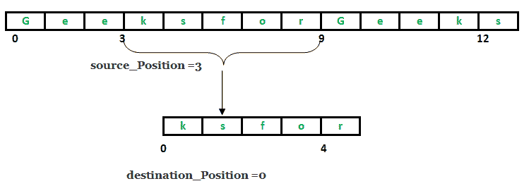

# Java 中的 System.arraycopy()

> 原文:[https://www.geeksforgeeks.org/system-arraycopy-in-java/](https://www.geeksforgeeks.org/system-arraycopy-in-java/)

java.lang.System 类为标准输入和输出、加载文件和库或访问外部定义的属性提供了有用的方法。java.lang.System.arraycopy()方法将源数组从特定的开始位置复制到目标数组的上述位置。要复制的参数数量由 **len** 参数决定。
源 _ 位置到**源 _ 位置+长度–1**的组件从**目的 _ 位置**到**目的 _ 位置+长度–1**被复制到目的数组

**班级申报**

```java
public final class System
   extends Object
```

**** 
**语法:**

```java
public static void arraycopy(Object source_arr, int sourcePos,
                            Object dest_arr, int destPos, int len)
Parameters : 
source_arr : array to be copied from
sourcePos : starting position in source array from where to copy
dest_arr : array to be copied in
destPos : starting position in destination array, where to copy in
len : total no. of components to be copied.

```

**实施**

```java
// Java program explaining System class method - arraycopy()
import java.lang.*;
public class NewClass
{
    public static void main(String[] args)
    {
        int s[] = { 10, 20, 30, 40, 50, 60, 70, 80, 90, 100};
        int d[] = { 15, 25, 35, 45, 55, 65, 75, 85, 95, 105};

        int source_arr[], sourcePos, dest_arr[], destPos, len;
        source_arr = s;
        sourcePos = 3;
        dest_arr = d;
        destPos = 5;
        len = 4;

        // Print elements of source
        System.out.print("source_array : ");
        for (int i = 0; i < s.length; i++)
            System.out.print(s[i] + " ");
        System.out.println("");

        System.out.println("sourcePos : " + sourcePos);

        // Print elements of source
        System.out.print("dest_array : ");
        for (int i = 0; i < d.length; i++)
            System.out.print(d[i] + " ");
        System.out.println("");

        System.out.println("destPos : " + destPos);

        System.out.println("len : " + len);

        // Use of arraycopy() method
        System.arraycopy(source_arr, sourcePos, dest_arr, 
                                            destPos, len);

        // Print elements of destination after
        System.out.print("final dest_array : ");
        for (int i = 0; i < d.length; i++)
            System.out.print(d[i] + " ");
    }
} 
```

输出:

```java
source_array : 10 20 30 40 50 60 70 80 90 100 
sourcePos : 3
dest_array : 15 25 35 45 55 65 75 85 95 105 
destPos : 5
len : 4
final dest_array : 15 25 35 45 55 40 50 60 70 105 

```

本文由 **莫希特·古普塔** 供稿。如果你喜欢 GeeksforGeeks 并想投稿，你也可以使用[contribute.geeksforgeeks.org](http://www.contribute.geeksforgeeks.org)写一篇文章或者把你的文章邮寄到 contribute@geeksforgeeks.org。看到你的文章出现在极客博客主页上，帮助其他极客。

如果你发现任何不正确的地方，或者你想分享更多关于上面讨论的话题的信息，请写评论。