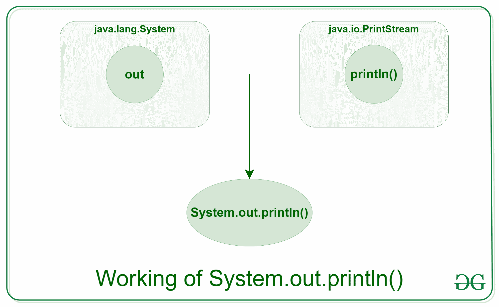

# Java 中的 system . out . println

> 原文:[https://www.geeksforgeeks.org/system-out-println-in-java/](https://www.geeksforgeeks.org/system-out-println-in-java/)

Java**system . out . println()**用于打印传递给它的参数。该陈述可分为 3 个部分，分别理解为:

1.  **[系统](https://www.geeksforgeeks.org/java-lang-system-class-java/) :** 是 [java.lang 包](https://www.geeksforgeeks.org/java-lang-package-java/)中定义的最终类。
2.  **out:** 这是 [PrintStream](https://www.geeksforgeeks.org/java-io-printstream-class-java-set-1/) 类型的一个实例，是[系统类](https://www.geeksforgeeks.org/java-lang-system-class-java/)的一个公共静态成员字段。
3.  **[println()](https://www.geeksforgeeks.org/difference-between-print-and-println-in-java/) :** 由于 [PrintStream 类](https://www.geeksforgeeks.org/java-io-printstream-class-java-set-1/)的所有实例都有一个公共方法 println()，因此我们也可以在 out 上调用相同的方法。这是 print()的升级版本。它打印传递给它的任何参数，并在输出中添加新的一行。我们可以假设系统输出代表标准输出流。

[](https://media.geeksforgeeks.org/wp-content/uploads/20191126171503/println1.png)

**语法:**

```
System.out.println(*parameter*)
```

**参数:**参数可以是用户希望在输出屏幕上打印的任何内容。

**例 1:**

```
// Java code to illustrate
// System.out.println();

import java.io.*;

class GFG {
    public static void main(String[] args)
    {
        System.out.println("Welcome");
        System.out.println("To");
        System.out.println("GeeksforGeeks");
    }
}
```

**Output:**

```
Welcome
To
GeeksforGeeks

```

**例 2:**

```
// Java code to illustrate
// System.out.println();

import java.io.*;

class GFG {
    public static void main(String[] args)
    {

        // Declaring variable
        int num1 = 10, num2 = 20, sum;

        // Printing the variables
        System.out.print("The addition of ");
        System.out.println(
            num1 + " and " + num2 + " is:");

        // Printing the result after operation
        System.out.println(num1 + num2);
    }
}
```

**Output:**

```
The addition of 10 and 20 is:
30

```

就像 **System.out** 一样，Java 为我们提供了另外两个标准或默认的**输入输出流**:

1.  系统:这是用于从键盘或任何其他标准输入设备读取字符的标准输入流。
    **例:**

    ```
    InputStreamReader inp = new InputStreamReader(System.in);

    ```

2.  **System.err** :这是一个标准的错误流，用于在计算机屏幕或任何标准输出设备上输出程序可能抛出的所有错误数据。
    **例:**

    ```
    System.err.print("Error");

    ```

**println()方法的过载**

我们知道，Java 中的[方法重载](https://www.geeksforgeeks.org/overloading-in-java/)允许不同的方法有相同的名称，但是有不同的签名或参数，其中每个签名可以因输入参数的数量或输入参数的类型或两者而异。从 println()的使用中我们观察到， [PrintStream 类](https://www.geeksforgeeks.org/java-io-printstream-class-java-set-1/)的单一方法允许用户通过接受不同类型和数量的参数来打印各种类型的元素。

**例如**:

```
System.out.println(), 
System.out.println(int), 
System.out.println(double), 
System.out.println(string), 
System.out.println(character), 
etc. 

```

PrintStream 大约有 10 个不同的 println()方法的重载，它们是根据用户传递的参数类型来调用的。

**示例:**

```
// Java code to illustrate method
// overloading in println()

import java.io.*;

class PrintLN {
    public static void main(String[] args)
    {

        // Declaring different datatypes
        int num = 10;
        char ch = 'G';
        String str = "GeeksforGeeks";
        double d = 10.2;
        float f = 13.5f;
        boolean bool = true;

        // Various overloads of println() method
        System.out.println();
        System.out.println(num);
        System.out.println(ch);
        System.out.println(str);
        System.out.println(d);
        System.out.println(f);
        System.out.println(bool);
        System.out.println("Hello");
    }
}
```

**Output:**

```

10
G
GeeksforGeeks
10.2
13.5
true
Hello

```

**[system . out . print()和 System.out.println()](https://www.geeksforgeeks.org/difference-between-print-and-println-in-java/)** 的区别

**System.out.print():** 此方法在控制台上打印文本，光标保留在控制台上文本的末尾。下一次印刷就发生在这里。此方法必须至少接受一个参数，否则会引发错误。

**System.out.println():** 此方法在控制台上打印文本，光标保持在控制台下一行的开头。下一次打印从下一行开始。该方法可以采用也可以不采用任何参数。

**示例:**

```
// Java code to illustrate difference
// between print() and println()

import java.io.*;

class Demo_print {
    public static void main(String[] args)
    {
        System.out.println("Using print()");

        // using print()
        // all are printed in the
        // same line
        System.out.print("GfG! ");
        System.out.print("GfG! ");
        System.out.print("GfG! ");

        System.out.println();
        System.out.println();
        System.out.println("Using println()");

        // using println()
        // all are printed in the
        // different line
        System.out.println("GfG! ");
        System.out.println("GfG! ");
        System.out.println("GfG! ");
    }
}
```

**输出:**

```
Using print()
GfG! GfG! GfG! 

Using println()
GfG! 
GfG! 
GfG! 
```

**system . out . println()的性能分析**

**println()** 是一种帮助在控制台上显示输出的方法。这可能取决于驱动该方法性能的各种因素。使用 println()传递的消息被传递到服务器的控制台，在那里需要**内核时间**来执行任务。内核时间指的是**的 CPU 时间**。由于 println()是一个同步的方法，所以当多个线程被传递时可能会导致**低性能问题**。System.out.println()是一种**慢速操作**，因为与大多数 IO 操作相比，它会在机器上产生大量开销。

通过调用或 **[BufferedWriter](https://www.geeksforgeeks.org/io-bufferedwriter-class-methods-java/)** 类，还有一种执行输出操作的替代方法。

与 println 类的 println() 相比，它们的速度更快。

**相关文章:**

1.  【print()和 println()
    的区别
2.  Java 中的输入输出
3.  [Java 中的 PrintStream println()方法，带示例](https://www.geeksforgeeks.org/printstream-println-method-in-java-with-examples/)
4.  [将 System.out.println()输出重定向到 Java 文件](https://www.geeksforgeeks.org/redirecting-system-out-println-output-to-a-file-in-java/)