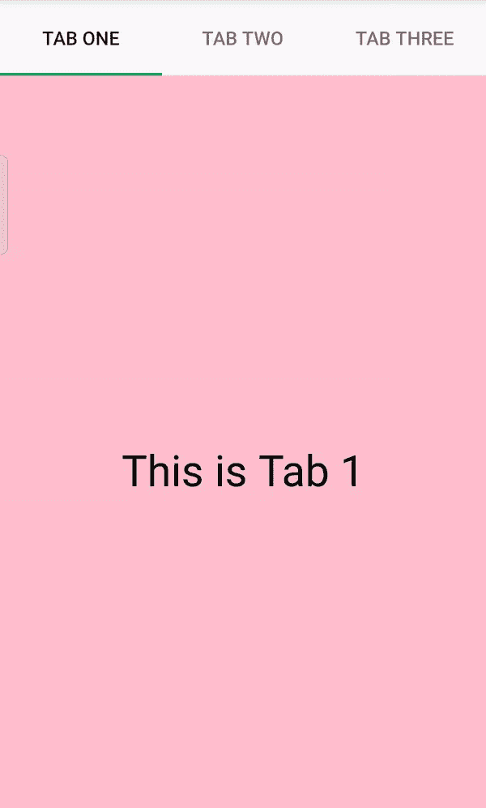

# 安卓中的 TabHost，示例

> 原文:[https://www . geesforgeks . org/带示例的 android 中的 tab host/](https://www.geeksforgeeks.org/tabhost-in-android-with-example/)

TabHost 是一个包含一组选项卡的容器。每个选项卡由活动或[片段](https://www.geeksforgeeks.org/introduction-fragments-android/)组成。TabHost 由两个子节点组成，其中一个是[框架布局](https://www.geeksforgeeks.org/android-framelayout-in-kotlin/)(用于显示活动内容)，另一个是 TabWidget。(用于选择用户想要打开的标签)。在[线形布局](https://www.geeksforgeeks.org/android-linearlayout-in-kotlin/)的帮助下，大部分 Tabhost 被用于项目中。

### TabHost 的重要方法

*   **添加选项卡(选项卡规范选项卡规范):**此方法用于将新选项卡添加到选项卡小部件上。每当使用 TabSpec 类指定一个新的选项卡时，就需要在我们的 TabHost 中添加该选项卡。

> //启动 TabHost
> 
> tabhost tabhost =(tabhost)findviewbyid(r . tabhost id)；
> 
> //设置 tabhost
> 
> tab host . setup()；
> 
> //设置新选项卡的名称
> 
> tabhost . tabs pec spec = tabhost . new tabs pec(" tab one ")；
> 
> setContent 规格(r . id . tab 1)；
> 
> 规格设置指示器(“标签一”)；
> 
> //将选项卡添加到 tabhost
> 
> tabhost.addTab(规格)：

*   **clearall tab():**此方法用于清除选项卡主机内的所有选项卡。如上图添加标签后，如果有人想从标签主机中清除标签，那么写下面的代码。

> tab host . clearalltab()；//此方法用于清除 tabhost 中的所有选项卡

*   **settantbchangedlistener(OnTabChangeListener):**此方法用于注册一个回调，当此列表中任何项目的选定状态发生变化时，需要调用该回调。当需要调用回调并在列表中任何选定项的状态改变时注册回调时，使用此方法。
*   **setCurrentTab(int index):** 默认情况下，标签主机将第一个标签位置设置为默认位置，该位置将在应用程序启动时出现，但我们可以使用这些方法明确更改标签的默认位置。(位置从 0 开始)

> tab host . setcurrenttab(1)；//它会将第二个选项卡设置为默认选定选项卡

### 例子

让我们通过做一个小项目来详细了解一下 TabHost。下面给出一个 GIF 样例，了解一下在这个项目 中我们要做什么。 注意，我们要用 **Java** 语言实现这个项目。



### 分步实施

**第一步:创建新项目**

要在安卓工作室创建新项目，请参考[如何在安卓工作室创建/启动新项目](https://www.geeksforgeeks.org/android-how-to-create-start-a-new-project-in-android-studio/)。注意选择 **Java** 作为编程语言。

**步骤 2:使用 activity_main.xml 文件**

现在转到代表应用程序用户界面的 **activity_main.xml** 文件。下面是 **activity_main.xml** 文件的代码。在代码中添加注释，以更详细地理解代码。

## 可扩展标记语言

```java
<?xml version="1.0" encoding="utf-8"?>
<!--Linear layout as the root layout-->
<LinearLayout
    xmlns:android="http://schemas.android.com/apk/res/android"
    xmlns:tools="http://schemas.android.com/tools"
    android:layout_width="match_parent"
    android:layout_height="match_parent"
    tools:context=".MainActivity">

    <TabHost
        android:id="@+id/tabhost"
        android:layout_width="match_parent"
        android:layout_height="match_parent">

        <LinearLayout
            android:layout_width="match_parent"
            android:layout_height="match_parent"
            android:orientation="vertical">

            <!--Tab widget to select the tab-->
            <TabWidget
                android:id="@android:id/tabs"
                android:layout_width="match_parent"
                android:layout_height="wrap_content" />

            <!--FrameLayout which contains the data of the activity-->
            <FrameLayout
                android:id="@android:id/tabcontent"
                android:layout_width="match_parent"
                android:layout_height="match_parent">

                <!--for tab 1-->
                <LinearLayout
                    android:id="@+id/tab1"
                    android:layout_width="match_parent"
                    android:layout_height="match_parent"
                    android:background="#FFC0CB"
                    android:orientation="vertical">

                    <!--Text View for applying the text to the tab-->
                    <TextView
                        android:layout_width="wrap_content"
                        android:layout_height="wrap_content"
                        android:layout_gravity="center"
                        android:layout_marginTop="270dp"
                        android:text="This is Tab 1"
                        android:textColor="#000"
                        android:textSize="32sp" />
                </LinearLayout>

                <!--for tab 2-->
                <LinearLayout
                    android:id="@+id/tab2"
                    android:layout_width="match_parent"
                    android:layout_height="match_parent"
                    android:background="#90ee90"
                    android:orientation="vertical">

                    <!--Text View for applying the text to the tab-->
                    <TextView
                        android:layout_width="wrap_content"
                        android:layout_height="wrap_content"
                        android:layout_gravity="center"
                        android:layout_marginTop="270dp"
                        android:text="This is Tab 2"
                        android:textColor="#000"
                        android:textSize="32sp" />
                </LinearLayout>

                <!--for tab 3-->
                <LinearLayout
                    android:id="@+id/tab3"
                    android:layout_width="match_parent"
                    android:layout_height="match_parent"
                    android:background="#add8e6"
                    android:orientation="vertical">

                    <!--Text View for applying the text to the tab-->
                    <TextView
                        android:layout_width="wrap_content"
                        android:layout_height="wrap_content"
                        android:layout_gravity="center"
                        android:layout_marginTop="270dp"
                        android:text="This is Tab 3"
                        android:textColor="#000"
                        android:textSize="32sp" />
                </LinearLayout>

            </FrameLayout>
        </LinearLayout>
    </TabHost>
</LinearLayout>
```

**第三步:使用 MainActivity.kt 文件**

转到**MainActivity.java**文件，参考以下代码。以下是**MainActivity.java**文件的代码。代码中添加了注释，以更详细地理解代码。

## Java 语言(一种计算机语言，尤用于创建网站)

```java
import android.os.Bundle;
import android.widget.TabHost;
import androidx.appcompat.app.AppCompatActivity;

public class MainActivity extends AppCompatActivity {

    @Override
    protected void onCreate(Bundle savedInstanceState) {
        super.onCreate(savedInstanceState);
        setContentView(R.layout.activity_main);

        // initiating the tabhost
        TabHost tabhost = (TabHost) findViewById(R.id.tabhost);

        // setting up the tab host
        tabhost.setup();

        // Code for adding Tab 1 to the tabhost
        TabHost.TabSpec spec = tabhost.newTabSpec("Tab One");
        spec.setContent(R.id.tab1);

        // setting the name of the tab 1 as "Tab One"
        spec.setIndicator("Tab One");

        // adding the tab to tabhost
        tabhost.addTab(spec);

        // Code for adding Tab 2 to the tabhost
        spec = tabhost.newTabSpec("Tab Two");
        spec.setContent(R.id.tab2);

        // setting the name of the tab 1 as "Tab Two"
        spec.setIndicator("Tab Two");
        tabhost.addTab(spec);

        // Code for adding Tab 3 to the tabhost
        spec = tabhost.newTabSpec("Tab Three");
        spec.setContent(R.id.tab3);
        spec.setIndicator("Tab Three");
        tabhost.addTab(spec);
    }
}
```

### **输出:**

<video class="wp-video-shortcode" id="video-502703-1" width="640" height="360" preload="metadata" controls=""><source type="video/mp4" src="https://media.geeksforgeeks.org/wp-content/uploads/20201019175424/Tab_Host_Android.mp4?_=1">[https://media.geeksforgeeks.org/wp-content/uploads/20201019175424/Tab_Host_Android.mp4](https://media.geeksforgeeks.org/wp-content/uploads/20201019175424/Tab_Host_Android.mp4)</video>