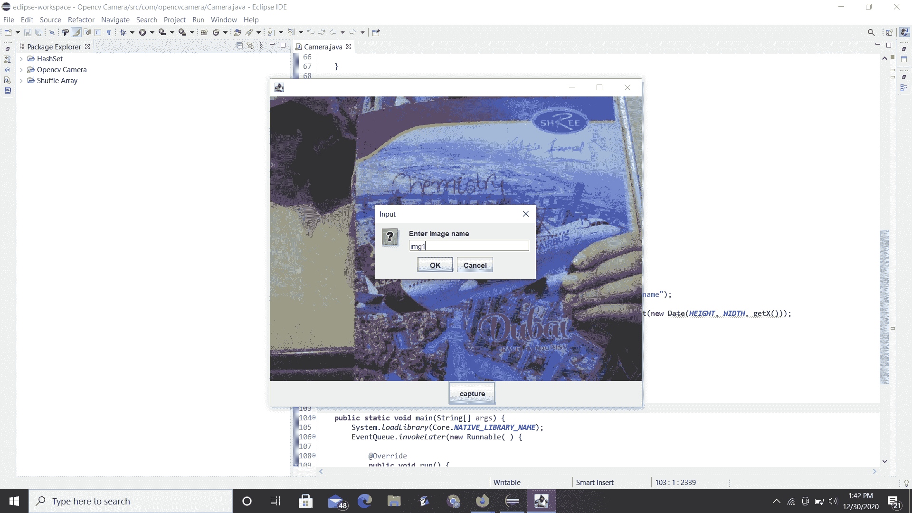

# 在 Java 中使用 OpenCV 从系统摄像头拍摄快照

> 原文:[https://www . geesforgeks . org/从系统中拍摄快照-相机-使用-opencv-in-java/](https://www.geeksforgeeks.org/taking-a-snapshot-from-system-camera-using-opencv-in-java/)

Java 中的 [OpenCV](https://www.geeksforgeeks.org/java-program-to-draw-geometric-shapes-on-images-in-opencv/) 库包含一个名为“ ***【视频捕获】*** 的类，该类提供了一个名为 read(预定义)的方法来扫描网络摄像头中的图片。Mat 对象在 read 方法中作为参数传递。

**概念:**

1.  “javax.swing”包
2.  [抽象窗口工具包](https://www.geeksforgeeks.org/awt-full-form/) (AWT)

在深入到过程和实现部分之前，让我们简单地讨论一下它们。

*   使用“javax.swing”包是因为该包为 Java Swing API 提供了类，如 JButton、 [JTextArea](https://www.geeksforgeeks.org/java-swing-jtextarea/) 、 [JCheckbox](https://www.geeksforgeeks.org/java-swing-jcheckbox-examples/) 、JMenu 等。这里涉及到的 java 概念是 Swing 类和抽象窗口工具包，如下所述:
    *   **javax . swing . ImageIcon**:ImageIcon 类是从图像中绘制图标的图标接口的实现。
    *   **javax.swing.Jframe** :类 Jframe 是一种继承 java 的容器类型。JFrame 的工作方式类似于主窗口，其中添加了标签、按钮、文本字段等组件来创建 GUI。
    *   **javax.swing.JLabel** :类 JLabel 用于显示一个短字符串或者一个图像图标. x
*   [抽象窗口工具包](https://www.geeksforgeeks.org/awt-full-form/) (AWT) 是一个用于创建图形用户界面的 Java 包。AWT 功能包括:
    *   一组本机接口组件。
    *   一个健壮的事件处理模型。
    *   图形和图像工具，包括形状、颜色和字体类。
    *   布局管理器，用于不依赖于特定窗口大小或屏幕分辨率的灵活窗口布局。
    *   数据传输类，用于通过本机平台剪贴板进行剪切和粘贴。

**程序**:在 OpenCV 中绘制图像几何形状的步骤

1.  创建一个项目并添加一个 [OpenCV 库](https://www.geeksforgeeks.org/java-program-to-draw-geometric-shapes-on-images-in-opencv/)。
2.  创建包
3.  创建一个类
4.  创建一个名为“图像”的文件夹来保存捕获的图像。
5.  将所需的 java 程序写入 java 文件。

**实现:**在 java 文件中编写以下 java 程序，从系统摄像头拍摄快照。

**例**

## Java 语言(一种计算机语言，尤用于创建网站)

```
// Java Program to take a Snapshot from System Camera
// using OpenCV

// Importing openCV modules
package com.opencvcamera;
// importing swing and awt classes
import java.awt.Dimension;
import java.awt.EventQueue;
import java.awt.event.ActionEvent;
import java.awt.event.ActionListener;
// Importing date class of sql package
import java.sql.Date;
import java.text.DateFormat;
import java.text.SimpleDateFormat;
import javax.swing.ImageIcon;
import javax.swing.JButton;
import javax.swing.JFrame;
import javax.swing.JLabel;
import javax.swing.JOptionPane;
import org.opencv.core.Core;
import org.opencv.core.Mat;
import org.opencv.core.MatOfByte;
import org.opencv.imgcodecs.Imgcodecs;
// Importing VideoCapture class
// This class is responsible for taking screenshot
import org.opencv.videoio.VideoCapture;

// Class - Swing Class
public class Camera extends JFrame {

    // Camera screen
    private JLabel cameraScreen;

    // Button for image capture
    private JButton btnCapture;

    // Start camera
    private VideoCapture capture;

    // Store image as 2D matrix
    private Mat image;

    private boolean clicked = false;

    public Camera()
    {

        // Designing UI
        setLayout(null);

        cameraScreen = new JLabel();
        cameraScreen.setBounds(0, 0, 640, 480);
        add(cameraScreen);

        btnCapture = new JButton("capture");
        btnCapture.setBounds(300, 480, 80, 40);
        add(btnCapture);

        btnCapture.addActionListener(new ActionListener() {
            @Override
            public void actionPerformed(ActionEvent e)
            {

                clicked = true;
            }
        });

        setSize(new Dimension(640, 560));
        setLocationRelativeTo(null);
        setDefaultCloseOperation(JFrame.EXIT_ON_CLOSE);
        setVisible(true);
    }

    // Creating a camera
    public void startCamera()
    {
        capture = new VideoCapture(0);
        image = new Mat();
        byte[] imageData;

        ImageIcon icon;
        while (true) {
            // read image to matrix
            capture.read(image);

            // convert matrix to byte
            final MatOfByte buf = new MatOfByte();
            Imgcodecs.imencode(".jpg", image, buf);

            imageData = buf.toArray();

            // Add to JLabel
            icon = new ImageIcon(imageData);
            cameraScreen.setIcon(icon);

            // Capture and save to file
            if (clicked) {
                // prompt for enter image name
                String name = JOptionPane.showInputDialog(
                    this, "Enter image name");
                if (name == null) {
                    name = new SimpleDateFormat(
                               "yyyy-mm-dd-hh-mm-ss")
                               .format(new Date(
                                   HEIGHT, WIDTH, getX()));
                }

                // Write to file
                Imgcodecs.imwrite("images/" + name + ".jpg",
                                  image);

                clicked = false;
            }
        }
    }

    // Main driver method
    public static void main(String[] args)
    {
        System.loadLibrary(Core.NATIVE_LIBRARY_NAME);
        EventQueue.invokeLater(new Runnable() {
            // Overriding existing run() method
            @Override public void run()
            {
                final Camera camera = new Camera();

                // Start camera in thread
                new Thread(new Runnable() {
                    @Override public void run()
                    {
                        camera.startCamera();
                    }
                }).start();
            }
        });
    }
}
```

**输出:**

> 程序编译成功后，执行如下:网络摄像头打开，点击*捕捉*按钮，其余图像命名。现在，点击“确定”按钮保存图像。输出图像将保存在先前创建的文件夹中。

