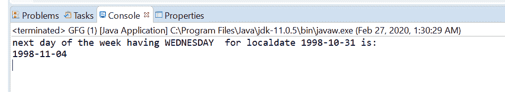
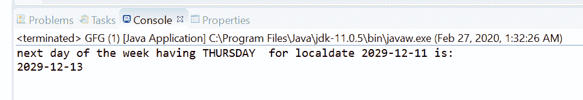

# 用示例在 Java 中临时调整 next()方法

> 原文:[https://www . geesforgeks . org/temporalaadjuster-next-method-in-Java-with-examples/](https://www.geeksforgeeks.org/temporaladjusters-next-method-in-java-with-examples/)

**时间调整类**的 **next(DayOfWeek)** 方法用于返回一周中的下一天时间调整对象，该对象可用于从应用此时间调整的任何日期对象中获取一个新的日期对象，该日期对象是具有相同匹配日期的下一个日期。

**语法:**

```
public static TemporalAdjuster next(DayOfWeek dayOfWeek)

```

**参数:**该方法接受**日期/星期**，可用于获取新的日期对象，该对象是下一个具有相同匹配日期/星期的日期。

**返回值:**此方法返回星期调整器的第二天，不为空。

下面的程序说明了临时调整下一个()方法:
**程序 1:**

```
// Java program to demonstrate
// TemporalAdjusters.next()

import java.time.*;
import java.time.temporal.*;

public class GFG {
    public static void main(String[] args)
    {

        // get TemporalAdjuster with
        // the next in month adjuster
        TemporalAdjuster temporalAdjuster
            = TemporalAdjusters.next(
                DayOfWeek.WEDNESDAY);

        // using adjuster for local date time
        LocalDate localDate
            = LocalDate.of(1998, 10, 31);
        LocalDate nextDOW
            = localDate.with(temporalAdjuster);

        // print
        System.out.println(
            "next day of the week having"
            + " WEDNESDAY for localdate "
            + localDate + " is: "
            + nextDOW);
    }
}
```

**Output:**

```
next day of the week having WEDNESDAY for localdate 1998-10-31 is: 1998-11-04

```



**程序 2:**

```
// Java program to demonstrate
// TemporalAdjusters.next() method

import java.time.*;
import java.time.temporal.*;

public class GFG {
    public static void main(String[] args)
    {

        // get TemporalAdjuster with the
        // next day of week adjuster
        TemporalAdjuster temporalAdjuster
            = TemporalAdjusters.next(
                DayOfWeek.THURSDAY);

        // using adjuster for local date time
        LocalDate localDate
            = LocalDate.of(2029, 12, 11);
        LocalDate nextDOW
            = localDate.with(temporalAdjuster);

        // print
        System.out.println(
            "next day of the week having"
            + " THURSDAY for localdate "
            + localDate + " is: "
            + nextDOW);
    }
}
```

**Output:**

```
next day of the week having THURSDAY for localdate 2029-12-11 is: 2029-12-13

```



参考资料:[https://docs . Oracle . com/javase/10/docs/API/Java/time/temporalaadjusters . html # next(Java . time . dayofweek)](https://docs.oracle.com/javase/10/docs/api/java/time/temporal/TemporalAdjusters.html#next(java.time.DayOfWeek))