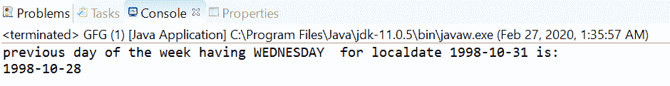
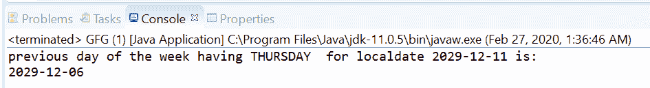

# 临时调整 Java 中以前的()方法，示例

> 原文:[https://www . geesforgeks . org/temporalaadjuster-previous-method-in-Java-with-examples/](https://www.geeksforgeeks.org/temporaladjusters-previous-method-in-java-with-examples/)

**时间调整类**的 **previous(DayOfWeek)** 方法用于返回一个前一个 DayOfWeek 时间调整对象，该对象可用于从应用此时间调整的任何日期对象中获取一个新的日期对象，该对象是具有相同匹配日期的前一个日期。

**语法:**

```
public static TemporalAdjuster previous(DayOfWeek dayOfWeek)

```

**参数:**该方法接受**日期/星期**，可用于获取一个新的日期对象，该对象是具有相同匹配日期/星期的前一个日期。

**返回值:**此方法返回星期调整器的前一天。

下面的程序说明了临时调整先前的()方法:
**程序 1:**

```
// Java program to demonstrate
// TemporalAdjusters.previous()

import java.time.*;
import java.time.temporal.*;

public class GFG {
    public static void main(String[] args)
    {

        // get TemporalAdjuster with the
        // previous in month adjuster
        TemporalAdjuster temporalAdjuster
            = TemporalAdjusters.previous(
                DayOfWeek.WEDNESDAY);

        // using adjuster for local date-time
        LocalDate localDate
            = LocalDate.of(1998, 10, 31);
        LocalDate previousDOW
            = localDate.with(temporalAdjuster);

        // print
        System.out.println(
            "Previous day of the week "
            + "having WEDNESDAY for localdate "
            + localDate + " is: "
            + previousDOW);
    }
}
```

**Output:**

```
Previous day of the week having WEDNESDAY for localdate 1998-10-31 is: 1998-10-28

```



**程序 2:**

```
// Java program to demonstrate
// TemporalAdjusters.previous() method

import java.time.*;
import java.time.temporal.*;

public class GFG {
    public static void main(String[] args)
    {

        // get TemporalAdjuster with the
        // previous day of week adjuster
        TemporalAdjuster temporalAdjuster
            = TemporalAdjusters.previous(
                DayOfWeek.THURSDAY);

        // using adjuster for local date time
        LocalDate localDate
            = LocalDate.of(2029, 12, 11);
        LocalDate previousDOW
            = localDate.with(temporalAdjuster);

        // print
        System.out.println(
            "previous day of the week "
            + "having THURSDAY for localdate "
            + localDate + " is: "
            + previousDOW);
    }
}
```

**Output:**

```
previous day of the week having THURSDAY for localdate 2029-12-11 is: 2029-12-06

```



参考文献:[https://docs . Oracle . com/javase/10/docs/API/Java/time/temporalaadjusters . html # previous(Java . time . dayofweek)](https://docs.oracle.com/javase/10/docs/api/java/time/temporal/TemporalAdjusters.html#previous(java.time.DayOfWeek))