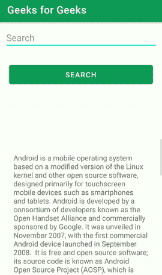

# 安卓文本荧光笔

> 原文:[https://www.geeksforgeeks.org/text-highlighter-in-android/](https://www.geeksforgeeks.org/text-highlighter-in-android/)

**文字荧光笔**是大部分应用中的热门功能之一。您可以在**注释**保存应用程序或任何教育应用程序中看到该功能。该功能的主要功能是在任何文档中突出显示搜索到的单词。在本文中，我们将看到如何在我们的安卓应用程序中实现文本荧光笔。下面给出了一个 GIF 示例，以了解我们在本文中要做什么。注意，我们将使用 **Java** 语言来实现这个项目。



### 文本荧光笔的应用

*   使用此文本荧光笔的主要特点是，它会在您的应用程序中突出显示搜索到的单词。
*   它会告诉你搜索到的单词重复了多少次，并且会高亮显示。
*   它用于应用程序中的关键词研究。

### 重要属性

<figure class="table">

| 

属性

 | 

描述

 |
| --- | --- |
| **。setBackgroundColor()** | 用于设置背景色。 |
| **。setforegrondcolor()** | 用于设置文本颜色。 |
| **。addTarget()** | 用于从特定文档中搜索单词。 |
| **。高亮()** | 用于突出显示搜索到的文本。 |

</figure>

### 逐步实施

**第一步:创建新项目**

要在安卓工作室创建新项目，请参考[如何在安卓工作室创建/启动新项目](https://www.geeksforgeeks.org/android-how-to-create-start-a-new-project-in-android-studio/)。注意选择 **Java** 作为编程语言。

**第二步:在 build.gradle 文件中添加文本荧光笔库的依赖关系**

然后导航到梯度脚本，然后导航到**构建.梯度(模块)**级别。在 dependencies 部分的 build.gradle 文件中添加以下行。

> 实现' com . xeoh . Android:text-highlight:1 . 0 . 3 '

现在点击**立即同步**它将同步你在 **build.gradle()中的所有文件。**

**第三步:在 activity_main.xml 文件中创建一个新的文本荧光笔**

转到**activity _ main . XML**文件，参考以下代码。下面是**activity _ main . XML**文件的代码。

## 可扩展标记语言

```java
<?xml version="1.0" encoding="utf-8"?>
<RelativeLayout 
    xmlns:android="http://schemas.android.com/apk/res/android"
    xmlns:tools="http://schemas.android.com/tools"
    android:layout_width="match_parent"
    android:layout_height="match_parent"
    tools:context=".MainActivity">

    <!--Scroll view for scrolling-->
    <ScrollView
        android:layout_width="match_parent"
        android:layout_height="300dp"
        android:layout_alignParentBottom="true"
        android:layout_centerHorizontal="true">

        <!--Linear layout to arrange elements one below another-->
        <LinearLayout
            android:layout_width="match_parent"
            android:layout_height="wrap_content"
            android:padding="30dp">

            <!--TextView to display text-->
            <TextView
                android:id="@+id/textView"
                android:layout_width="wrap_content"
                android:layout_height="wrap_content"
                android:layout_alignParentBottom="true"
                android:layout_centerHorizontal="true"
                android:text="Android is a mobile operating system based on a modified version of the Linux kernel and other open source software, designed primarily for touchscreen mobile devices such as smartphones and tablets. Android is developed by a consortium of developers known as the Open Handset Alliance and commercially sponsored by Google. It was unveiled in November 2007, with the first commercial Android device launched in September 2008.

                              It is free and open source software; its source code is known as Android Open Source Project (AOSP), which is primarily licensed under the Apache License. However most Android devices ship with additional proprietary software pre-installed,[10] most notably Google Mobile Services (GMS)[11] which includes core apps such as Google Chrome, the digital distribution platform Google Play and associated Google Play Services development platform. About 70 percent of Android smartphones run Google's ecosystem;[12] competing Android ecosystems and forks include Fire OS (developed by Amazon) or LineageOS. However the 'Android' name and logo are trademarks of Google which impose standards to restrict 'uncertified' devices outside their ecosystem to use Android branding.[13][14]

                              The source code has been used to develop variants of Android on a range of other electronics, such as game consoles, digital cameras, portable media players, PCs and others, each with a specialized user interface. Some well known derivatives include Android TV for televisions and Wear OS for wearables, both developed by Google. Software packages on Android, which use the APK format, are generally distributed through proprietary application stores like Google Play Store, Samsung Galaxy Store, and Huawei AppGallery, or open source platforms like Aptoide or F-Droid.

                              Android has been the best-selling OS worldwide on smartphones since 2011 and on tablets since 2013\. As of May 2017, it has over two billion monthly active users, the largest installed base of any operating system, and as of August 2020, the Google Play Store features over 3 million apps.[15] The current stable version is Android 11, released on September 8, 2020\. " />
        </LinearLayout>
    </ScrollView>

    <!--Button to search text-->
    <Button
        android:id="@+id/button"
        android:layout_width="match_parent"
        android:layout_height="wrap_content"
        android:layout_below="@+id/search"
        android:layout_centerInParent="true"
        android:layout_margin="20dp"
        android:padding="10dp"
        android:text="Search" />

    <!--EditText to give text input-->
    <EditText
        android:id="@+id/search"
        android:layout_width="match_parent"
        android:layout_height="wrap_content"
        android:layout_alignParentTop="true"
        android:layout_centerHorizontal="true"
        android:layout_margin="10dp"
        android:ems="10"
        android:hint="Search"
        android:inputType="text"
        android:text="" />

</RelativeLayout>
```

**步骤 4:使用 MainActivity.java 文件**

转到**MainActivity.java**文件，参考以下代码。以下是**MainActivity.java**文件的代码。代码中添加了注释，以更详细地理解代码。

## Java 语言(一种计算机语言，尤用于创建网站)

```java
import android.graphics.Color;
import android.os.Bundle;
import android.view.View;
import android.widget.Button;
import android.widget.EditText;
import android.widget.TextView;

import androidx.appcompat.app.AppCompatActivity;

import com.xeoh.android.texthighlighter.TextHighlighter;

public class MainActivity extends AppCompatActivity {

    // Variable for button,
    // edit text and text view given
    Button button;
    EditText editText;
    TextView textView;

    @Override
    protected void onCreate(Bundle savedInstanceState) {
        super.onCreate(savedInstanceState);
        setContentView(R.layout.activity_main);

        // Accepted through Id's
        button = (Button) findViewById(R.id.button);
        editText = (EditText) findViewById(R.id.search);
        textView = (TextView) findViewById(R.id.textView);

        button.setOnClickListener(new View.OnClickListener() {
            @Override
            public void onClick(View view) {
                new TextHighlighter()
                        .setBackgroundColor(Color.parseColor("#FFFF00"))
                        .setForegroundColor(Color.GREEN)
                        .addTarget(textView)
                        .highlight(editText.getText().toString(), TextHighlighter.BASE_MATCHER);
            }
        });
    }
}
```

**第 5 步:使用 AndroidManifest.xml 文件**

在 **<活动>** 标签内的 **AndroidManifest.xml** 文件中添加以下行。

> Android:windowSoftInputMode = " adjustNothing | state hidden " >

下面是 **AndroidManifest.xml** 文件的完整代码。

## 可扩展标记语言

```java
<?xml version="1.0" encoding="utf-8"?>
<manifest xmlns:android="http://schemas.android.com/apk/res/android"
    package="com.example.emoji_slider">

    <application
        android:allowBackup="true"
        android:icon="@mipmap/ic_launcher"
        android:label="@string/app_name"
        android:roundIcon="@mipmap/ic_launcher_round"
        android:supportsRtl="true"
        android:theme="@style/Theme.Emoji_slider">
        <activity android:name=".MainActivity"

            android:windowSoftInputMode="adjustNothing|stateHidden">

            <intent-filter>
                <action android:name="android.intent.action.MAIN" />

                <category android:name="android.intent.category.LAUNCHER" />
            </intent-filter>
        </activity>
    </application>

</manifest>
```

### **输出:**

<video class="wp-video-shortcode" id="video-542645-1" width="640" height="360" preload="metadata" controls=""><source type="video/mp4" src="https://media.geeksforgeeks.org/wp-content/uploads/20210116233654/Text-Highlighter-in-Android.mp4?_=1">[https://media.geeksforgeeks.org/wp-content/uploads/20210116233654/Text-Highlighter-in-Android.mp4](https://media.geeksforgeeks.org/wp-content/uploads/20210116233654/Text-Highlighter-in-Android.mp4)</video>