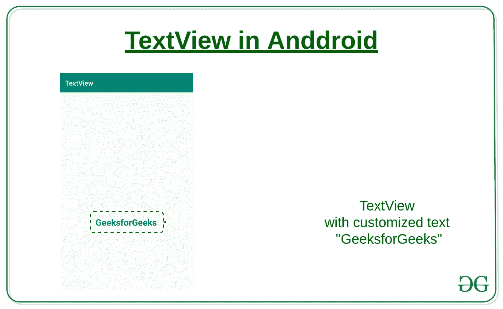
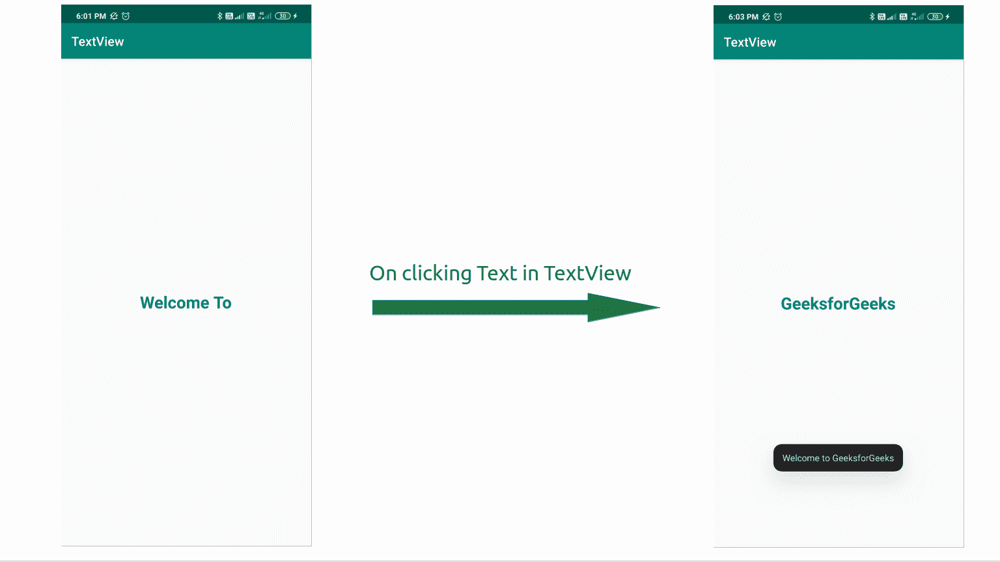

# 安卓中使用 Java 的 TextView 小部件，示例

> 原文:[https://www . geesforgeks . org/textview-widget-in-Android-using-Java-with-examples/](https://www.geeksforgeeks.org/textview-widget-in-android-using-java-with-examples/)

**小部件**是指[用户界面](https://www.geeksforgeeks.org/user-interface-ui/)的元素，帮助用户与安卓应用交互。**文本视图**是许多可以用来改进应用程序用户界面的小部件之一。

**文本视图**是指根据为特定文本视图设置的布局、大小、颜色等在屏幕上显示一些文本的小部件。它还允许我们随意修改或编辑自己。

**类语法:**

```java
public class TextView
  extends View 
  implements ViewTreeObserver.OnPreDrawListener

```

**等级等级:**

```java
java.lang.Object
  ↳ android.view.View
     ↳ android.widget.TextView

```

**语法:**

```java
<SomeLayout>
    .
    .
    <TextView>
        android:SomeAttribute1 = "Value of attribute1"
        android:SomeAttribute2 = "Value of attribute2"
        .
        .
        android:SomeAttributeN = "Value of attributeN"
    </TextView>
    .
    .
</SomeLayout>

```

这里的布局可以是任何布局，如相对、线性等(参考本文了解更多关于布局的信息)。在本文下面给出的表中，属性可能很多。

**示例:**

```java
 <LinearLayout
      xmlns:android="http://schemas.android.com/apk/res/android"
      android:layout_width="match_parent"
      android:layout_height="match_parent">

    <TextView
        android:id="@+id/text_view_id"
        android:layout_height="wrap_content"
        android:layout_width="wrap_content"
        android:text="GeeksforGeeks" />

 </LinearLayout>

```

[](https://media.geeksforgeeks.org/wp-content/uploads/20200306150158/TextView-Android.jpg)

**如何在安卓应用中加入文本视图:**

1.  首先[新建一个安卓应用](https://www.geeksforgeeks.org/android-how-to-create-start-a-new-project-in-android-studio/)，或者拿一个已有的应用去编辑。在这两种情况下，必须有一个 **[XML 布局活动](https://www.geeksforgeeks.org/android-ui-layouts/)** 文件和一个 [**Java 类**](https://www.geeksforgeeks.org/java-class-file/) 文件链接到此活动。
2.  打开“活动”文件，并在该文件中包含一个文本视图。文本视图的代码将是:
3.  Now in the Java file, link this layout file with the below code:

    ```java
    @Override
    protected void onCreate(Bundle savedInstanceState)
    {
        super.onCreate(savedInstanceState);
        setContentView(R.layout.activity_main);
    }

    ```

    其中 activity_main 是要附加的布局文件的名称。

4.  在 Java 文件中，我们将尝试在触摸时更改文本视图上显示的文本以及[吐司消息](https://www.geeksforgeeks.org/android-what-is-toast-and-how-to-use-it-with-examples/)。
5.  布局文件和 Java 文件的完整代码如下。

以下是上述方法的实现:

## activity_main.xml

```java
<?xml version="1.0" encoding="utf-8"?>

<RelativeLayout
    xmlns:android="http://schemas.android.com/apk/res/android"
    xmlns:app="http://schemas.android.com/apk/res-auto"
    xmlns:tools="http://schemas.android.com/tools"
    android:layout_width="match_parent"
    android:layout_height="match_parent"
    tools:context=".MainActivity"
    android:gravity="center">

    <TextView
        android:id="@+id/textview"
        android:layout_width="wrap_content"
        android:layout_height="wrap_content"
        android:text="Welcome To"
        android:textSize="26sp"
        android:textStyle="bold"
        android:textColor="@color/colorPrimary"
        app:layout_constraintBottom_toBottomOf="parent"
        app:layout_constraintLeft_toLeftOf="parent"
        app:layout_constraintRight_toRightOf="parent"
        app:layout_constraintTop_toTopOf="parent" />

</RelativeLayout>
```

## MainActivity.java

```java
package com.project.textview;

import androidx.appcompat.app.AppCompatActivity;
import android.os.Bundle;
import android.view.View;
import android.widget.TextView;
import android.widget.Toast;

public class MainActivity extends AppCompatActivity {

    // Creating the instance of the TextView created
    private TextView textView;

    @Override
    protected void onCreate(Bundle savedInstanceState)
    {
        super.onCreate(savedInstanceState);

        // Linking the activity file to this Java file
        setContentView(R.layout.activity_main);

        // Get the TextView with the id
        // mentioned in the layout file
        textView = (TextView)findViewById(R.id.textview);

        // Try to change the text of the Textview upon touch
        // and also display a Toast message
        textView.setOnClickListener(new View.OnClickListener() {

            @Override
            public void onClick(View v)
            {

                // Changing text
                textView.setText("GeeksforGeeks");

                // Displaying Toast message
                Toast
                    .makeText(MainActivity.this,
                              "Welcome to GeeksforGeeks",
                              Toast.LENGTH_SHORT)
                    .show();
            }
        });
    }
}
```

**输出:**
[](https://media.geeksforgeeks.org/wp-content/uploads/20200304182431/Screenshot-from-2020-03-04-18-21-141.png)

### 安卓系统中文本视图的 XML 属性

| 属性 | 描述 |
| --- | --- |
| android:文本 | 设置文本视图的文本 |
| android:id | 给文本视图一个唯一的标识 |
| android:游标可见 | 使用此属性使光标可见或不可见。默认值可见。 |
| android:drawableBottom | 将图像或其他图形资源设置在文本视图的下方。 |
| Android:draw end | 将图像或其他图形资源设置到文本视图的末尾。 |
| 安卓:可画左 | 将图像或其他图形资源设置在文本视图的左侧。 |
| Android:draw padding | 为文本视图中的可绘制内容(图像或其他图形资源)设置填充。 | android:自动链接 | 此属性用于自动检测 url 或电子邮件，并将其显示为可点击的链接。 |
| android:自动图文集 | 自动纠正文本视图文本中的拼写错误。 |
| 安卓:大写 | 无论用户在文本视图中键入什么，它都会自动大写。 |
| 安卓:drawableRight | 在文本视图中将可绘制对象设置在文本的右侧。 |
| android:drawableStart | 在文本视图中将可绘制内容设置为文本的开头。 |
| android:drawableTop | 在“文本视图”中将可绘图项设置在文本的顶部。 |
| android:椭球体 | 如果文本长度超过文本视图宽度，当您希望文本被椭圆化时，请使用此属性。 |
| 安德里亚斯姆 | 设置 ems 中 Textview 的宽度。 |
| 安卓:重力 | 我们可以垂直或水平对齐文本视图的文本，或者两者都对齐。 |
| 安卓:身高 | 用于设置文本视图的高度。 |
| 安卓:提示 | 用于在没有文本时显示提示。 |
| android:inputType | 用于设置文本视图的输入类型。可以是号码、密码、电话等。 |
| 安卓:线条 | 用于根据行数设置文本视图的高度。 |
| android:maxHeight | 设置文本视图的最大高度。 |
| android:minHeight | 设置文本视图的最小高度。 |
| android:maxLength | 设置文本视图的最大字符长度。 |
| android:maxLines | 设置文本视图可以拥有的最大行数。 |
| android:minLines | 设置文本视图可以拥有的最少行数。 |
| android:最大宽度 | 设置文本视图可以具有的最大宽度。 |
| 安卓:minWidth | 设置文本视图可以拥有的最少行数。 |
| Android:text llcaps | 用大写字母显示文本视图的所有文本。 |
| android:文本颜色 | 设置文本的颜色。 |
| android:文本大小 | 设置文本的字体大小。 |
| android:textStyle | 设置文本的样式。例如，粗体、斜体、粗斜体。 |
| 安卓:字体 | 设置文本的字体。例如，普通、无衬线、衬线等 |
| 安卓:宽度 | 设置文本视图的宽度。 |