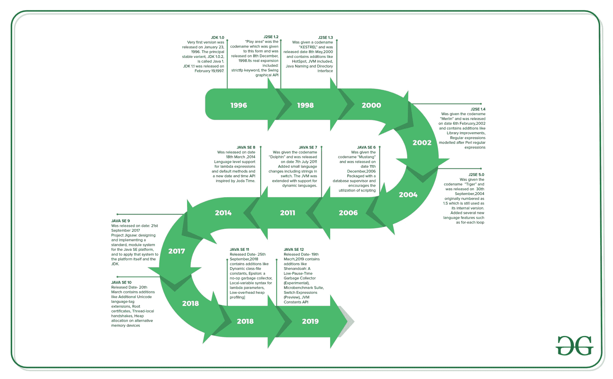

# Java 编程语言的完整历史

> 原文:[https://www . geesforgeks . org/Java 编程语言的完整历史/](https://www.geeksforgeeks.org/the-complete-history-of-java-programming-language/)

[Java](https://www.geeksforgeeks.org/java-tutorials/) 是上世纪 90 年代初由**詹姆斯·高斯林**开发的[面向对象编程](https://www.geeksforgeeks.org/object-oriented-programming-oops-concept-in-java/)语言。该团队发起了这个项目，为机顶盒、电视等数字设备开发一种语言。最初 [C++](https://www.geeksforgeeks.org/c-plus-plus/) 被认为在项目中使用，但是这个想法因为几个原因被拒绝(例如 C++需要更多的内存)。小鹅试图改变和扩展 [C++](https://www.geeksforgeeks.org/c-plus-plus/) 然而不久之后，它放弃了这一点，转而创造了另一个阶段**绿色**。詹姆斯·高斯林和他的团队称他们的项目为“绿色对话”，文件扩展名为“T14”。gt 后来被称为“ **OAK** ”。

<u>**为什么是“橡树”？**</u>
**橡树**这个名字是由**小鹅**用在他办公室外面的一棵**橡树**之后。此外，橡树是团结的象征，被美国、法国、德国、罗马尼亚等许多国家选为国树。但他们后来不得不将其改名为“ **JAVA** ，因为它已经是**橡树科技**的商标。

**<u>【JAVA】</u>**
小鹅和他的团队做了一个头脑风暴会议，会议结束后，他们想出了几个名字，比如 **JAVA、DNA、SILK、RUBY 等。**

**Java** 名字是经过多次讨论决定的，因为它实在是太独特了。爪哇这个名字来源于一种叫做“T2”的浓缩咖啡豆。小鹅是在办公室附近喝咖啡时想到这个名字的。
Java 是基于**健壮、可移植、平台无关、高性能、多线程等原则创建的。**被《时代》杂志**评为 1995 年**十大最佳产品之一**。**

**目前**互联网编程、移动设备、游戏、电子商务解决方案等都在使用 Java。**自 **JDK 1.0** 以来， [Java 语言](https://www.geeksforgeeks.org/java/)经历了一些变化，就像对标准库的类和包的各种扩展一样。除了语言上的变化，这些年来 Java 类库发生了更惊人的变化，从 JDK 1.0 的几百个类发展到 J2SE 5 的三千多个类。**

****

**<u>**各种 Java 版本历史:**</u>**

| 版本 | 出厂日期 | 重大变化 |
| --- | --- | --- |
| JDK Beta 版 | One thousand nine hundred and ninety-five |
| JDK 1.0 | 1996 年 1 月 | 第一个版本于 1996 年 1 月 23 日发布。主要的稳定变体 JDK 1.0.2 被称为 Java 1。 |
| JDK 1.1 | 1997 年 2 月 | 于 1997 年 2 月 19 日被释放。与 1.0 版本相比，JDK 1.1 版本中增加了许多内容，例如

*   Show AWT scenes
*   Extensive reorganization, adding internal classes in the language.
*   JavaBean s
*   JDBC
*   无线电磁指示器（Radio Magnetic Indicator 的缩写）

 |
| J2SE 1.2 | 1998 年 12 月 | “游戏区”是该表格的代号，于 1998 年 12 月 8 日发布。其真正的扩展包括:strictfp 关键字

*   Swing graphics API is coordinated into the central class
*   Sun JVM was suddenly equipped with JIT compiler.
*   Java module
*   Java IDL, an IDL usage for CORBA interoperability
*   收集系统

 |
| J2SE 1.3 | 2000 年 5 月 | 代号-" kestral "
发布日期-2000 年 5 月 8 日
新增:

*   HotSpot JVM 包含
*   Java naming and directory interface
*   JPDA(日本)

*   Composite proxy class

 |
| J2SE 1.4 | 2002 年 2 月 | Codename- “Merlin”
Release Date- 6th February 2002
Additions: Library improvements

*   模仿 Perl 正则表达式的正则表达式
*   图像输入/输出应用编程接口，用于以 JPEG 和 PNG 等格式读写图像
*   集成的 XML 解析器和 XSLT 处理器(JAXP)(在 JSR 5 和 JSR 63 中指定)
*   首选项 API (java.util.prefs)

此版本的公共支持和安全更新于 2008 年 10 月结束。 |
| J2SE 5.0 | 2004 年 9 月 | 代号-【虎】
发布日期-【2004 年 9 月 30 日】
原编号为 1.5，仍作为其内部版本使用。增加了几个新的语言特性，例如:

*   Generics
*   Automatic packing
*   哪里生气了

 |
| JAVA SE 6 | 2006 年 12 月 | 代号-“Mustang”
发布日期-2006 年 12 月 11 日
与数据库管理员打包在一起，并鼓励 JVM 使用脚本语言。用 ava SE 替换了 J2SE 这个名字，并从版本号中删除了. 0。
补充:

*   Upgrade JAXB to version 2.0: including integrating a StAX parser.
*   Supports pluggable labeling (JSR 269).
*   JDBC 4.0 支持(JSR 221)

 |
| JAVA SE 7 | 2011 年 7 月 | 代号-“Dolphin”
发布日期-2011 年 7 月 7 日
在开关中添加了包括字符串在内的小的语言更改。JVM 得到了扩展，支持动态语言。
补充:

*   Compress 64-bit pointers.
*   Binary integer text.
*   Upstream updates to XML and Unicode.

 |
| JAVA SE 8 | 2014 年 3 月 | 发布日期-2014 年 3 月 18 日
对 lambda 表达式和默认方法的语言级支持，以及受 Joda Time 启发的新日期和时间 API。 |
| JAVA SE 9 | 2017 年 9 月 | 发布日期:2017 年 9 月 21 日
项目 Jigsaw:为 Java SE 平台设计和实现一个标准、一个模块系统，并将该系统应用于平台本身和 JDK。 |
| JAVA SE 10 | 2018 年 3 月 | 发布日期-3 月 20 日
添加:

*   Attach Unicode language tag extension
*   Root certificate
*   Local thread handshake
*   Heap allocation on standby memory device
*   Delete this tool javah for nose generation.
*   Consolidate JDK forest into a single repository.

 |
| JAVA SE 11 | 2018 年 9 月 | 发布日期-2018 年 9 月 25 日
添加-

*   Dynamic class file constant
*   ε: No-operation garbage collector
*   Local variable syntax of lambda parameter
*   Low overhead heap parsing
*   HTTP client (standard)
*   Transport layer security (TLS) 1.3
*   black box

 |
| JAVA SE 12 | 2019 年 3 月 | 发布日期-2019 年 3 月 19 日
新增-

*   Micro-benchmark kit
*   Switch expression (preview)
*   虚拟机（Java Virtual Machine 的缩写）常量应用程序接口
*   One AArch64 port instead of two
*   Default CDS file

 |