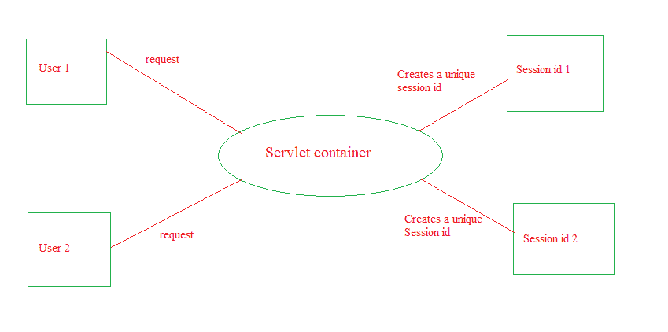
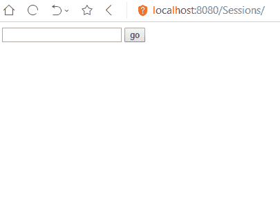
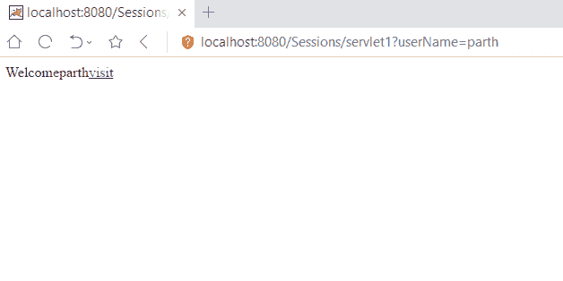
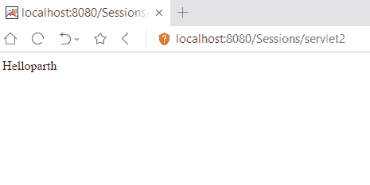

# Servlet 中的 HttpSession 接口

> 原文:[https://www . geesforgeks . org/the-https session-interface-in-servlet/](https://www.geeksforgeeks.org/the-httpsession-interface-in-servlet/)

**什么是会话？**

在网络术语中，会话只是两个系统相互通信的有限时间间隔。这两个系统可以共享客户端-服务器或对等关系。然而，在 Http 协议中，通信的状态不被维护。因此，使用 http 协议的 web 应用程序使用几种不同的技术，包括**会话跟踪**，这意味着维护用户的状态(数据)，以便识别他/她。

为了在 servlets 中实现会话跟踪，cookies 已经成为最常用的技术之一。但是，它们有以下缺点:

*   他们只能保留文本信息。
*   它们依赖于浏览器。因此，如果客户端禁用它们，您的 web 应用程序就不能使用它们
*   单个 cookie 包含的信息不能超过 4kb

**如何在 java servlet** 中为每个用户创建具有唯一会话 id 的会话

为此，servlets 提供了一个名为**‘httpessioninterface’**的接口。下图解释了 Http 会话在 servlets 中的工作方式:


**httpersvlet 界面**中的方法

| 方法 | 描述 |
| public HttpSession getSession() | 获取 HttpSession 对象。如果请求没有与之关联的会话，则会创建一个新会话 |
| public http session get session(boolean create) | 获取与请求关联的会话。如果还不存在，则根据传递给它的布尔参数的值创建一个新的 |
| public String getId() | 返回唯一的会话 id |
| 公共长 getCreationTime() | 它返回创建此会话的时间，从 1970 年 1 月 1 日午夜开始以毫秒为单位。 |
| public long getlastaccessedtime() | 它返回上次访问此会话的时间，以毫秒为单位，自 1970 年 1 月 1 日午夜开始计算。 |
| public long getlastaccessedtime() | 它返回上次访问此会话的时间，以毫秒为单位，自 1970 年 1 月 1 日午夜开始计算。 |
| 公共作废无效() | 使会话无效 |

**Servlet 中 Http 会话的优势**

*   任何类型的对象都可以存储到一个会话中，可以是文本、数据库、数据集等。
*   会话的使用不依赖于客户端的浏览器。
*   会话是安全和透明的

**Http 会话的缺点**

*   由于会话对象存储在服务器上而导致的性能开销
*   数据序列化和反序列化导致的开销

**使用 HttpServlet 接口进行会话跟踪的示例:**在下面的示例中，HttpSession 接口的 setAttribute()和 getAttribute()方法用于在一个 Servlet 的会话范围内创建一个属性，并从另一个 servlet 的会话范围内获取该属性。

*   **index.html**T3

    ```java
    <html>
    <head>
    <body>
    <form action="servlet1">  
    Name:<input type="text" name="userName"/><br/>  
    <input type="submit" value="submit"/>  
    </form>  
    </body>
    </html>
    ```

    T4】
*   **First.java**T3

    ```java
    // The first servlet
    import java.io.*;
    import javax.servlet.*;
    import javax.servlet.http.*;

    < div class
    = "noIdeBtnDiv" > public class First extends HttpServlet {

        public void doGet(HttpServletRequest request, HttpServletResponse response)
        {
            try { /*Declaration of the get method*/

                response.setContentType("text/html"); // Setting the content type to text
                PrintWriter out = response.getWriter();

                String n = request.getParameter("userName"); /*Fetching the contents of
                                                     the userName field from the form*/
                out.print("Welcome " + n); // Printing the username

                HttpSession session = request.getSession(); /* Creating a new session*/

                session.setAttribute("uname", n);
                /*Setting a variable uname
                                     containing the value as the fetched 
                                     username as an attribute of the session
                                     which will be shared among different servlets
                                     of the application*/

                out.print("<a href='servlet2'>visit</a>"); // Link to the second servlet

                out.close();
            }
            catch (Exception e) {
                System.out.println(e);
            }
        }
    }
    ```

    T4】
*   **Second.java**T3

    ```java
    // The second servlet
    import java.io.*;
    import javax.servlet.*;
    import javax.servlet.http.*;

    public class SecondServlet extends HttpServlet {

        public void doGet(HttpServletRequest request, HttpServletResponse response) try {
            /*Declaration of the get method*/
            response.setContentType("text/html");
            PrintWriter out = response.getWriter();

            HttpSession session = request.getSession(false);
            /*Resuming the session created 
                                            in the previous servlet using 
                                            the same method that was used
                                            to create the session. 
                                            The boolean parameter 'false'
                                            has been passed so that a new session
                                            is not created since the session already
                                            exists*/

            String n = (String)session.getAttribute("uname");
            out.print("Hello " + n);

            out.close();
        }
        catch (Exception e) {
            System.out.println(e);
        }
    }
    }
    ```

    T4】
*   **web.xml**

    ```java
    <web-app>  

    <servlet>  
    <servlet-name>s1</servlet-name>  
    <servlet-class>First</servlet-class>  
    </servlet>  

    <servlet-mapping>  
    <servlet-name>s1</servlet-name>  
    <url-pattern>/servlet1</url-pattern>  
    </servlet-mapping>  

    <servlet>  
    <servlet-name>s2</servlet-name>  
    <servlet-class>Second</servlet-class>  
    </servlet>  

    <servlet-mapping>  
    <servlet-name>s2</servlet-name>  
    <url-pattern>/servlet2</url-pattern>  
    </servlet-mapping>  

    </web-app>  
    ```

**输出:**

*   #### index.html:

    

*   #### Servlet1:

    

*   #### Servlet2:

    