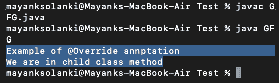

# Java 中的@Override 注释

> 原文:[https://www . geesforgeks . org/the-override-annotation-in-Java/](https://www.geeksforgeeks.org/the-override-annotation-in-java/)

@Override 注释是一个标准的 Java 注释，最初是在 Java 1.5 中引入的。@Override 注释表示子类方法覆盖基类方法。

出于两个原因，@Override 注释很有用。

1.  如果带注释的方法实际上没有重写任何内容，编译器会发出警告。
2.  它有助于提高源代码的可读性。

**我们为什么使用@Override 注释:**

由于以下两个优点，在重写方法时使用@Override 注释被认为是 Java 编码的最佳实践:

1)如果程序员在重写时犯了一个错误，比如使用了错误的方法名或参数类型，您将会得到一个编译时错误。因为您正在通知编译器您正在通过使用此注释来重写此方法。如果不使用注释，子类方法将被视为子类中的新方法(而不是覆盖方法)。

2)提高了代码的可读性。如果您更改被重写方法的签名，所有重写它的子类将抛出编译错误，这最终将导致您更改子类中的签名。如果您的应用程序中有大量的类，这个注释将极大地帮助您识别当方法的签名改变时需要改变的类。

**语法:**

```java
public @interface Override
```

**例 1:** 不使用抽象类

## Java 语言(一种计算机语言，尤用于创建网站)

```java
// Java Program Illustrating Override Annotation

// Importing input output classes
import java.io.*;

// Class 1
// Parent class
class ParentClass {

    // Method inside parent class
    public void display()
    {

        // Print statement whenever
        // method of parent class is called
        System.out.println("We are in base class method");
    }
}

// Class 2
// Child class
class ChildClass extends ParentClass {

    // @Override
    // Method inside child class
    public void display()
    {

        // Print statement whenever
        // method of child class is called
        System.out.println("We are in child class method");
    }
}

// Clas 3
// OverrideAnnotationTest
public class GFG {

    // Main driver method
    public static void main(String args[])
    {

        // Display message only
        System.out.println(
            "Example of @Override annotation");

        // Creating an object of parent class
        // with reference t ochild class
        ParentClass obj = new ChildClass();

        // Calling the method to execute inside classes
        obj.display();
    }
}
```

**输出:**



**示例 2:** 使用抽象类

## Java 语言(一种计算机语言，尤用于创建网站)

```java
// Java Program illustrating Override Annotation
// Using Abstract class

// Importing input output classes
import java.io.*;

// Class 1
// Helper abstract class
abstract class Vehicle {

    // Calling this method
    public abstract void method();
}

// Class 2
// Helper class
class Car extends Vehicle {

    // @Override
    // Method of Car class
    public void method()
    {

        // Print statement whenever this method is called
        System.out.println("This is Car");
    }
}

// Class 3
// Helper class
class Bike extends Vehicle {

    // @Override
    // Method of bike class
    public void method()
    {

        // Print statement whenever this method is called
        System.out.println("This is Bike");
    }
}

// Class 4
// OverrideAnnotationExample
public class GFG {
    // Main drive method
    public static void main(String[] args)
    {
        // Creating object of both the classes
        // namely Car and Bike
        Car Carobj = new Car();

        // Calling method over car object
        Carobj.method();

        Bike Bikeobj = new Bike();

        // Similarly calling method over bike object
        Bikeobj.method();
    }
}
```

**Output**

```java
This is Car
This is Bike
```