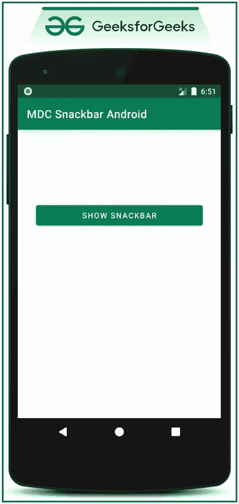
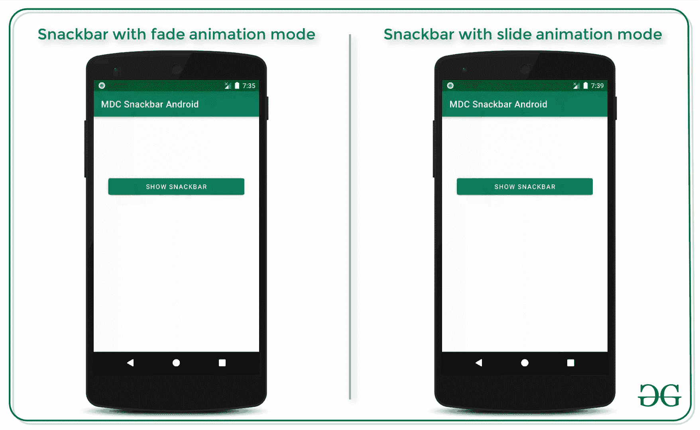

# 安卓中主题化材质设计工具条示例

> 原文:[https://www . geesforgeks . org/theming-material-design-snackbar-in-Android-with-example/](https://www.geeksforgeeks.org/theming-material-design-snackbars-in-android-with-example/)

在之前的文章中，已经讨论过[安卓](https://www.geeksforgeeks.org/snackbar-material-design-components-in-android/)中的 Snackbar 材质设计组件。在这篇文章中，我们已经讨论了如何主题材料设计 Snackbar 和增加用户体验。

### **主题化示例 1:**

*   这个方法是使用**style . XML**文件完成的。我们需要覆盖 Snackbar 的默认样式。
*   看看下面的图片，了解所有可以在 Snackbar 上定制的东西。



*   通过实现这个方法，所有的 Snackbars 都会受到这些样式属性的影响。
*   在此自定义中，背景色调和操作按钮文本颜色会发生变化。
*   这使得用户专注于该动作，并且他们可以根据 Snackbar 上显示的消息来做期望的动作。
*   这也防止了用户不必要的点击动作按钮。

## 可扩展标记语言

```java
<resources>

    <!-- Base application theme. -->
    <style name="AppTheme" parent="Theme.MaterialComponents.Light.DarkActionBar">
        <!-- Customize your theme here. -->
        <item name="colorPrimary">@color/colorPrimary</item>
        <item name="colorPrimaryDark">@color/colorPrimaryDark</item>
        <item name="colorAccent">@color/colorAccent</item>

        <!--this is makes changes to the entire snackbar-->
        <item name="snackbarStyle">@style/Widget.App.Snackbar</item>

        <!--this item is optional as all the snackbar wont contain the action button-->
        <item name="snackbarButtonStyle">@style/Widget.App.SnackbarButton</item>

    </style>

    <style name="Widget.App.Snackbar" parent="Widget.MaterialComponents.Snackbar">

        <!--this child makes changes to the background color of the snackbar-->
        <item name="materialThemeOverlay">@style/ThemeOverlay.App.Snackbar</item>

        <!--if this is made 0 then the action button text color will be white-->
        <!--if this is 1 then the custom color can be set to action button text-->
        <item name="actionTextColorAlpha">1</item>
    </style>

    <!--this is child is needed only when there is action button in snackbar-->
    <!--otherwise this is not necessary-->
    <!--in this case the action button color inside the snackbar is set to red-->
    <style name="Widget.App.SnackbarButton" parent="Widget.MaterialComponents.Button.TextButton.Snackbar">
        <item name="android:textColor">@android:color/holo_red_dark</item>
    </style>

    <!--this color inside this child is the background color of the snackbar-->
    <style name="ThemeOverlay.App.Snackbar" parent="">
        <item name="colorOnSurface">@color/colorPrimaryDark</item>
    </style>

</resources>
```

**输出:在仿真器上运行**

<video class="wp-video-shortcode" id="video-510690-1" width="640" height="360" preload="metadata" controls=""><source type="video/mp4" src="https://media.geeksforgeeks.org/wp-content/uploads/20201102185421/GFG_nexus_5.mp4?_=1">[https://media.geeksforgeeks.org/wp-content/uploads/20201102185421/GFG_nexus_5.mp4](https://media.geeksforgeeks.org/wp-content/uploads/20201102185421/GFG_nexus_5.mp4)</video>

### **主题化示例 2:**

*   这种实现方法仅对特定的 Snackbar 进行更改，而不是对所有 Snackbar 进行更改。
*   通过以编程方式设置所有内容也可以达到同样的效果。
*   现在正在处理**MainActivity.java**文件。

## Java 语言(一种计算机语言，尤用于创建网站)

```java
import androidx.appcompat.app.AppCompatActivity;
import android.os.Bundle;
import android.view.View;
import android.widget.Button;
import android.widget.Toast;
import com.google.android.material.snackbar.Snackbar;

public class MainActivity extends AppCompatActivity {

    // Button to show the snackbar
    Button bShowSnackbar;

    @Override
    protected void onCreate(Bundle savedInstanceState) {
        super.onCreate(savedInstanceState);
        setContentView(R.layout.activity_main);

        // register the show snackbar button with the
        // appropriate ID
        bShowSnackbar = findViewById(R.id.show_snackbar_button);

        // button click listener to show the snackbar
        bShowSnackbar.setOnClickListener(new View.OnClickListener() {
            @Override
            public void onClick(View v) {
                // pass the mSnackbarLayout as the view
                // to the make function
                Snackbar snackbar = Snackbar.make(v, "You have deleted an item", Snackbar.LENGTH_LONG);
                snackbar.setAction("UNDO", new View.OnClickListener() {
                    @Override
                    public void onClick(View v) {
                        // perform any action when the button on the snackbar is clicked here in this case it
                          // shows a simple toast
                        Toast.makeText(MainActivity.this, "The item has been restored", Toast.LENGTH_SHORT).show();
                    }
                });
                // the duration is in terms of milliseconds
                snackbar.setDuration(3000);
                // set the background tint color for the snackbar
                snackbar.setBackgroundTint(getResources().getColor(R.color.colorPrimary));
                // set the action button text color of the snackbar however this is optional
                // as all the snackbar wont have the action button
                snackbar.setActionTextColor(getResources().getColor(R.color.actionTextColorForSnackbar));
                snackbar.show();
            }
        });
    }
}
```

**输出:在仿真器上运行**

<video class="wp-video-shortcode" id="video-510690-2" width="640" height="360" preload="metadata" controls=""><source type="video/mp4" src="https://media.geeksforgeeks.org/wp-content/uploads/20201102190417/GFG_nexus_5.mp4?_=2">[https://media.geeksforgeeks.org/wp-content/uploads/20201102190417/GFG_nexus_5.mp4](https://media.geeksforgeeks.org/wp-content/uploads/20201102190417/GFG_nexus_5.mp4)</video>

### **主题化示例 3:**

*   更改 Snackbar 的动画模式。
*   这也增加了用户体验，通过改变进入和退出 Snackbar 的动画，使用户专注于他们在 Snackbar 上获得的消息，并根据该消息执行操作。
*   请看下图，了解 Snackbar 动画模式的区别。



*   材质设计为 Snackbar 提供了两种动画模式。一个是 ***渐变*** 动画(这是默认的)第二个是 ***滑动*** 动画。
*   必须在***style . XML***文件中调用以下代码。在这种情况下，Snackbar 动画模式被设置为幻灯片。

## 可扩展标记语言

```java
<resources>

    <!-- Base application theme. -->
    <style name="AppTheme" parent="Theme.MaterialComponents.Light.DarkActionBar">
        <!-- Customize your theme here. -->
        <item name="colorPrimary">@color/colorPrimary</item>
        <item name="colorPrimaryDark">@color/colorPrimaryDark</item>
        <item name="colorAccent">@color/colorAccent</item>

        <!--this is makes changes to the entire snackbar-->
        <item name="snackbarStyle">@style/Widget.App.Snackbar</item>

        <!--this item is optional as all the snackbar wont contain the action button-->
        <item name="snackbarButtonStyle">@style/Widget.App.SnackbarButton</item>

    </style>

    <style name="Widget.App.Snackbar" parent="Widget.MaterialComponents.Snackbar">

        <!--this child makes changes to the background color of the snackbar-->
        <item name="materialThemeOverlay">@style/ThemeOverlay.App.Snackbar</item>

        <!--if this is made 0 then the action button text color will be white-->
        <!--if this is 1 then the custom color can be set to action button text-->
        <item name="actionTextColorAlpha">1</item>

        <!--this attribute makes slide animation for the snackbar-->
        <item name="animationMode">slide</item>
    </style>

    <!--this is child is needed only when there is action button in snackbar-->
    <!--otherwise this is not necessary-->
    <!--in this case the action button color inside the snackbar is set to red-->
    <style name="Widget.App.SnackbarButton" parent="Widget.MaterialComponents.Button.TextButton.Snackbar">
        <item name="android:textColor">@android:color/holo_red_dark</item>
        <item name="actionButtonStyle">?attr/buttonStyle</item>
    </style>

    <!--this color inside this child is the background color of the snackbar-->
    <style name="ThemeOverlay.App.Snackbar" parent="">
        <item name="colorOnSurface">@android:color/black</item>
    </style>

</resources>
```

**输出:在仿真器上运行**

<video class="wp-video-shortcode" id="video-510690-3" width="640" height="360" preload="metadata" controls=""><source type="video/mp4" src="https://media.geeksforgeeks.org/wp-content/uploads/20201102194451/GFG_back_frame.mp4?_=3">[https://media.geeksforgeeks.org/wp-content/uploads/20201102194451/GFG_back_frame.mp4](https://media.geeksforgeeks.org/wp-content/uploads/20201102194451/GFG_back_frame.mp4)</video>