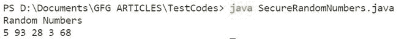

# Java 中 ThreadLocalRandom vs SecureRandom 类

> 原文:[https://www . geeksforgeeks . org/threadlocal random-vs-secureandom-class-in-Java/](https://www.geeksforgeeks.org/threadlocalrandom-vs-securerandom-class-in-java/)

java.util 包的 **ThreadLocalRandom** 类是一个随机数生成器，它生成与当前线程隔离的随机数。它是[随机](https://www.geeksforgeeks.org/java-util-random-class-java/)类的一个子类。它是用内部生成的种子值初始化的，不能修改。

线程本地随机在几个线程并发运行的应用程序中会很有用，因为随机数生成保持隔离，线程不必竞争共享实例(就像在随机类实例的情况下)，并提供更好的性能和更低的开销。然而，它不是加密安全的。这就是安全领域发挥作用的地方，这将在本文后面讨论。

**语法:**

```java
public class ThreadLocalRandom extends Random
```

ThreadLocalRandom 的用法通常为:

```java
ThreadLocalRandom.current().nextX(...) {where X = Int, Long, Double etc}
```

**实施:**

假设在 main()方法中创建了两个线程。现在在 run()方法中，我们调用 threadlocalrandom . current . nextint()。[线程](https://www.geeksforgeeks.org/java-lang-thread-class-java/)类的 run()方法是编写任何线程的可执行部分的地方。当使用 [start()](https://www.geeksforgeeks.org/start-function-multithreading-java/) 方法启动线程时，run()本质上被调用。线程运行并生成随机整数值，我们称之为线程本地随机的 nextInt()方法。

它们可以用相同的种子值生成相同的数字，但这一代仍然是孤立的，即没有空间竞争，就像共享对象的情况一样。

**示例:**

## Java 语言(一种计算机语言，尤用于创建网站)

```java
// java Program to illustrate ThreadLocalRandom class

// Importing class from java.util.concurrent package
import java.util.concurrent.ThreadLocalRandom;

// Main class
public class ThreadLocalRandomNumbers extends Thread {

    // The run() method of the Thread class
    // Must be defined by every class that extends it
    public void run()
    {

        // Try method to check for exceptions
        try {
            // Call the ThreadLocalRandom
            int r = ThreadLocalRandom.current().nextInt(20);

            // Print the generated number r
            System.out.println(
                "Thread " + Thread.currentThread().getId()
                + " generated " + r);
        }

        // Catch block to handle the exceptions
        catch (Exception e) {
            System.out.println("Exception");
        }
    }
    public static void main(String[] args)
    {
        // Create 2 threads
        ThreadLocalRandomNumbers t1
            = new ThreadLocalRandomNumbers();
        ThreadLocalRandomNumbers t2
            = new ThreadLocalRandomNumbers();

        // Start the threads using the start() method
        t1.start();
        t2.start();
    }
}
```

**Output**

```java
Thread 11 generated 2
Thread 12 generated 10
```

java.util 包的 **SecureRandom** 类是一个加密安全的随机数生成器。它是[随机](https://www.geeksforgeeks.org/java-util-random-class-java/)类的一个子类。密码安全随机数符合 FIPS 140-2《密码模块的安全要求》第 4.9.1 节中规定的统计随机数发生器测试。SecureRandom 会产生不确定的输出，这是此类模块的必要要求。

**语法:**

```java
public class SecureRandom extends Random
```

让我们举个例子，在下面给出的代码中，我们创建了一个 SecureRandom 类的实例，并初始化了种子值。接下来，我们使用 for 循环调用 nextInt()方法 5 次。 *nextInt()* 方法使用种子值生成从 0 到 seed-1(包括 0 和 1)的整数。所有这些都是在 try-catch 块中完成的，因为它在任何在线编译器上使用时都会引发异常(阅读下面给出的注释)。

**例**

## Java 语言(一种计算机语言，尤用于创建网站)

```java
// Java Program to illustrate SecureRandom Class

// Importing class from java.security package
import java.security.SecureRandom;

// Main class
public class SecureRandomNumbers {

    // Main driver method
    public static void main(String[] args)
    {

        // Try block to check for exceptions
        try {

            // Create an instance of SecureRandom
            // using the default constructor
            SecureRandom r = new SecureRandom();

            // Initialise a seed value
            int seed = 100;

            System.out.println("Random Numbers");

            for (int i = 0; i < 5; i++) {
                // Use the nextInt() method to generate
                // random numbers between 0 and seed-1
                // inclusive
                System.out.print(r.nextInt(seed) + " ");
            }
        }

        // Catch block to handle the exceptions
        catch (Exception e) {

            System.out.print("Exception");
        }
    }
}
```

**Output**

```java
Random Numbers
Exception
```

**输出**



**注意:**secureandom 类由于其加密安全的特性，将无法在在线编译器上工作。但是，如果您在系统上使用集成开发环境，您将能够获得上图所示的输出。