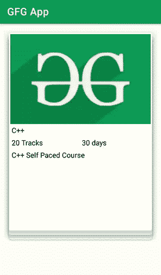

# 安卓火绒刷视图示例

> 原文:[https://www . geesforgeks . org/tinder-swipe-view-带示例的安卓/](https://www.geeksforgeeks.org/tinder-swipe-view-with-example-in-android/)

Tinder Swipe View 是许多安卓应用中最常用的用户界面组件之一。这个特性让我们能够以一个巨大的列表形式轻松地表示数据。在本文中，我们将看看如何在我们的安卓应用程序中实现这种滑动视图功能。

### 我们将在本文中构建什么？

我们将构建一个简单的应用程序，在其中我们将显示一叠卡片，在其中我们将显示极客上可供极客使用的不同课程。在这些卡片上，我们将增加一个类似于 Tinder 的刷卡功能。下面给出了一个 GIF 示例，来了解一下我们将在本文中做什么。注意，我们将使用 **Java** 语言来实现这个项目。



### **分步实施**

**第一步:创建新项目**

要在安卓工作室创建新项目，请参考[如何在安卓工作室创建/启动新项目](https://www.geeksforgeeks.org/android-how-to-create-start-a-new-project-in-android-studio/)。注意选择 **Java** 作为编程语言。

**第二步:在 build.gradle** 中添加下面的依赖项

导航到应用程序>渐变脚本>构建.渐变，并在依赖项部分添加以下依赖项。

> 实现' com . dapl labs . aaron:card stack:0 . 3 . 1-beta 0 '

添加上述依赖项后，现在同步您的项目，我们将进入我们的 **activity_main.xml.**

**步骤 3:使用 activity_main.xml 文件**

导航到**应用程序> res >布局> activity_main.xml** 并将下面的代码添加到该文件中。下面是 **activity_main.xml** 文件的代码。

## 可扩展标记语言

```java
<?xml version="1.0" encoding="utf-8"?>
<RelativeLayout 
    xmlns:android="http://schemas.android.com/apk/res/android"
    xmlns:tools="http://schemas.android.com/tools"
    android:layout_width="match_parent"
    android:layout_height="match_parent"
    android:orientation="vertical"
    tools:context=".MainActivity">

    <!--on below line we are creating a swipe
         frame layout for providing a swipe action-->
    <com.daprlabs.cardstack.SwipeFrameLayout 
        xmlns:swipedeck="http://schemas.android.com/apk/res-auto"
        android:layout_width="match_parent"
        android:layout_height="match_parent"
        android:orientation="vertical">

        <!--below widget is used for creating a swipe deck-->
        <!--in below widget card spacing is the spacing between cards
            max visible is the max number of cards which are visible
            render above is to render the cards
            rotation degree is the angle of card rotation when card is swiped-->
        <com.daprlabs.cardstack.SwipeDeck
            android:id="@+id/swipe_deck"
            android:layout_width="match_parent"
            android:layout_height="480dp"
            android:padding="20dp"
            swipedeck:card_spacing="10dp"
            swipedeck:max_visible="3"
            swipedeck:render_above="true"
            swipedeck:rotation_degrees="15" />

    </com.daprlabs.cardstack.SwipeFrameLayout>

</RelativeLayout>
```