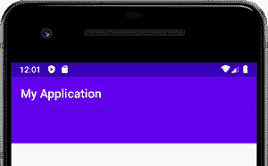

# 安卓工具栏示例

> 原文:[https://www . geesforgeks . org/带示例的安卓工具栏/](https://www.geeksforgeeks.org/toolbar-in-android-with-example/)

在[安卓](https://www.geeksforgeeks.org/kotlin-android-tutorial/)应用中，**工具栏**是一种**视图组**，可以放置在[活动](https://www.geeksforgeeks.org/activity-lifecycle-in-android-with-demo-app/)的 **XML 布局**中。是谷歌安卓团队在**安卓棒棒糖(API 21)** 发布时推出的。工具栏基本上是**动作栏**的高级继承者。它在外观和功能上更加灵活和可定制。与 ActionBar 不同，它的位置不是硬编码的，即不在活动的顶部。开发人员可以根据需要将其放置在活动中的任何位置，就像安卓中的任何其他**视图**一样。工具栏使用安卓的 [**材质设计**](https://www.geeksforgeeks.org/introduction-to-material-design-in-android/) **主题**功能，因此它提供了到 **API 7(安卓 2.1)** 的向后兼容性。可以通过以下两种方式使用工具栏:

1.  **作为动作栏使用:**在应用中，工具栏可以作为动作栏使用，以便提供更多的定制和更好的外观。ActionBar 的所有功能，如菜单膨胀、ActionBarDrawerToogle 等。工具栏中也支持。
2.  **使用独立的工具栏:**它可以用来实现应用程序的某种设计，而这种设计是 ActionBar 无法实现的。例如，在活动顶部以外的位置显示工具栏，或者在一个活动中显示多个工具栏。

工具栏支持的功能比操作栏更具针对性和可定制性。以下是可以添加的组件，以使用户有吸引力的工具栏:

*   **导航按钮:**此元素相对于工具栏的最小高度垂直对齐。它被用作在应用程序内其他目的地之间切换的指南。该元素的外观可以有多种形式，如[导航菜单切换](https://www.geeksforgeeks.org/create-a-mobile-toggle-navigation-menu-using-html-css-and-javascript/)、关闭、折叠、完成、简单的向上箭头或应用程序所需的任何其他类型的字形。
*   **品牌标志/App 图标:**它是应用程序最重要的方面之一，因为它提供了一种身份。徽标/图标的高度通常达到工具栏的高度，但也可以根据需要进行扩展。
*   **标题和副标题:**向工具栏提供标题的目的是提供关于应用导航层次结构中当前位置的信息。字幕用于指示关于内容的任何种类的扩展信息。
*   **动作菜单视图:**类似于动作栏中的**动作按钮**，显示用户可能经常需要的一些重要的应用动作/元素。此菜单的元素放置在工具栏的末端(最右侧)。
*   **多个自定义视图:**安卓允许开发者添加一个或多个视图，如 [ImageView](https://www.geeksforgeeks.org/imageview-in-kotlin/) 、 [TextView](https://www.geeksforgeeks.org/textview-in-kotlin/) 等。在工具栏的布局中。这些视图被视为工具栏布局的子视图，它们的位置可以根据需要进行调整。

### **设计工具栏**

使用**工具栏**与任何操作**视图**非常相似。人们可以很容易地指定约束、改变高度和宽度、选择背景颜色等等。为了在 ActionBar 中执行这些相同的任务，需要编写额外的代码行。这里有一个使用**工具栏作为动作栏**的例子。下面是一步一步的方法，涵盖了整个过程。

> **注意:**在 Android Studio 版本上执行以下步骤

**步骤 1:确保这些依赖项存在于应用级**[**build . gradle**](https://www.geeksforgeeks.org/android-build-gradle/)**文件**中

为了将工具栏用作操作栏，必须在应用程序模块的 build.gradle 文件中包含以下依赖项。这些依赖关系可能已经存在于文件中，但是检查一次总是好的。

> 依赖项{
> 
> …..
> 
> …..
> 
> implementation ' andidx . app compat:app compat:1 . 2 . 0 '
> 
> 实现' com . Google . Android . material:material:1 . 2 . 1 '
> 
> }

**第二步:默认设置**

打开应用程序的 **activity_main.xml** 文件，切换到其**设计窗口**。此时，活动预览将不包含任何操作栏或工具栏。但是，在运行应用程序时，ActionBar 的默认格式将出现在活动的顶部，活动将只显示应用程序的名称。

**第三步:在 activity_main.xml 文件**中添加工具栏

从位于**设计窗口**左上角的**调色板菜单**中搜索**工具栏视图**。拖动并将其作为**约束布局**的子级放置。要使其外观类似于动作栏，请在 **activity_main.xml** 文件中添加 **AppBarLayout** ，使工具栏成为其子级。添加 AppBarLayout 的顶部、左侧和右侧约束。通过在这个时间点运行应用程序，可以观察到活动顶部的工具栏和操作栏(因为这是默认设置)。下面是将产生所讨论的输出的**activity _ main . XML 文件**的代码。

## 可扩展标记语言

```
<?xml version="1.0" encoding="utf-8"?>
<androidx.constraintlayout.widget.ConstraintLayout 
    xmlns:android="http://schemas.android.com/apk/res/android"
    xmlns:app="http://schemas.android.com/apk/res-auto"
    xmlns:tools="http://schemas.android.com/tools"
    android:layout_width="match_parent"
    android:layout_height="match_parent"
    tools:context=".MainActivity">

    <com.google.android.material.appbar.AppBarLayout
        android:layout_width="0dp"
        android:layout_height="wrap_content"
        app:layout_constraintEnd_toEndOf="parent"
        app:layout_constraintStart_toStartOf="parent"
        app:layout_constraintTop_toTopOf="parent">

        <androidx.appcompat.widget.Toolbar
            android:id="@+id/toolbar"
            android:layout_width="match_parent"
            android:layout_height="wrap_content"
            android:background="?attr/colorPrimary"
            android:minHeight="?attr/actionBarSize"
            android:theme="?attr/actionBarTheme"
            tools:layout_editor_absoluteX="0dp"
            tools:layout_editor_absoluteY="0dp" />

    </com.google.android.material.appbar.AppBarLayout>

    <TextView
        android:id="@+id/textView"
        android:layout_width="wrap_content"
        android:layout_height="wrap_content"
        android:text="Hello World!"
        app:layout_constraintBottom_toBottomOf="parent"
        app:layout_constraintLeft_toLeftOf="parent"
        app:layout_constraintRight_toRightOf="parent"
        app:layout_constraintTop_toTopOf="parent" />

</androidx.constraintlayout.widget.ConstraintLayout>
```

**输出:**



**第四步:移除动作栏**

从整个应用程序中移除 ActionBar 最简单的方法是更改**style . XML**文件的默认代码。父/基础应用程序的主题必须更改为**主题。AppCompat.Light.NoActionBar** 。下面是将进行所需更改的代码。

## 可扩展标记语言

```
<resources>
    <!-- Base application theme. -->
    <style name="AppTheme" parent="Theme.AppCompat.Light.NoActionBar">
        <!-- Customize your theme here. -->
        <item name="colorPrimary">@color/colorPrimary</item>
        <item name="colorPrimaryDark">@color/colorPrimaryDark</item>
        <item name="colorAccent">@color/colorAccent</item>
    </style>

</resources>
```